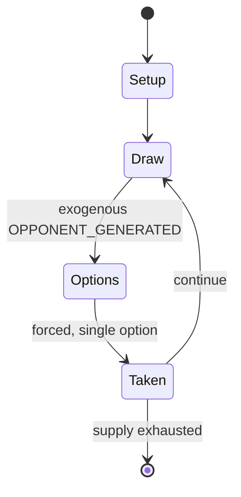

# Colorforms

*brand of toy*

`colorforms` &nbsp; state: **DEEPENED** &nbsp; method: **heuristic**

## Found layer (recorded, not trusted)

| field | value |
| --- | --- |
| wikidata | Q5149050 |
| wikipedia | Colorforms |
| genres (source) | -- |
| instance of (source) | board game |
| country of origin | -- |

## Declared layer (orders bench work)

| field | value |
| --- | --- |
| year created | 1957 |
| epoch | MODERN |
| region | -- |
| media | BOARD, PUZZLE |
| players | -- |
| age band | -- |
| exogenous process | OPPONENT_GENERATED |
| loss shape | -- |
| live axes | TRADE |
| horizon | -- |
| scoring shape | -- |
| information | -- |
| interaction | NEGOTIATION |
| turn structure | -- |
| tractability | INTRACTABLE |
| randomness | DICE |
| luck factor | 0.58 |
| rules complexity | 2.92 |
| strategic depth | 2.12 |
| novelty | 0.963 |
| solved status | -- |
| strategies | spatial_packing |
| algorithms | -- |

## Object model

```
Episode
  players      : ?
  turn_structure: ?
  horizon       : ?
  scoring       : ?

Board          -- spatial substrate; cells carry position and occupancy
Piece          -- movable token owned by a player
Configuration  -- the arrangement to be resolved
Constraint     -- predicate a legal configuration must satisfy
Offer          -- proposed exchange between two agents
```

## State transition diagram



## Research item -- turn trace

```
# Colorforms -- simulated turn events
# generated from the DECLARED vector, not from a rulebook.
# structure: exo=OPPONENT_GENERATED loss=None horizon=None scoring=None axes=TRADE

t=0    SETUP        players=2  pot=0  capacity=7
t=1    DRAW         p1 observe from opponent move -> outcome #1  (p=0.163)
t=2    FORCED       p1 single legal option taken (pot_gain=+0.9)
t=3    DRAW         p1 observe from opponent move -> outcome #3  (p=0.291)
t=4    FORCED       p1 single legal option taken (pot_gain=+1.1)
t=5    ENDTURN      turn passes to p2
t=6    DRAW         p2 observe from opponent move -> outcome #5  (p=0.070)
t=7    FORCED       p2 single legal option taken (pot_gain=+0.6)
t=8    DRAW         p2 observe from opponent move -> outcome #6  (p=0.100)
t=9    FORCED       p2 single legal option taken (pot_gain=+1.9)
t=10   ENDTURN      turn passes to p1
t=11   DRAW         p1 observe from opponent move -> outcome #3  (p=0.186)
t=12   FORCED       p1 single legal option taken (pot_gain=+1.7)
t=13   TRADE        p1 offers 2:1 exchange to p2
t=14   ENDTURN      turn passes to p2
t=15   DRAW         p2 observe from opponent move -> outcome #4  (p=0.231)
t=16   FORCED       p2 single legal option taken (pot_gain=+2.0)
t=17   DRAW         p2 observe from opponent move -> outcome #2  (p=0.124)
t=18   FORCED       p2 single legal option taken (pot_gain=+1.7)
t=19   TRADE        p2 offers 2:1 exchange to p1
t=20   ENDTURN      turn passes to p1
t=21   DRAW         p1 observe from opponent move -> outcome #3  (p=0.075)
t=22   FORCED       p1 single legal option taken (pot_gain=+0.9)
t=23   TRADE        p1 offers 2:1 exchange to p2
t=24   DRAW         p1 observe from opponent move -> outcome #5  (p=0.001)
t=25   FORCED       p1 single legal option taken (pot_gain=+1.0)
t=26   TRADE        p1 offers 2:1 exchange to p2

terminal: VARIABLE
```

## Conditions

| kind | threshold | effect | trigger |
| --- | --- | --- | --- |
| BOUNDARY | -- | -- | The Colorforms company was the major licensee of the Plasticine brand of modeling clay in the United States from 1979 until at least 1984; Plasticine is a non-drying putty-like modeling material made from a proprietary m |

## Source extract

Colorforms is a creative toy named for the simple shapes and forms cut from colored vinyl
sheeting that cling to a smooth backing surface without adhesives. These pieces are used to
create picture graphics, designs, and play scenes which can then be changed countless times by
repositioning the removable color forms. The name also refers to the specific registered
trademark brand these products are produced under, as well as the company that manufactures the
toys, Colorforms Brand, LLC. Sets initially featured basic geometric shapes and bright primary
colors on black or white backgrounds. The Colorforms line evolved to include full-color
illustrated playsets, games and puzzles, interactive books, and creative activity sets for
children of all ages. The licensing of media properties related to contemporary pop culture
became integral to the product and company's success. Since its inception, more than a billion
Colorforms playsets have been produced and sold.   == Design == Colorforms are sheet-thin, die-
cut vinyl pieces in colorful geometric "forms" and abstract shapes (figurative or object), often
with over-printed images that are to be attached to a smooth plastic-laminated paperb

<sub>Wikipedia, CC BY-SA. Retained as evidence for the structural
classification above. Every rule inferred from it is HYPOTHESIZED
until audited against a rulebook.</sub>
