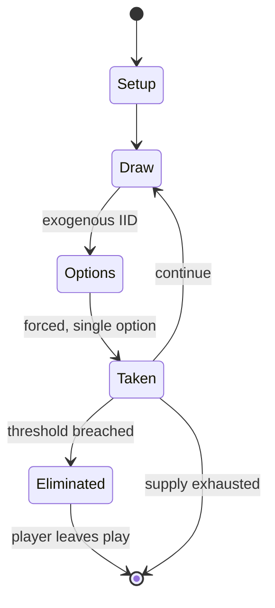

# Commands & Colors: Ancients

*Board wargame*

`commands_colors_ancients` &nbsp; state: **DEEPENED** &nbsp; method: **heuristic**

## Found layer (recorded, not trusted)

| field | value |
| --- | --- |
| wikidata | Q1115156 |
| wikipedia | Commands & Colors: Ancients |
| genres (source) | board wargame |
| instance of (source) | board game, wargame |
| country of origin | -- |

## Declared layer (orders bench work)

| field | value |
| --- | --- |
| year created | -3000 |
| epoch | DEEP_ANTIQUITY |
| region | -- |
| media | BOARD, DICE, WARGAME |
| players | -- |
| age band | -- |
| exogenous process | IID |
| loss shape | ELIMINATION |
| live axes | SPATIAL |
| horizon | -- |
| scoring shape | -- |
| information | -- |
| interaction | -- |
| turn structure | STRICT_TURN |
| tractability | EXACT_WITH_CUT |
| randomness | DICE |
| luck factor | 0.58 |
| rules complexity | 3.27 |
| strategic depth | 1.87 |
| novelty | 0.745 |
| solved status | -- |
| strategies | -- |
| algorithms | -- |

## Object model

```
Episode
  players      : ?
  turn_structure: STRICT_TURN
  horizon       : ?
  scoring       : ?

Board          -- spatial substrate; cells carry position and occupancy
Piece          -- movable token owned by a player
DicePool       -- n dice, each an iid categorical draw
Roll           -- realised outcome of a pool
Placement      -- position subject to geometric legality
```

## State transition diagram



## Research item -- turn trace

```
# Commands & Colors: Ancients -- simulated turn events
# generated from the DECLARED vector, not from a rulebook.
# structure: exo=IID loss=ELIMINATION horizon=None scoring=None axes=SPATIAL

t=0    SETUP        players=2  pot=0  capacity=8
t=1    DRAW         p1 roll from d6 pool -> outcome #6  (p=0.099)
t=2    FORCED       p1 single legal option taken (pot_gain=+0.7)
t=3    SPATIAL      p1 places at (5,4); adjacency legal
t=4    DRAW         p1 roll from d6 pool -> outcome #4  (p=0.077)
t=5    FORCED       p1 single legal option taken (pot_gain=+1.3)
t=6    DRAW         p1 roll from d6 pool -> outcome #6  (p=0.288)
t=7    FORCED       p1 single legal option taken (pot_gain=+1.9)
t=8    ENDTURN      turn passes to p2
t=9    DRAW         p2 roll from d6 pool -> outcome #6  (p=0.024)
t=10   FORCED       p2 single legal option taken (pot_gain=+1.3)
t=11   SPATIAL      p2 places at (7,5); adjacency legal
t=12   DRAW         p2 roll from d6 pool -> outcome #5  (p=0.099)
t=13   FORCED       p2 single legal option taken (pot_gain=+0.8)
t=14   DRAW         p2 roll from d6 pool -> outcome #2  (p=0.076)
t=15   FORCED       p2 single legal option taken (pot_gain=+1.7)
t=16   SPATIAL      p2 places at (0,0); adjacency legal
t=17   ENDTURN      turn passes to p1
t=18   DRAW         p1 roll from d6 pool -> outcome #3  (p=0.154)
t=19   FORCED       p1 single legal option taken (pot_gain=+1.5)
t=20   DRAW         p1 roll from d6 pool -> outcome #4  (p=0.057)
t=21   FORCED       p1 single legal option taken (pot_gain=+0.8)
t=22   SPATIAL      p1 places at (3,0); adjacency legal
t=23   DRAW         p1 roll from d6 pool -> outcome #5  (p=0.026)
t=24   FORCED       p1 single legal option taken (pot_gain=+0.6)
t=25   SPATIAL      p1 places at (7,0); adjacency legal
t=26   ENDTURN      turn passes to p2

terminal: VARIABLE
```

## Conditions

| kind | threshold | effect | trigger |
| --- | --- | --- | --- |
| ELIMINATE | -- | -- | Victory banners are earned each time a player completely eliminates an enemy unit or leader. |

## Source extract

Commands & Colors: Ancients is a board wargame designed by Richard Borg, Pat Kurivial, and Roy
Grider, and published by GMT Games in 2006.  It is based on Borg's Commands & Colors system
using some elements similar to his other games such as Commands & Colours: Napoleonics, The
Great War, Memoir '44 and Battle Cry designed to simulate the "fog of war" and uncertainty
encountered on real battlefields. Commands & Colors: Ancients focuses on the historic period of
3000 BC - 400 AD.   == Components == The core game includes several hundred wood blocks in two
colors for the Roman/Syracusan armies and Carthaginian army.  Sheets of stickers representing
different unit types must be affixed to the blocks prior to initial play.  16 small wooden
blocks representing "victory banners" and 7 larger plastic dice must also have stickers applied.
Extra stickers are included for use as replacements.  The game also contains a full-color rule
book, color scenario book, and two color two-page double-sided "cheat sheets" for players to
reference during play for dice results and unit statistics.  The board is folded card stock laid
flat for play.  Hexagonal terrain pieces are laid on the board when cal

<sub>Wikipedia, CC BY-SA. Retained as evidence for the structural
classification above. Every rule inferred from it is HYPOTHESIZED
until audited against a rulebook.</sub>
