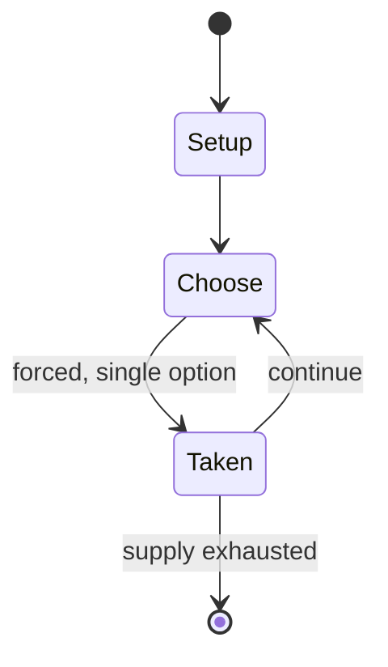

# Commerce (card game)

`commerce_card_game` &nbsp; state: **DEEPENED** &nbsp; method: **heuristic**

## Found layer (recorded, not trusted)

| field | value |
| --- | --- |
| wikidata | Q5152407 |
| wikipedia | Commerce (card game) |
| genres (source) | -- |
| instance of (source) | -- |
| country of origin | -- |

## Declared layer (orders bench work)

| field | value |
| --- | --- |
| year created | -- |
| epoch | -- |
| region | -- |
| media | CARD |
| players | 3-10 |
| age band | -- |
| exogenous process | -- |
| loss shape | -- |
| live axes | TRADE |
| horizon | -- |
| scoring shape | -- |
| information | -- |
| interaction | NEGOTIATION |
| turn structure | STRICT_TURN |
| tractability | INTRACTABLE |
| randomness | -- |
| luck factor | 0.35 |
| rules complexity | 2.6 |
| strategic depth | 2.25 |
| novelty | 0.8909 |
| solved status | -- |
| strategies | spatial_packing |
| algorithms | -- |

## Object model

```
Episode
  players      : 3-10
  turn_structure: STRICT_TURN
  horizon       : ?
  scoring       : ?

Deck           -- ordered multiset, drawn without replacement
Hand           -- private multiset held by one player
DiscardPile    -- public accumulation of spent cards
Offer          -- proposed exchange between two agents
```

## State transition diagram



## Research item -- turn trace

```
# Commerce (card game) -- simulated turn events
# generated from the DECLARED vector, not from a rulebook.
# structure: exo=None loss=None horizon=None scoring=None axes=TRADE

t=0    SETUP        players=3  pot=0  capacity=4
t=1    FORCED       p1 single legal option taken (pot_gain=+1.0)
t=2    TRADE        p1 offers 2:1 exchange to p2
t=3    FORCED       p1 single legal option taken (pot_gain=+0.8)
t=4    FORCED       p1 single legal option taken (pot_gain=+0.9)
t=5    TRADE        p1 offers 2:1 exchange to p2
t=6    FORCED       p1 single legal option taken (pot_gain=+0.7)
t=7    TRADE        p1 offers 2:1 exchange to p2
t=8    FORCED       p1 single legal option taken (pot_gain=+0.6)
t=9    ENDTURN      turn passes to p2
t=10   FORCED       p2 single legal option taken (pot_gain=+1.9)
t=11   ENDTURN      turn passes to p3
t=12   FORCED       p3 single legal option taken (pot_gain=+1.9)
t=13   TRADE        p3 offers 2:1 exchange to p1
t=14   ENDTURN      turn passes to p1
t=15   FORCED       p1 single legal option taken (pot_gain=+0.7)
t=16   FORCED       p1 single legal option taken (pot_gain=+2.0)
t=17   FORCED       p1 single legal option taken (pot_gain=+1.7)
t=18   FORCED       p1 single legal option taken (pot_gain=+1.3)
t=19   FORCED       p1 single legal option taken (pot_gain=+1.1)
t=20   FORCED       p1 single legal option taken (pot_gain=+2.0)
t=21   FORCED       p1 single legal option taken (pot_gain=+1.0)
t=22   TRADE        p1 offers 2:1 exchange to p2
t=23   ENDTURN      turn passes to p2
t=24   FORCED       p2 single legal option taken (pot_gain=+1.3)
t=25   TRADE        p2 offers 2:1 exchange to p3
t=26   FORCED       p2 single legal option taken (pot_gain=+1.6)

terminal: VARIABLE
```

## Source extract

Commerce is an 18th-century gambling French card game akin to thirty-one and perhaps ancestral
to whisky poker and stop the bus. It aggregates a variety of games with the same game mechanics.
Trade and barter, the English equivalent, has the same combinations, but a different way of
acquiring them. Trentuno and Trente et un, apply basically to the same method of play, but also
have slightly different combinations. Its rules are recorded as early as 1769.   == Object ==
Like other games of the commerce group, the aim is to finish with the best three-card
combination in hand. The players can try to improve their hands by swapping one or more of their
cards for a table card and this continues until one of the players is satisfied with their hand,
bringing the game to a showdown.   == Rules == Commerce is usually played by 3–10 players,
although any number can play. The game is played with a complete pack of 52 cards ranking A K Q
J T 9 8 7 6 5 4 3 2. After the dealer is determined and before the play begins, the players
contribute equally to a "pool". The players are dealt, singly or in just one batch, three cards
each and another batch of three cards are dealt face up to the table to

<sub>Wikipedia, CC BY-SA. Retained as evidence for the structural
classification above. Every rule inferred from it is HYPOTHESIZED
until audited against a rulebook.</sub>
