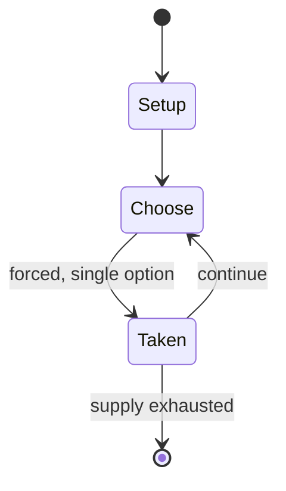

# Computer Othello

*abstract strategy game*

`computer_othello` &nbsp; state: **DEEPENED** &nbsp; method: **heuristic**

## Found layer (recorded, not trusted)

| field | value |
| --- | --- |
| wikidata | Q1122104 |
| wikipedia | Computer Othello |
| genres (source) | -- |
| instance of (source) | abstract strategy game |
| country of origin | -- |

## Declared layer (orders bench work)

| field | value |
| --- | --- |
| year created | -- |
| epoch | -- |
| region | -- |
| media | ABSTRACT, VIDEO |
| players | 2 |
| age band | -- |
| exogenous process | NONE |
| loss shape | OPPORTUNITY_ONLY |
| live axes | ORDER, SPATIAL |
| horizon | -- |
| scoring shape | -- |
| information | PERFECT |
| interaction | SOLITAIRE |
| turn structure | -- |
| tractability | EXACT |
| randomness | NONE |
| luck factor | 0.02 |
| rules complexity | 3.0 |
| strategic depth | 3.25 |
| novelty | 0.8349 |
| solved status | SOLVED_STRONG |
| strategies | opening_theory |
| algorithms | alpha_beta, heuristic_evaluation, minimax, opening_book |

## Object model

```
Episode
  players      : 2
  turn_structure: ?
  horizon       : ?
  scoring       : ?

WorldState     -- simulation state advanced by the engine
Avatar         -- player-controlled agent
Clock          -- frame or tick counter
Sequence       -- the permutation under the player's control
Placement      -- position subject to geometric legality
```

## State transition diagram



## Research item -- turn trace

```
# Computer Othello -- simulated turn events
# generated from the DECLARED vector, not from a rulebook.
# structure: exo=NONE loss=OPPORTUNITY_ONLY horizon=None scoring=None axes=ORDER,SPATIAL

t=0    SETUP        players=2  pot=0  capacity=8
t=1    FORCED       p1 single legal option taken (pot_gain=+1.1)
t=2    FORCED       p1 single legal option taken (pot_gain=+0.5)
t=3    FORCED       p1 single legal option taken (pot_gain=+1.8)
t=4    SPATIAL      p1 places at (2,3); adjacency legal
t=5    ENDTURN      turn passes to p2
t=6    FORCED       p2 single legal option taken (pot_gain=+0.6)
t=7    SPATIAL      p2 places at (4,3); adjacency legal
t=8    ENDTURN      turn passes to p1
t=9    FORCED       p1 single legal option taken (pot_gain=+1.2)
t=10   FORCED       p1 single legal option taken (pot_gain=+0.7)
t=11   FORCED       p1 single legal option taken (pot_gain=+1.8)
t=12   FORCED       p1 single legal option taken (pot_gain=+1.4)
t=13   SPATIAL      p1 places at (1,6); adjacency legal
t=14   FORCED       p1 single legal option taken (pot_gain=+1.4)
t=15   FORCED       p1 single legal option taken (pot_gain=+1.9)
t=16   ENDTURN      turn passes to p2
t=17   FORCED       p2 single legal option taken (pot_gain=+1.6)
t=18   FORCED       p2 single legal option taken (pot_gain=+1.5)
t=19   ENDTURN      turn passes to p1
t=20   FORCED       p1 single legal option taken (pot_gain=+1.8)
t=21   FORCED       p1 single legal option taken (pot_gain=+1.0)
t=22   FORCED       p1 single legal option taken (pot_gain=+1.3)
t=23   ENDTURN      turn passes to p2
t=24   FORCED       p2 single legal option taken (pot_gain=+1.2)
t=25   FORCED       p2 single legal option taken (pot_gain=+1.5)
t=26   FORCED       p2 single legal option taken (pot_gain=+1.4)

terminal: VARIABLE
```

## Conditions

| kind | threshold | effect | trigger |
| --- | --- | --- | --- |
| BOUNDARY | -- | -- | This search continues until a certain maximum search depth or the program determines that a final "leaf" position has been reached. |

## Source extract

Computer Othello refers to computer architecture encompassing computer hardware and computer
software capable of playing the game of Othello. A version of Othello was famously included in
Microsoft Windows from version 1.0 to XP, where it is simply known as Reversi.   == Availability
== There are many Othello programs such as NTest, Saio, Edax, Cassio, Pointy Stone, Herakles,
WZebra, and Logistello that can be downloaded from the Internet for free. These programs, when
run on any up-to-date computer, can play games in which the best human players are easily
defeated. This is because although the consequences of moves are predictable for both computers
and humans, computers are better at exploring them.   == Search techniques == Computer Othello
programs search for any possible legal moves using a game tree. In theory, they examine all
positions / nodes, where each move by one player is called a "ply". This search continues until
a certain maximum search depth or the program determines that a final "leaf" position has been
reached. A naive implementation of this approach, known as Minimax or Negamax, can only search
to a small depth in a practical amount of time, so various methods

<sub>Wikipedia, CC BY-SA. Retained as evidence for the structural
classification above. Every rule inferred from it is HYPOTHESIZED
until audited against a rulebook.</sub>
