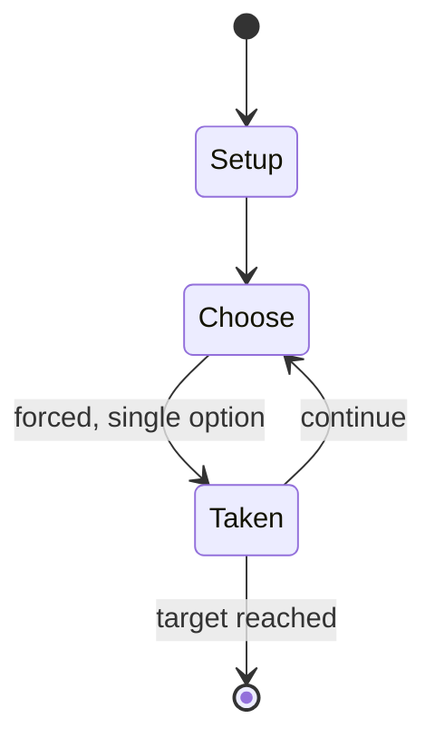

# Connect6

*abstract strategy game*

`connect6` &nbsp; state: **DEEPENED** &nbsp; method: **heuristic**

## Found layer (recorded, not trusted)

| field | value |
| --- | --- |
| wikidata | Q1073196 |
| wikipedia | Connect6 |
| genres (source) | -- |
| instance of (source) | abstract strategy game |
| country of origin | -- |

## Declared layer (orders bench work)

| field | value |
| --- | --- |
| year created | 2003 |
| epoch | CONTEMPORARY |
| region | -- |
| media | ABSTRACT, BOARD |
| players | -- |
| age band | -- |
| exogenous process | NONE |
| loss shape | OPPORTUNITY_ONLY |
| live axes | SPATIAL |
| horizon | RACE_TO_TARGET |
| scoring shape | NONLINEAR |
| information | PERFECT |
| interaction | COMPETITIVE |
| turn structure | STRICT_TURN |
| tractability | SAMPLING_ONLY |
| randomness | NONE |
| luck factor | 0.35 |
| rules complexity | 2.09 |
| strategic depth | 2.0 |
| novelty | 0.6056 |
| solved status | -- |
| strategies | -- |
| algorithms | -- |

## Object model

```
Episode
  players      : ?
  turn_structure: STRICT_TURN
  horizon       : RACE_TO_TARGET
  scoring       : NONLINEAR

Board          -- spatial substrate; cells carry position and occupancy
Piece          -- movable token owned by a player
Placement      -- position subject to geometric legality
```

## State transition diagram



## Research item -- turn trace

```
# Connect6 -- simulated turn events
# generated from the DECLARED vector, not from a rulebook.
# structure: exo=NONE loss=OPPORTUNITY_ONLY horizon=RACE_TO_TARGET scoring=NONLINEAR axes=SPATIAL

t=0    SETUP        players=2  pot=0  capacity=4
t=1    FORCED       p1 single legal option taken (pot_gain=+0.5)
t=2    ENDTURN      turn passes to p2
t=3    FORCED       p2 single legal option taken (pot_gain=+0.6)
t=4    SPATIAL      p2 places at (1,7); adjacency legal
t=5    FORCED       p2 single legal option taken (pot_gain=+1.3)
t=6    FORCED       p2 single legal option taken (pot_gain=+1.1)
t=7    FORCED       p2 single legal option taken (pot_gain=+1.3)
t=8    SPATIAL      p2 places at (1,4); adjacency legal
t=9    FORCED       p2 single legal option taken (pot_gain=+1.3)
t=10   FORCED       p2 single legal option taken (pot_gain=+0.8)
t=11   FORCED       p2 single legal option taken (pot_gain=+1.7)
t=12   SPATIAL      p2 places at (0,0); adjacency legal
t=13   FORCED       p2 single legal option taken (pot_gain=+2.0)
t=14   ENDTURN      turn passes to p1
t=15   FORCED       p1 single legal option taken (pot_gain=+0.6)
t=16   SPATIAL      p1 places at (3,4); adjacency legal
t=17   FORCED       p1 single legal option taken (pot_gain=+1.4)
t=18   FORCED       p1 single legal option taken (pot_gain=+1.7)
t=19   ENDTURN      turn passes to p2
t=20   FORCED       p2 single legal option taken (pot_gain=+1.5)
t=21   SPATIAL      p2 places at (1,2); adjacency legal
t=22   FORCED       p2 single legal option taken (pot_gain=+1.1)
t=23   SPATIAL      p2 places at (2,2); adjacency legal
t=24   FORCED       p2 single legal option taken (pot_gain=+1.1)
t=25   SPATIAL      p2 places at (2,2); adjacency legal
t=26   ENDTURN      turn passes to p1

terminal: RACE_TO_TARGET
```

## Conditions

| kind | threshold | effect | trigger |
| --- | --- | --- | --- |
| WIN | -- | -- | The one who gets six or more stones in a row (horizontally, vertically or diagonally) first wins the game. |
| WIN | -- | -- | Winner: The player who is the first to get six or more stones in a row (horizontally, vertically, or diagonally) wins. |

## Source extract

Connect6 (Chinese: 六子棋; Pinyin: liùzǐqí; Chinese: 連六棋;Japanese: 六目並べ; Korean: 육목) introduced in
2003 by Professor I-Chen Wu at Department of Computer Science and Information Engineering,
National Chiao Tung University in Taiwan, is a two-player strategy game similar to Gomoku. Two
players, Black and White, alternately place two stones of their own colour, black and white
respectively, on empty intersections of a Go-like board, except that Black (the first player)
places one stone only for the first move. The one who gets six or more stones in a row
(horizontally, vertically or diagonally) first wins the game.   == Rules == The rules of
Connect6 are very simple and similar to the traditional game of Gomoku:  Players and stones:
There are two players. Black plays first, and White second. Each player plays with an
appropriate color of stones, as in Go and Gomoku. Game board: Connect6 is played on a square
board made up of orthogonal lines, with each intersection capable of holding one stone. In
theory, the game board can be any finite size from 1×1 up (integers only), or it could be of
infinite size. However, boards that are too small may lack strategy (boards smaller than 6×6 are
aut

<sub>Wikipedia, CC BY-SA. Retained as evidence for the structural
classification above. Every rule inferred from it is HYPOTHESIZED
until audited against a rulebook.</sub>
