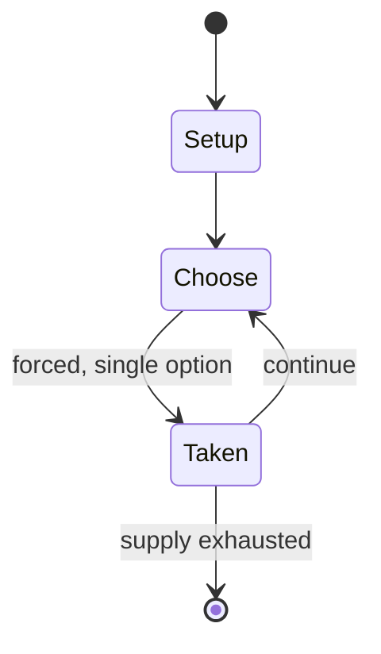

# Connect Four

`connect_four` &nbsp; state: **DEEPENED** &nbsp; method: **heuristic**

## Found layer (recorded, not trusted)

| field | value |
| --- | --- |
| wikidata | Q17254 |
| wikipedia | Connect Four |
| genres (source) | -- |
| instance of (source) | -- |
| country of origin | -- |

## Declared layer (orders bench work)

| field | value |
| --- | --- |
| year created | -- |
| epoch | -- |
| region | -- |
| media | BOARD, VIDEO |
| players | 4 |
| age band | -- |
| exogenous process | NONE |
| loss shape | -- |
| live axes | SPATIAL |
| horizon | -- |
| scoring shape | -- |
| information | PERFECT |
| interaction | SOLITAIRE |
| turn structure | TICK_BASED |
| tractability | EXACT |
| randomness | HIDDEN_INFO, NONE |
| luck factor | 0.05 |
| rules complexity | 2.7 |
| strategic depth | 2.65 |
| novelty | 0.908 |
| solved status | SOLVED_STRONG |
| strategies | blocking |
| algorithms | alpha_beta, minimax |

## Object model

```
Episode
  players      : 4
  turn_structure: TICK_BASED
  horizon       : ?
  scoring       : ?

Board          -- spatial substrate; cells carry position and occupancy
Piece          -- movable token owned by a player
WorldState     -- simulation state advanced by the engine
Avatar         -- player-controlled agent
Clock          -- frame or tick counter
Placement      -- position subject to geometric legality
```

## State transition diagram



## Research item -- clock trace

```
# Connect Four -- simulated clock trace (no turn boundary)
# generated from the DECLARED vector, not from a rulebook.
# structure: exo=NONE loss=None horizon=None scoring=None axes=SPATIAL

clk=0.000s  START        agents=4  clock=free running
clk=2.038s  SCORE        a3 scores (+1)
clk=2.339s  ACTION       a3 acts continuously; no turn boundary crossed
clk=4.650s  ACTION       a3 acts continuously; no turn boundary crossed
clk=5.483s  CONTEST      a2 and a3 contend for the same resource
clk=8.085s  INFRACTION   a1 commits infraction (count=1)
clk=8.641s  CONTEST      a4 and a1 contend for the same resource
clk=10.423s  ACTION       a1 acts continuously; no turn boundary crossed
clk=13.231s  ACTION       a3 acts continuously; no turn boundary crossed
clk=15.604s  ACTION       a3 acts continuously; no turn boundary crossed
clk=18.157s  CONTEST      a3 and a4 contend for the same resource
clk=19.184s  STOPPAGE     clock halts; state frozen
clk=22.171s  CONTEST      a3 and a4 contend for the same resource
clk=24.595s  STOPPAGE     clock halts; state frozen
clk=26.303s  INFRACTION   a2 commits infraction (count=1)
clk=28.817s  STOPPAGE     clock halts; state frozen
clk=30.268s  CONTEST      a4 and a1 contend for the same resource
clk=32.760s  INFRACTION   a1 commits infraction (count=2)
clk=33.057s  STOPPAGE     clock halts; state frozen
clk=33.850s  STOPPAGE     clock halts; state frozen
clk=34.489s  ACTION       a1 acts continuously; no turn boundary crossed
clk=37.187s  INFRACTION   a2 commits infraction (count=2)
clk=38.505s  CONTEST      a1 and a2 contend for the same resource
clk=40.233s  ACTION       a3 acts continuously; no turn boundary crossed
clk=41.642s  ACTION       a3 acts continuously; no turn boundary crossed
clk=44.173s  ACTION       a1 acts continuously; no turn boundary crossed
clk=44.896s  ACTION       a3 acts continuously; no turn boundary crossed

note: elapsed time, not move count, is the episode's ordering variable.
```

## Conditions

| kind | threshold | effect | trigger |
| --- | --- | --- | --- |
| WIN | 2 players | -- | The two players then alternate turns dropping one of their discs at a time into an unfilled column, until the second player, with red discs, achieves a diagonal four in a row, and wins the game. |
| WIN | -- | -- | But, look out – your opponent can sneak up on you and win the game! |
| WIN | -- | -- | The first player to connect four of their discs horizontally, vertically, or diagonally wins the game. |
| WIN | -- | -- | The first player to set aside ten discs of their color wins the game. |

## Source extract

Connect Four (also known as Connect 4, Four Up, Plot Four, Find Four, Captain's Mistress, Four
in a Row, Drop Four, and, in the Soviet Union, Gravitrips) is a game in which the players choose
a color and then take turns dropping colored tokens into a six-row, seven-column vertically
suspended grid. The pieces fall straight down, occupying the lowest available space within the
column. The objective of the game is to be the first to form a horizontal, vertical, or diagonal
line of four of one's own tokens. It is therefore a type of m,n,k-game (7, 6, 4) with restricted
piece placement. Connect Four is a solved game; the first player can always win by playing the
right moves. The game was created by Howard Wexler, and first sold under the Connect Four
trademark by Milton Bradley in February 1974.   == Gameplay == Object: Connect four of your
discs in a row while preventing your opponent from doing the same. But, look out – your opponent
can sneak up on you and win the game! A gameplay example (below right) shows the first player
starting Connect Four by dropping one of their yellow discs into the center column of an empty
game board. The two players then alternate turns dropping one of

<sub>Wikipedia, CC BY-SA. Retained as evidence for the structural
classification above. Every rule inferred from it is HYPOTHESIZED
until audited against a rulebook.</sub>
