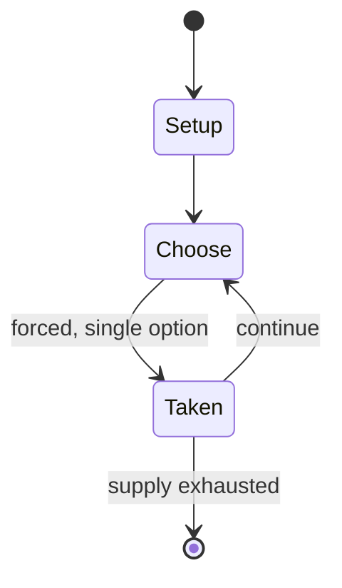

# Coral Sea

*board wargame*

`coral_sea` &nbsp; state: **DEEPENED** &nbsp; method: **heuristic**

## Found layer (recorded, not trusted)

| field | value |
| --- | --- |
| wikidata | Q112205643 |
| wikipedia | Coral Sea (wargame) |
| genres (source) | -- |
| instance of (source) | board wargame |
| country of origin | -- |

## Declared layer (orders bench work)

| field | value |
| --- | --- |
| year created | 1974 |
| epoch | DIGITAL |
| region | -- |
| media | WARGAME |
| players | -- |
| age band | -- |
| exogenous process | -- |
| loss shape | -- |
| live axes | SPATIAL |
| horizon | -- |
| scoring shape | -- |
| information | ASYMMETRIC |
| interaction | COMPETITIVE |
| turn structure | PHASE_STRUCTURED |
| tractability | SAMPLING_ONLY |
| randomness | DICE |
| luck factor | 0.58 |
| rules complexity | 3.92 |
| strategic depth | 1.87 |
| novelty | 0.633 |
| solved status | -- |
| strategies | -- |
| algorithms | -- |

## Object model

```
Episode
  players      : ?
  turn_structure: PHASE_STRUCTURED
  horizon       : ?
  scoring       : ?

Placement      -- position subject to geometric legality
```

## State transition diagram



## Research item -- turn trace

```
# Coral Sea -- simulated turn events
# generated from the DECLARED vector, not from a rulebook.
# structure: exo=None loss=None horizon=None scoring=None axes=SPATIAL

t=0    SETUP        players=2  pot=0  capacity=8
t=1    FORCED       p1 single legal option taken (pot_gain=+0.9)
t=2    SPATIAL      p1 places at (4,1); adjacency legal
t=3    FORCED       p1 single legal option taken (pot_gain=+2.0)
t=4    SPATIAL      p1 places at (4,4); adjacency legal
t=5    FORCED       p1 single legal option taken (pot_gain=+1.3)
t=6    ENDTURN      turn passes to p2
t=7    FORCED       p2 single legal option taken (pot_gain=+0.9)
t=8    SPATIAL      p2 places at (3,2); adjacency legal
t=9    FORCED       p2 single legal option taken (pot_gain=+0.6)
t=10   FORCED       p2 single legal option taken (pot_gain=+1.5)
t=11   SPATIAL      p2 places at (2,3); adjacency legal
t=12   FORCED       p2 single legal option taken (pot_gain=+1.3)
t=13   SPATIAL      p2 places at (2,7); adjacency legal
t=14   ENDTURN      turn passes to p1
t=15   FORCED       p1 single legal option taken (pot_gain=+0.5)
t=16   FORCED       p1 single legal option taken (pot_gain=+1.1)
t=17   FORCED       p1 single legal option taken (pot_gain=+1.0)
t=18   SPATIAL      p1 places at (4,5); adjacency legal
t=19   FORCED       p1 single legal option taken (pot_gain=+2.0)
t=20   FORCED       p1 single legal option taken (pot_gain=+0.8)
t=21   SPATIAL      p1 places at (1,5); adjacency legal
t=22   FORCED       p1 single legal option taken (pot_gain=+1.3)
t=23   FORCED       p1 single legal option taken (pot_gain=+0.7)
t=24   SPATIAL      p1 places at (3,5); adjacency legal
t=25   FORCED       p1 single legal option taken (pot_gain=+1.5)
t=26   FORCED       p1 single legal option taken (pot_gain=+1.1)
t=27   ENDTURN      turn passes to p2

terminal: VARIABLE
```

## Source extract

Coral Sea, subtitled "Turning the Japanese Advance, 1942", is a board wargame published by Game
Designers' Workshop (GDW) in 1974 that simulates the Battle of the Coral Sea in the Pacific
Theater of World War II.   == Background == In May 1942, Japanese and American aircraft carrier
fleets engaged in long-distance combat in the area of the Coral Sea, the first action in which
aircraft carriers engaged each other and the first in which the opposing ships neither sighted
nor fired directly upon one another.   == Description == Coral Sea is a two-player wargame in
which one player controls the Japanese fleet, and the other player controls the American fleet.
=== Components === The ziplock bag contains:  22" x 28" paper hex grid map scaled at 40 mi (65
km) per hex 240 die-cut counters rulebook various charts and player aids   === Gameplay === The
game has two phases. First the opposing fleets must be located. While aircraft on the map can
always be seen by both players, fleets are hidden, and players use the numbered hex grid system
to track their fleet movements. Fleet locations are only revealed when spotted by aircraft,
reconnaissance ships or coast watchers. Once a fleet has been

<sub>Wikipedia, CC BY-SA. Retained as evidence for the structural
classification above. Every rule inferred from it is HYPOTHESIZED
until audited against a rulebook.</sub>
