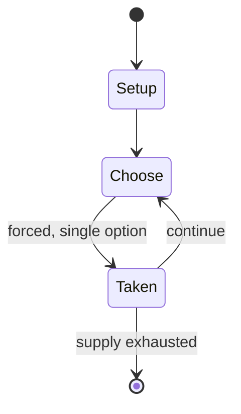

# Core War

*1984 video game*

`core_war` &nbsp; state: **DEEPENED** &nbsp; method: **heuristic**

## Found layer (recorded, not trusted)

| field | value |
| --- | --- |
| wikidata | Q1132500 |
| wikipedia | Core War |
| genres (source) | programming game |
| instance of (source) | video game |
| country of origin | Canada |

## Declared layer (orders bench work)

| field | value |
| --- | --- |
| year created | 1994 |
| epoch | DIGITAL |
| region | NORTH_AMERICA |
| media | VIDEO |
| players | -- |
| age band | CHILD |
| exogenous process | -- |
| loss shape | -- |
| live axes | COMMIT_BLIND |
| horizon | -- |
| scoring shape | SURVIVAL |
| information | -- |
| interaction | COMPETITIVE |
| turn structure | STRICT_TURN |
| tractability | SAMPLING_ONLY |
| randomness | -- |
| luck factor | 0.35 |
| rules complexity | 2.57 |
| strategic depth | 2.0 |
| novelty | 0.5986 |
| solved status | -- |
| strategies | -- |
| algorithms | -- |

## Object model

```
Episode
  players      : ?
  turn_structure: STRICT_TURN
  horizon       : ?
  scoring       : SURVIVAL

WorldState     -- simulation state advanced by the engine
Avatar         -- player-controlled agent
Clock          -- frame or tick counter
SealedChoice   -- irrevocable choice made without observation
```

## State transition diagram



## Research item -- turn trace

```
# Core War -- simulated turn events
# generated from the DECLARED vector, not from a rulebook.
# structure: exo=None loss=None horizon=None scoring=SURVIVAL axes=COMMIT_BLIND

t=0    SETUP        players=2  pot=0  capacity=7
t=1    FORCED       p1 single legal option taken (pot_gain=+0.9)
t=2    FORCED       p1 single legal option taken (pot_gain=+1.8)
t=3    FORCED       p1 single legal option taken (pot_gain=+1.9)
t=4    FORCED       p1 single legal option taken (pot_gain=+1.0)
t=5    ENDTURN      turn passes to p2
t=6    FORCED       p2 single legal option taken (pot_gain=+1.6)
t=7    ENDTURN      turn passes to p1
t=8    FORCED       p1 single legal option taken (pot_gain=+1.9)
t=9    ENDTURN      turn passes to p2
t=10   FORCED       p2 single legal option taken (pot_gain=+0.7)
t=11   FORCED       p2 single legal option taken (pot_gain=+1.8)
t=12   FORCED       p2 single legal option taken (pot_gain=+1.1)
t=13   FORCED       p2 single legal option taken (pot_gain=+0.7)
t=14   FORCED       p2 single legal option taken (pot_gain=+0.8)
t=15   FORCED       p2 single legal option taken (pot_gain=+0.9)
t=16   FORCED       p2 single legal option taken (pot_gain=+2.0)
t=17   FORCED       p2 single legal option taken (pot_gain=+1.0)
t=18   ENDTURN      turn passes to p1
t=19   FORCED       p1 single legal option taken (pot_gain=+1.0)
t=20   FORCED       p1 single legal option taken (pot_gain=+1.1)
t=21   FORCED       p1 single legal option taken (pot_gain=+1.0)
t=22   FORCED       p1 single legal option taken (pot_gain=+1.8)
t=23   FORCED       p1 single legal option taken (pot_gain=+1.1)
t=24   ENDTURN      turn passes to p2
t=25   FORCED       p2 single legal option taken (pot_gain=+0.5)
t=26   FORCED       p2 single legal option taken (pot_gain=+0.7)

terminal: VARIABLE
```

## Conditions

| kind | threshold | effect | trigger |
| --- | --- | --- | --- |
| BOUNDARY | -- | -- | The maximum address value is set to equal one less than the number of memory locations and will wrap around if necessary. |

## Source extract

Core War is a 1984 programming game created by D. G. Jones and A. K. Dewdney. In the game, two
or more battle programs, known as warriors, compete for control of a virtual computer. These
programs are written in an abstract assembly language called Redcode. Initial standards for
Redcode and the virtual machine were established by the International Core Wars Society (ICWS),
with later revisions shaped by community consensus.   == Gameplay == At the start of a match,
each warrior is loaded into a random memory location. Programs take turns executing one
instruction at a time. A program wins by terminating all opponents, typically by causing them to
execute invalid instructions, leaving the victorious program in sole possession of the machine.
Early versions of Redcode featured only eight instructions. This number increased to 10 in the
ICWS-86 standard, 11 in ICWS-88, and 16 in the 1994 draft standard, which is still widely used.
With various addressing modes and instruction modifiers introduced in the 1994 draft, the total
number of possible operations is 7168. Redcode does not define how instructions are represented
in memory, nor does it allow programs to inspect their own code st

<sub>Wikipedia, CC BY-SA. Retained as evidence for the structural
classification above. Every rule inferred from it is HYPOTHESIZED
until audited against a rulebook.</sub>
