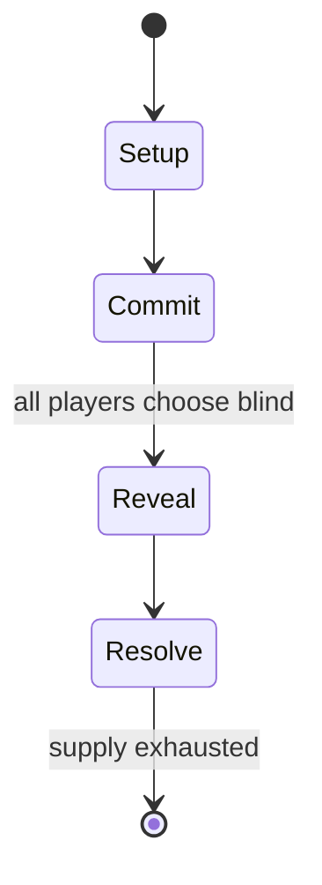

# correspondence chess

*slow chess played via paper postal system (one game taking weeks then) or e-mail*

`correspondence_chess` &nbsp; state: **DEEPENED** &nbsp; method: **heuristic**

## Found layer (recorded, not trusted)

| field | value |
| --- | --- |
| wikidata | Q1128406 |
| wikipedia | Correspondence chess |
| genres (source) | -- |
| instance of (source) | activity, board game, chess variant, play-by-mail game |
| country of origin | -- |

## Declared layer (orders bench work)

| field | value |
| --- | --- |
| year created | -- |
| epoch | -- |
| region | -- |
| media | BOARD |
| players | -- |
| age band | -- |
| exogenous process | -- |
| loss shape | -- |
| live axes | - |
| horizon | -- |
| scoring shape | WINNER_TAKE_ALL |
| information | -- |
| interaction | -- |
| turn structure | SIMULTANEOUS |
| tractability | SAMPLING_ONLY |
| randomness | SIMULTANEOUS_CHOICE |
| luck factor | 0.3 |
| rules complexity | 1.8 |
| strategic depth | 2.0 |
| novelty | 0.6525 |
| solved status | -- |
| strategies | -- |
| algorithms | -- |

## Object model

```
Episode
  players      : ?
  turn_structure: SIMULTANEOUS
  horizon       : ?
  scoring       : WINNER_TAKE_ALL

Board          -- spatial substrate; cells carry position and occupancy
Piece          -- movable token owned by a player
```

## State transition diagram



## Research item -- turn trace

```
# correspondence chess -- simulated turn events
# generated from the DECLARED vector, not from a rulebook.
# structure: exo=None loss=None horizon=None scoring=WINNER_TAKE_ALL axes=-

t=0    SETUP        players=2  pot=0  capacity=6
t=1    FORCED       p1 single legal option taken (pot_gain=+1.9)
t=2    FORCED       p1 single legal option taken (pot_gain=+0.9)
t=3    FORCED       p1 single legal option taken (pot_gain=+2.0)
t=4    FORCED       p1 single legal option taken (pot_gain=+1.4)
t=5    FORCED       p1 single legal option taken (pot_gain=+0.6)
t=6    ENDTURN      turn passes to p2
t=7    FORCED       p2 single legal option taken (pot_gain=+1.1)
t=8    ENDTURN      turn passes to p1
t=9    FORCED       p1 single legal option taken (pot_gain=+1.2)
t=10   FORCED       p1 single legal option taken (pot_gain=+1.4)
t=11   ENDTURN      turn passes to p2
t=12   FORCED       p2 single legal option taken (pot_gain=+1.1)
t=13   FORCED       p2 single legal option taken (pot_gain=+1.1)
t=14   FORCED       p2 single legal option taken (pot_gain=+1.8)
t=15   FORCED       p2 single legal option taken (pot_gain=+2.0)
t=16   ENDTURN      turn passes to p1
t=17   FORCED       p1 single legal option taken (pot_gain=+1.8)
t=18   ENDTURN      turn passes to p2
t=19   FORCED       p2 single legal option taken (pot_gain=+1.9)
t=20   FORCED       p2 single legal option taken (pot_gain=+0.5)
t=21   FORCED       p2 single legal option taken (pot_gain=+0.7)
t=22   FORCED       p2 single legal option taken (pot_gain=+1.8)
t=23   FORCED       p2 single legal option taken (pot_gain=+1.8)
t=24   FORCED       p2 single legal option taken (pot_gain=+1.0)
t=25   FORCED       p2 single legal option taken (pot_gain=+1.6)
t=26   ENDTURN      turn passes to p1

terminal: VARIABLE
```

## Source extract

Correspondence chess is chess played by various forms of long-distance correspondence,
traditionally through the postal system. Today it is usually played through a correspondence
chess server, a public internet chess forum, or email. Less common methods that have been
employed include fax, homing pigeon and phone. It is in contrast to over-the-board (OTB) chess,
where the players sit at a physical chessboard at the same time; and most online chess, where
the players play each other in real time over the internet. However, correspondence chess can
also be played online. Correspondence chess allows people or clubs who are geographically
distant to play one another without meeting in person. The length of a game played by
correspondence can vary depending on the method used to transmit moves: a game played via a
server or by email might last no more than a few days, weeks, or months; a game played by post
between players in different countries might last several years.   == Structure ==
Correspondence chess differs from over-the-board (OTB) play in several respects. While players
in OTB chess generally play one game at a time (an exception being a simultaneous exhibition),
correspond

<sub>Wikipedia, CC BY-SA. Retained as evidence for the structural
classification above. Every rule inferred from it is HYPOTHESIZED
until audited against a rulebook.</sub>
