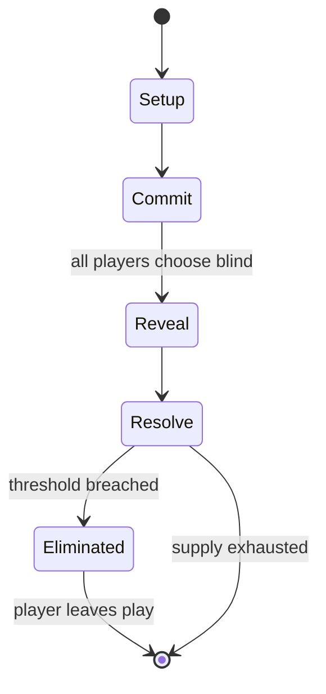

# Cosmic Wimpout

`cosmic_wimpout` &nbsp; state: **DEEPENED** &nbsp; method: **heuristic**

## Found layer (recorded, not trusted)

| field | value |
| --- | --- |
| wikidata | Q5174120 |
| wikipedia | Cosmic Wimpout |
| genres (source) | -- |
| instance of (source) | -- |
| country of origin | -- |

## Declared layer (orders bench work)

| field | value |
| --- | --- |
| year created | -- |
| epoch | -- |
| region | -- |
| media | DICE |
| players | -- |
| age band | -- |
| exogenous process | IID |
| loss shape | ELIMINATION |
| live axes | - |
| horizon | -- |
| scoring shape | NONLINEAR |
| information | -- |
| interaction | -- |
| turn structure | SIMULTANEOUS |
| tractability | EXACT_WITH_CUT |
| randomness | DICE |
| luck factor | 0.58 |
| rules complexity | 2.04 |
| strategic depth | 2.12 |
| novelty | 0.7705 |
| solved status | -- |
| strategies | set_collection |
| algorithms | -- |

## Object model

```
Episode
  players      : ?
  turn_structure: SIMULTANEOUS
  horizon       : ?
  scoring       : NONLINEAR

DicePool       -- n dice, each an iid categorical draw
Roll           -- realised outcome of a pool
```

## State transition diagram



## Research item -- turn trace

```
# Cosmic Wimpout -- simulated turn events
# generated from the DECLARED vector, not from a rulebook.
# structure: exo=IID loss=ELIMINATION horizon=None scoring=NONLINEAR axes=-

t=0    SETUP        players=2  pot=0  capacity=7
t=1    DRAW         p1 roll from d6 pool -> outcome #2  (p=0.249)
t=2    FORCED       p1 single legal option taken (pot_gain=+1.5)
t=3    DRAW         p1 roll from d6 pool -> outcome #1  (p=0.261)
t=4    FORCED       p1 single legal option taken (pot_gain=+0.6)
t=5    DRAW         p1 roll from d6 pool -> outcome #2  (p=0.126)
t=6    FORCED       p1 single legal option taken (pot_gain=+0.7)
t=7    DRAW         p1 roll from d6 pool -> outcome #2  (p=0.277)
t=8    FORCED       p1 single legal option taken (pot_gain=+1.7)
t=9    DRAW         p1 roll from d6 pool -> outcome #5  (p=0.247)
t=10   FORCED       p1 single legal option taken (pot_gain=+0.8)
t=11   DRAW         p1 roll from d6 pool -> outcome #5  (p=0.284)
t=12   FORCED       p1 single legal option taken (pot_gain=+1.1)
t=13   DRAW         p1 roll from d6 pool -> outcome #1  (p=0.012)
t=14   FORCED       p1 single legal option taken (pot_gain=+1.2)
t=15   DRAW         p1 roll from d6 pool -> outcome #1  (p=0.195)
t=16   FORCED       p1 single legal option taken (pot_gain=+1.8)
t=17   DRAW         p1 roll from d6 pool -> outcome #3  (p=0.131)
t=18   FORCED       p1 single legal option taken (pot_gain=+0.7)
t=19   DRAW         p1 roll from d6 pool -> outcome #5  (p=0.104)
t=20   FORCED       p1 single legal option taken (pot_gain=+1.0)
t=21   DRAW         p1 roll from d6 pool -> outcome #1  (p=0.223)
t=22   FORCED       p1 single legal option taken (pot_gain=+1.8)
t=23   DRAW         p1 roll from d6 pool -> outcome #5  (p=0.046)
t=24   FORCED       p1 single legal option taken (pot_gain=+1.8)
t=25   DRAW         p1 roll from d6 pool -> outcome #5  (p=0.043)
t=26   FORCED       p1 single legal option taken (pot_gain=+1.8)

terminal: VARIABLE
```

## Conditions

| kind | threshold | effect | trigger |
| --- | --- | --- | --- |
| BOUNDARY | 35 points | -- | You must score at least 35 points to get on the board. |
| ELIMINATE | -- | -- | However, rolling a freight train of 10's is called a "supernova", and considered too many points, resulting in that player instantly losing and being out of the game. |

## Source extract

Cosmic Wimpout is a dice game produced by C3, Inc in 1976. It is similar to 1000/5000/10000,
Farkle, Greed, Hot Dice, Squelch, Zilch, to name but a few. The game is played with five custom
dice, and may use a combination score board and rolling surface, in the form of a piece of cloth
or felt available in various colors and designs. Players supply their own game piece for score
keeping.   The game of Cosmic Wimpout has often been associated with the Berkeley area, the
Grateful Dead, and other free-form subcultures. An annual tournament takes place at the Green
River Festival in Greenfield, Massachusetts.   == Gameplay == The five Cosmic Wimpout dice are
referred to as "cubes". Four of the cubes have face values of "two swirls", "three triangular
glyphs", "four lightning bolts", "the number 5", "six stars", and "the number 10" - the fifth
cube, often a different colour, has a single "flaming sun" icon in place of the three triangular
glyphs. The general rules for the game have evolved since its inception and there have been
various minor modifications made to the colors and patterns of the face designs on the cubes.
=== Scoring === The game is played by rolling all five cubes and

<sub>Wikipedia, CC BY-SA. Retained as evidence for the structural
classification above. Every rule inferred from it is HYPOTHESIZED
until audited against a rulebook.</sub>
