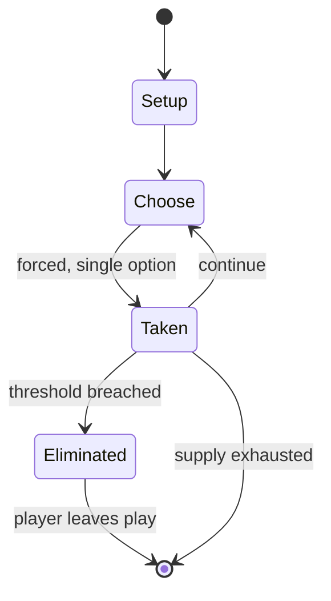

# Coucou

*French card game*

`coucou` &nbsp; state: **DEEPENED** &nbsp; method: **heuristic**

## Found layer (recorded, not trusted)

| field | value |
| --- | --- |
| wikidata | Q101149514 |
| wikipedia | Coucou |
| genres (source) | -- |
| instance of (source) | card game |
| country of origin | -- |

## Declared layer (orders bench work)

| field | value |
| --- | --- |
| year created | -- |
| epoch | -- |
| region | -- |
| media | CARD |
| players | -- |
| age band | -- |
| exogenous process | -- |
| loss shape | ELIMINATION |
| live axes | TRADE |
| horizon | VARIABLE |
| scoring shape | -- |
| information | -- |
| interaction | -- |
| turn structure | STRICT_TURN |
| tractability | SAMPLING_ONLY |
| randomness | -- |
| luck factor | -- |
| rules complexity | 2.17 |
| strategic depth | 2.25 |
| novelty | 0.6188 |
| solved status | -- |
| strategies | spatial_packing |
| algorithms | -- |

## Object model

```
Episode
  players      : ?
  turn_structure: STRICT_TURN
  horizon       : VARIABLE
  scoring       : ?

Deck           -- ordered multiset, drawn without replacement
Hand           -- private multiset held by one player
DiscardPile    -- public accumulation of spent cards
Offer          -- proposed exchange between two agents
```

## State transition diagram



## Research item -- turn trace

```
# Coucou -- simulated turn events
# generated from the DECLARED vector, not from a rulebook.
# structure: exo=None loss=ELIMINATION horizon=VARIABLE scoring=None axes=TRADE

t=0    SETUP        players=2  pot=0  capacity=4
t=1    FORCED       p1 single legal option taken (pot_gain=+1.9)
t=2    ENDTURN      turn passes to p2
t=3    FORCED       p2 single legal option taken (pot_gain=+1.3)
t=4    TRADE        p2 offers 2:1 exchange to p1
t=5    FORCED       p2 single legal option taken (pot_gain=+1.7)
t=6    TRADE        p2 offers 2:1 exchange to p1
t=7    ENDTURN      turn passes to p1
t=8    FORCED       p1 single legal option taken (pot_gain=+0.5)
t=9    ENDTURN      turn passes to p2
t=10   FORCED       p2 single legal option taken (pot_gain=+0.7)
t=11   TRADE        p2 offers 2:1 exchange to p1
t=12   FORCED       p2 single legal option taken (pot_gain=+1.3)
t=13   ENDTURN      turn passes to p1
t=14   FORCED       p1 single legal option taken (pot_gain=+0.8)
t=15   FORCED       p1 single legal option taken (pot_gain=+2.0)
t=16   FORCED       p1 single legal option taken (pot_gain=+1.9)
t=17   FORCED       p1 single legal option taken (pot_gain=+1.1)
t=18   FORCED       p1 single legal option taken (pot_gain=+0.9)
t=19   FORCED       p1 single legal option taken (pot_gain=+0.8)
t=20   ENDTURN      turn passes to p2
t=21   FORCED       p2 single legal option taken (pot_gain=+1.3)
t=22   FORCED       p2 single legal option taken (pot_gain=+1.7)
t=23   FORCED       p2 single legal option taken (pot_gain=+1.7)
t=24   TRADE        p2 offers 2:1 exchange to p1
t=25   ENDTURN      turn passes to p1
t=26   FORCED       p1 single legal option taken (pot_gain=+1.6)

terminal: VARIABLE
```

## Conditions

| kind | threshold | effect | trigger |
| --- | --- | --- | --- |
| ELIMINATE | 1 player | -- | The game ends when only one player remains in the game, all the others having been eliminated. |
| ELIMINATE | -- | eliminated | When a player has no chips remaining, they must withdraw from the game and are eliminated. |
| WIN | -- | -- | That player wins the game and sweeps the agreed stake. |

## Source extract

Coucou ("Cuckoo") is an historical French card game that uses a pack of 32 or 52 cards and is
played by five to twenty players. It is unusual for being played with only a single card in
hand. As a shedding game, there is only one winner who may claim the stakes, if there are any.
The game has also been called As Qui Court or Hère.   == History == The earliest references to
the game date to the early 16th century in France where it was known by the name of Mécontent
(also Méscontent, Maucontent or Malcontent) and was played with a standard 52-card deck. The
first rules appear under the name Hère in 1690 and as Coucou in 1721. The name As Qui Court
appears in the mid-19th century, but the name Coucou ("cuckoo") persisted and the game is still
played in France today under that name. The game migrated to England by 1881 as Ranter-Go-Round,
but is now also sometimes known as Cuckoo.   == Cards == The game uses a regular 52-card pack,
or a smaller 32-card deck (with 2s through 6s absent) if fewer than seven are playing. Suits are
not relevant; only the card ranks are important. Regardless of whether the 32 or 52 cards is
used, the lowest card is always the Ace and the highest the King.

<sub>Wikipedia, CC BY-SA. Retained as evidence for the structural
classification above. Every rule inferred from it is HYPOTHESIZED
until audited against a rulebook.</sub>
