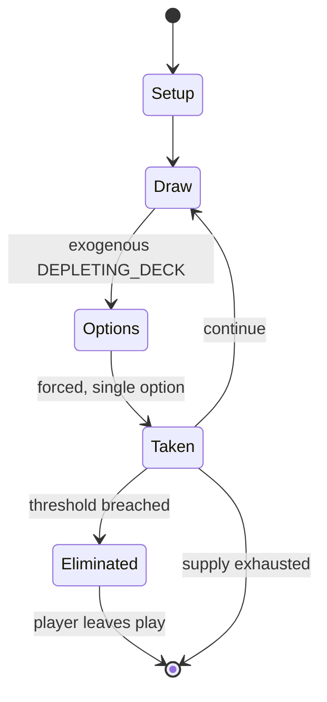

# Coup (card game)

`coup_card_game` &nbsp; state: **DEEPENED** &nbsp; method: **heuristic**

## Found layer (recorded, not trusted)

| field | value |
| --- | --- |
| wikidata | Q108581082 |
| wikipedia | Coup (card game) |
| genres (source) | -- |
| instance of (source) | -- |
| country of origin | -- |

## Declared layer (orders bench work)

| field | value |
| --- | --- |
| year created | 2012 |
| epoch | CONTEMPORARY |
| region | -- |
| media | BOARD, CARD |
| players | -- |
| age band | -- |
| exogenous process | DEPLETING_DECK |
| loss shape | ELIMINATION |
| live axes | BLUFF |
| horizon | -- |
| scoring shape | -- |
| information | IMPERFECT |
| interaction | SOLITAIRE |
| turn structure | STRICT_TURN |
| tractability | EXACT_WITH_CUT |
| randomness | DICE, HIDDEN_INFO |
| luck factor | 0.63 |
| rules complexity | 2.6 |
| strategic depth | 2.29 |
| novelty | 0.7444 |
| solved status | -- |
| strategies | bluffing, deduction |
| algorithms | -- |

## Object model

```
Episode
  players      : ?
  turn_structure: STRICT_TURN
  horizon       : ?
  scoring       : ?

Board          -- spatial substrate; cells carry position and occupancy
Piece          -- movable token owned by a player
Deck           -- ordered multiset, drawn without replacement
Hand           -- private multiset held by one player
DiscardPile    -- public accumulation of spent cards
Belief         -- what an observer is induced to think is true
```

## State transition diagram



## Research item -- turn trace

```
# Coup (card game) -- simulated turn events
# generated from the DECLARED vector, not from a rulebook.
# structure: exo=DEPLETING_DECK loss=ELIMINATION horizon=None scoring=None axes=BLUFF

t=0    SETUP        players=2  pot=0  capacity=4
t=1    DRAW         p1 draw from deck -> outcome #3  (p=0.040)
t=2    FORCED       p1 single legal option taken (pot_gain=+1.0)
t=3    DRAW         p1 draw from deck -> outcome #2  (p=0.201)
t=4    FORCED       p1 single legal option taken (pot_gain=+1.3)
t=5    DRAW         p1 draw from deck -> outcome #6  (p=0.257)
t=6    FORCED       p1 single legal option taken (pot_gain=+1.7)
t=7    DRAW         p1 draw from deck -> outcome #2  (p=0.260)
t=8    FORCED       p1 single legal option taken (pot_gain=+1.0)
t=9    DRAW         p1 draw from deck -> outcome #6  (p=0.113)
t=10   FORCED       p1 single legal option taken (pot_gain=+1.3)
t=11   BLUFF        p1 represents a holding it does not have
t=12   DRAW         p1 draw from deck -> outcome #6  (p=0.300)
t=13   FORCED       p1 single legal option taken (pot_gain=+1.1)
t=14   ENDTURN      turn passes to p2
t=15   DRAW         p2 draw from deck -> outcome #6  (p=0.102)
t=16   FORCED       p2 single legal option taken (pot_gain=+1.2)
t=17   BLUFF        p2 represents a holding it does not have
t=18   DRAW         p2 draw from deck -> outcome #3  (p=0.072)
t=19   FORCED       p2 single legal option taken (pot_gain=+1.5)
t=20   ENDTURN      turn passes to p1
t=21   DRAW         p1 draw from deck -> outcome #1  (p=0.184)
t=22   FORCED       p1 single legal option taken (pot_gain=+1.3)
t=23   DRAW         p1 draw from deck -> outcome #5  (p=0.080)
t=24   FORCED       p1 single legal option taken (pot_gain=+1.2)
t=25   ENDTURN      turn passes to p2
t=26   DRAW         p2 draw from deck -> outcome #5  (p=0.243)
t=27   FORCED       p2 single legal option taken (pot_gain=+0.8)
t=28   ENDTURN      turn passes to p1

terminal: VARIABLE
```

## Conditions

| kind | threshold | effect | trigger |
| --- | --- | --- | --- |
| ELIMINATE | 2 cards | -- | Players are given two cards and attempt to eliminate the other players by lying and calling their bluffs until only one player remains. |
| ELIMINATE | -- | eliminated | When a player loses both their character cards, that player is eliminated. |
| ELIMINATE | -- | -- | The winner is the remaining player after all others have been eliminated. |
| ELIMINATE | -- | -- | After the other faction has all been eliminated or converted, all remaining players within a faction descend into in-fighting, and the game proceeds as in Coup (2012). |

## Source extract

Coup is a social deduction card game designed by Rikki Tahta and published in 2012 by Indie
Boards & Cards and La Mame Games. Players are given two cards and attempt to eliminate the other
players by lying and calling their bluffs until only one player remains.   == Gameplay == Each
player has two face-down character cards, with the remaining cards being placed in a Court Deck
in the centre of the play area. Players take turns performing actions, while the other players
have the opportunity to challenge or enact a counteraction.   Some actions and counteractions
require a player to claim to have a specific character card (which they can do regardless of
whether or not they have it). Such claims can be challenged by anyone in the game, regardless of
whether they are directly involved in the action. If a player is challenged, they must prove
they had the played character card by revealing it from their face-down cards. If they can not
or do not want to prove it, they lose the challenge, but if they can, the challenger loses.
Whoever loses the challenge immediately loses one of their character cards. When a player loses
both their character cards, that player is eliminated. The winner

<sub>Wikipedia, CC BY-SA. Retained as evidence for the structural
classification above. Every rule inferred from it is HYPOTHESIZED
until audited against a rulebook.</sub>
