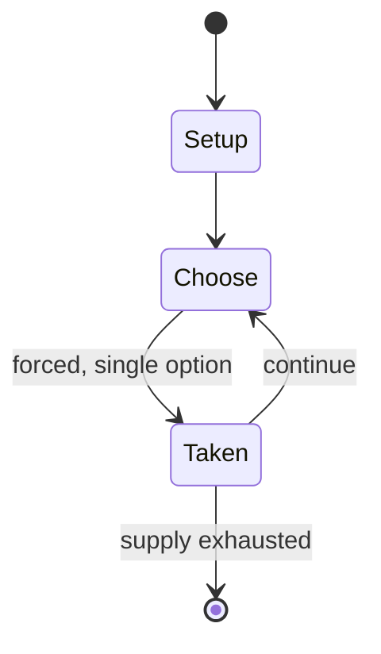

# Cram

*game*

`cram` &nbsp; state: **DEEPENED** &nbsp; method: **heuristic**

## Found layer (recorded, not trusted)

| field | value |
| --- | --- |
| wikidata | Q1106423 |
| wikipedia | Cram (game) |
| genres (source) | -- |
| instance of (source) | abstract strategy game |
| country of origin | -- |

## Declared layer (orders bench work)

| field | value |
| --- | --- |
| year created | -- |
| epoch | -- |
| region | -- |
| media | TILE |
| players | -- |
| age band | -- |
| exogenous process | -- |
| loss shape | -- |
| live axes | SPATIAL |
| horizon | -- |
| scoring shape | SET_COLLECTION_CONVEX |
| information | -- |
| interaction | -- |
| turn structure | STRICT_TURN |
| tractability | SAMPLING_ONLY |
| randomness | -- |
| luck factor | 0.35 |
| rules complexity | 2.08 |
| strategic depth | 2.5 |
| novelty | 0.5312 |
| solved status | -- |
| strategies | set_collection, signalling |
| algorithms | -- |

## Object model

```
Episode
  players      : ?
  turn_structure: STRICT_TURN
  horizon       : ?
  scoring       : SET_COLLECTION_CONVEX

TileBag        -- unordered draw source
Layout         -- placed tiles and their adjacencies
Placement      -- position subject to geometric legality
```

## State transition diagram



## Research item -- turn trace

```
# Cram -- simulated turn events
# generated from the DECLARED vector, not from a rulebook.
# structure: exo=None loss=None horizon=None scoring=SET_COLLECTION_CONVEX axes=SPATIAL

t=0    SETUP        players=2  pot=0  capacity=6
t=1    FORCED       p1 single legal option taken (pot_gain=+1.2)
t=2    FORCED       p1 single legal option taken (pot_gain=+1.8)
t=3    FORCED       p1 single legal option taken (pot_gain=+1.6)
t=4    FORCED       p1 single legal option taken (pot_gain=+2.0)
t=5    SPATIAL      p1 places at (2,1); adjacency legal
t=6    FORCED       p1 single legal option taken (pot_gain=+2.0)
t=7    FORCED       p1 single legal option taken (pot_gain=+0.9)
t=8    ENDTURN      turn passes to p2
t=9    FORCED       p2 single legal option taken (pot_gain=+2.0)
t=10   SPATIAL      p2 places at (1,1); adjacency legal
t=11   FORCED       p2 single legal option taken (pot_gain=+1.8)
t=12   SPATIAL      p2 places at (7,4); adjacency legal
t=13   FORCED       p2 single legal option taken (pot_gain=+1.9)
t=14   FORCED       p2 single legal option taken (pot_gain=+1.2)
t=15   SPATIAL      p2 places at (6,7); adjacency legal
t=16   FORCED       p2 single legal option taken (pot_gain=+1.8)
t=17   FORCED       p2 single legal option taken (pot_gain=+0.6)
t=18   SPATIAL      p2 places at (3,3); adjacency legal
t=19   FORCED       p2 single legal option taken (pot_gain=+1.2)
t=20   FORCED       p2 single legal option taken (pot_gain=+1.0)
t=21   FORCED       p2 single legal option taken (pot_gain=+0.6)
t=22   ENDTURN      turn passes to p1
t=23   FORCED       p1 single legal option taken (pot_gain=+0.6)
t=24   SPATIAL      p1 places at (2,7); adjacency legal
t=25   FORCED       p1 single legal option taken (pot_gain=+1.1)
t=26   FORCED       p1 single legal option taken (pot_gain=+1.3)

terminal: VARIABLE
```

## Conditions

| kind | threshold | effect | trigger |
| --- | --- | --- | --- |
| WIN | -- | -- | If Player 2 follows this strategy, Player 2 will always make the last move, and thus win the game. |

## Source extract

Cram is a mathematical game played on a sheet of graph paper (or any type of grid). It is the
impartial version of Domineering and the only difference in the rules is that players may place
their dominoes in either orientation, but it results in a very different game. It has been
called by many names, including "plugg" by Geoffrey Mott-Smith, and "dots-and-pairs".  Cram was
popularized by Martin Gardner in Scientific American.   == Rules == The game is played on a
sheet of graph paper, with any set of designs traced out. It is most commonly played on
rectangular board like a 6×6 square or a checkerboard, but it can also be played on an entirely
irregular polygon or a cylindrical board. Two players have a collection of dominoes which they
place on the grid in turn. A player can place a domino either horizontally or vertically.
Contrary to the related game of Domineering, the possible moves are the same for the two
players, and Cram is then an impartial game. As for all impartial games, there are two possible
conventions for victory: in the normal game, the first player who cannot move loses, and on the
contrary, in the misère version, the first player who cannot move wins.   == Symm

<sub>Wikipedia, CC BY-SA. Retained as evidence for the structural
classification above. Every rule inferred from it is HYPOTHESIZED
until audited against a rulebook.</sub>
