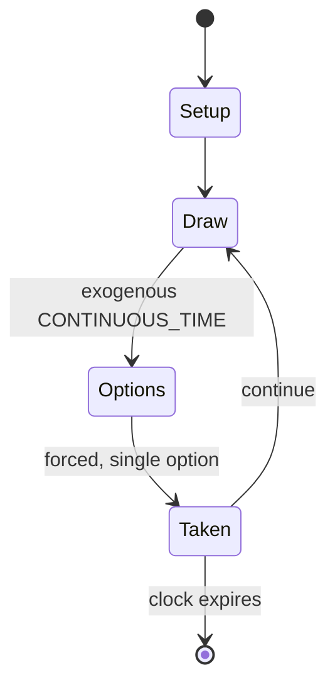

# Creature from the Black Lagoon

*pinball machine game*

`creature_from_the_black_lagoon` &nbsp; state: **DEEPENED** &nbsp; method: **heuristic**

## Found layer (recorded, not trusted)

| field | value |
| --- | --- |
| wikidata | Q5183641 |
| wikipedia | Creature from the Black Lagoon (pinball) |
| genres (source) | pinball video game |
| instance of (source) | pinball machine game, video game |
| country of origin | -- |

## Declared layer (orders bench work)

| field | value |
| --- | --- |
| year created | 1992 |
| epoch | DIGITAL |
| region | -- |
| media | PLAYGROUND, VIDEO |
| players | -- |
| age band | -- |
| exogenous process | CONTINUOUS_TIME |
| loss shape | -- |
| live axes | - |
| horizon | CLOCK_LIMITED |
| scoring shape | NONLINEAR |
| information | -- |
| interaction | COOPERATIVE |
| turn structure | -- |
| tractability | SAMPLING_ONLY |
| randomness | REAL_TIME_PHYSICAL |
| luck factor | 0.3 |
| rules complexity | 2.09 |
| strategic depth | 2.0 |
| novelty | 0.7706 |
| solved status | -- |
| strategies | -- |
| algorithms | -- |

## Object model

```
Episode
  players      : ?
  turn_structure: ?
  horizon       : CLOCK_LIMITED
  scoring       : NONLINEAR

WorldState     -- simulation state advanced by the engine
Avatar         -- player-controlled agent
Clock          -- frame or tick counter
```

## State transition diagram



## Research item -- turn trace

```
# Creature from the Black Lagoon -- simulated turn events
# generated from the DECLARED vector, not from a rulebook.
# structure: exo=CONTINUOUS_TIME loss=None horizon=CLOCK_LIMITED scoring=NONLINEAR axes=-

t=0    SETUP        players=2  pot=0  capacity=8
t=1    DRAW         p1 tick from clock -> outcome #6  (p=0.202)
t=2    FORCED       p1 single legal option taken (pot_gain=+1.6)
t=3    ENDTURN      turn passes to p2
t=4    DRAW         p2 tick from clock -> outcome #1  (p=0.266)
t=5    FORCED       p2 single legal option taken (pot_gain=+0.6)
t=6    DRAW         p2 tick from clock -> outcome #4  (p=0.292)
t=7    FORCED       p2 single legal option taken (pot_gain=+1.8)
t=8    DRAW         p2 tick from clock -> outcome #3  (p=0.238)
t=9    FORCED       p2 single legal option taken (pot_gain=+1.4)
t=10   ENDTURN      turn passes to p1
t=11   DRAW         p1 tick from clock -> outcome #5  (p=0.261)
t=12   FORCED       p1 single legal option taken (pot_gain=+1.3)
t=13   ENDTURN      turn passes to p2
t=14   DRAW         p2 tick from clock -> outcome #1  (p=0.147)
t=15   FORCED       p2 single legal option taken (pot_gain=+0.8)
t=16   ENDTURN      turn passes to p1
t=17   DRAW         p1 tick from clock -> outcome #5  (p=0.125)
t=18   FORCED       p1 single legal option taken (pot_gain=+1.5)
t=19   DRAW         p1 tick from clock -> outcome #3  (p=0.079)
t=20   FORCED       p1 single legal option taken (pot_gain=+1.6)
t=21   DRAW         p1 tick from clock -> outcome #2  (p=0.138)
t=22   FORCED       p1 single legal option taken (pot_gain=+2.0)
t=23   ENDTURN      turn passes to p2
t=24   DRAW         p2 tick from clock -> outcome #2  (p=0.109)
t=25   FORCED       p2 single legal option taken (pot_gain=+1.2)
t=26   ENDTURN      turn passes to p1

terminal: CLOCK_LIMITED
```

## Conditions

| kind | threshold | effect | trigger |
| --- | --- | --- | --- |
| BOUNDARY | -- | -- | The Jackpot is set to 40 million at the start of the game and can be increased by hitting the jet bumpers, to a maximum of 1 billion. |
| BOUNDARY | -- | -- | During multiball, shots to the left ramp feed into a small whirlpool above the right flipper, adding letters to the word CREATURE for every revolution; once the word is completed, the playfield multiplier is increased by |
| BOUNDARY | -- | -- | The first shot sets the combo value at 500,000, and each successive shot doubles it to a maximum of 16 million. |
| BOUNDARY | -- | -- | The first spin is worth 5 million, and the value increases by this amount per spin to a maximum of 35 million, after which no more points are awarded. |

## Source extract

Creature from the Black Lagoon is a pinball machine designed by John Trudeau ("Dr. Flash") and
released by Midway (under the Bally brand name). It is loosely based on the movie of the same
name. The game's theme is 1950s drive-in theater. The pinball game was licensed from Universal
Studios by Bally so that all backglass and cabinet artwork and creature depictions would
resemble those of the original movie.   == Design == The game is set at the Starlight drive-in
theatre.   === Hologram === The centerpiece of the table's playfield is a holographic depiction
of the titular Creature, illuminated and in motion during multiball play within its "Black
Lagoon habitat" (the space beneath the playfield visible through a customized window). The green
hologram was produced by Polaroid and is affixed to a metal plate that is divided into three
sections which are designed so that the hologram appears to float. A cam behind one section
presses against the back of the plate, gently bending the hologram's surface, so that the
Creature appears to "ripple" as if underwater and to swipe at the player with its claw. A second
motor mounted in the bottom of the cabinet oscillates the light-reflecting m

<sub>Wikipedia, CC BY-SA. Retained as evidence for the structural
classification above. Every rule inferred from it is HYPOTHESIZED
until audited against a rulebook.</sub>
