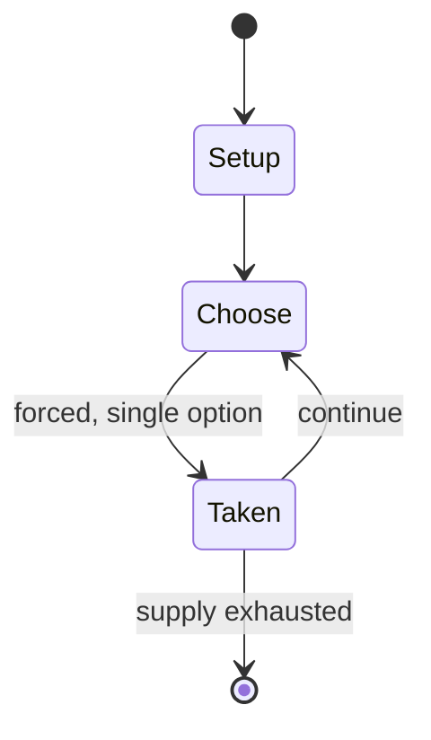

# cribbage

*English two-player card game using a wooden board with pegs*

`cribbage` &nbsp; state: **DEEPENED** &nbsp; method: **heuristic**

## Found layer (recorded, not trusted)

| field | value |
| --- | --- |
| wikidata | Q1139885 |
| wikipedia | Cribbage |
| genres (source) | -- |
| instance of (source) | card game |
| country of origin | Kingdom of England |

## Declared layer (orders bench work)

| field | value |
| --- | --- |
| year created | -- |
| epoch | -- |
| region | EUROPE_WEST |
| media | CARD |
| players | 2 |
| age band | -- |
| exogenous process | NONE |
| loss shape | OPPORTUNITY_ONLY |
| live axes | ORDER |
| horizon | VARIABLE |
| scoring shape | SET_COLLECTION_CONVEX |
| information | PERFECT |
| interaction | SOLITAIRE |
| turn structure | STRICT_TURN |
| tractability | EXACT_WITH_CUT |
| randomness | NONE |
| luck factor | 0.02 |
| rules complexity | 2.46 |
| strategic depth | 3.15 |
| novelty | 0.7801 |
| solved status | -- |
| strategies | probability_estimation, set_collection, spatial_packing |
| algorithms | -- |

## Object model

```
Episode
  players      : 2
  turn_structure: STRICT_TURN
  horizon       : VARIABLE
  scoring       : SET_COLLECTION_CONVEX

Deck           -- ordered multiset, drawn without replacement
Hand           -- private multiset held by one player
DiscardPile    -- public accumulation of spent cards
Sequence       -- the permutation under the player's control
```

## State transition diagram



## Research item -- turn trace

```
# cribbage -- simulated turn events
# generated from the DECLARED vector, not from a rulebook.
# structure: exo=NONE loss=OPPORTUNITY_ONLY horizon=VARIABLE scoring=SET_COLLECTION_CONVEX axes=ORDER

t=0    SETUP        players=2  pot=0  capacity=6
t=1    FORCED       p1 single legal option taken (pot_gain=+1.5)
t=2    FORCED       p1 single legal option taken (pot_gain=+1.2)
t=3    ENDTURN      turn passes to p2
t=4    FORCED       p2 single legal option taken (pot_gain=+1.5)
t=5    FORCED       p2 single legal option taken (pot_gain=+2.0)
t=6    FORCED       p2 single legal option taken (pot_gain=+1.3)
t=7    FORCED       p2 single legal option taken (pot_gain=+0.8)
t=8    FORCED       p2 single legal option taken (pot_gain=+0.6)
t=9    FORCED       p2 single legal option taken (pot_gain=+0.9)
t=10   FORCED       p2 single legal option taken (pot_gain=+0.6)
t=11   ENDTURN      turn passes to p1
t=12   FORCED       p1 single legal option taken (pot_gain=+1.0)
t=13   FORCED       p1 single legal option taken (pot_gain=+1.1)
t=14   ENDTURN      turn passes to p2
t=15   FORCED       p2 single legal option taken (pot_gain=+0.9)
t=16   ENDTURN      turn passes to p1
t=17   FORCED       p1 single legal option taken (pot_gain=+0.7)
t=18   ENDTURN      turn passes to p2
t=19   FORCED       p2 single legal option taken (pot_gain=+0.7)
t=20   FORCED       p2 single legal option taken (pot_gain=+1.6)
t=21   FORCED       p2 single legal option taken (pot_gain=+1.8)
t=22   FORCED       p2 single legal option taken (pot_gain=+1.8)
t=23   FORCED       p2 single legal option taken (pot_gain=+1.5)
t=24   ENDTURN      turn passes to p1
t=25   FORCED       p1 single legal option taken (pot_gain=+1.5)
t=26   ENDTURN      turn passes to p2

terminal: VARIABLE
```

## Conditions

| kind | threshold | effect | trigger |
| --- | --- | --- | --- |
| WIN | 121 points | -- | If a player triple skunks their opponent (reaches 121 points before their opponent reaches 31 points), they automatically win the match. |
| TERMINATE | 1 player | -- | If one player reaches the target (usually 61 or 121), the game ends immediately and that player wins. |
| WIN | -- | -- | The objective of the game is to be the first player to score a target number of points, typically 61 or 121. |
| TERMINATE | -- | -- | At any time during any of these stages, if a player reaches the target score (usually 121), play ends immediately with that player being the winner of the game. |

## Source extract

Cribbage, or crib, is a card game, traditionally for two players, that involves playing and
grouping cards in combinations which gain points.  It can be adapted for three or four players.
Cribbage has several distinctive features, including the cribbage board used for score-keeping;
the crib, box, or kitty; two distinct scoring stages; and a unique scoring system, including
points for groups of cards that total 15. The game has relatively few rules yet many subtleties,
which accounts for its ongoing appeal and popularity. Tactical play varies, depending on which
cards one's opponent has played, how many cards in the remaining pack will help the hand one
holds, and what one's position on the board is. A game may be decided by a single point, and the
edge often goes to an experienced player who utilizes strategy, including calculating odds and
making decisions based on the relative positions of players on the board. Both cribbage and its
close relative costly colours are descended from the old English card game of noddy. Cribbage
added the distinctive feature of a crib and changed the scoring system for points, whereas
costly colours added more combinations but retained the original

<sub>Wikipedia, CC BY-SA. Retained as evidence for the structural
classification above. Every rule inferred from it is HYPOTHESIZED
until audited against a rulebook.</sub>
