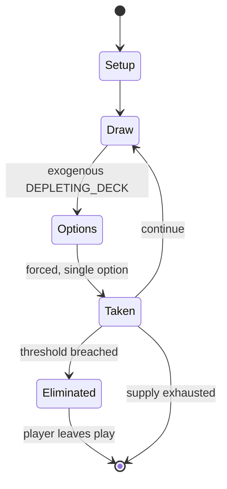

# crokinole

*table top disk-flicking game*

`crokinole` &nbsp; state: **DEEPENED** &nbsp; method: **heuristic**

## Found layer (recorded, not trusted)

| field | value |
| --- | --- |
| wikidata | Q3890237 |
| wikipedia | Crokinole |
| genres (source) | -- |
| instance of (source) | board game, game of skill |
| country of origin | Canada |

## Declared layer (orders bench work)

| field | value |
| --- | --- |
| year created | -- |
| epoch | -- |
| region | NORTH_AMERICA |
| media | BOARD, DEXTERITY |
| players | -- |
| age band | -- |
| exogenous process | DEPLETING_DECK |
| loss shape | ELIMINATION |
| live axes | - |
| horizon | -- |
| scoring shape | -- |
| information | -- |
| interaction | COMPETITIVE |
| turn structure | STRICT_TURN |
| tractability | EXACT_WITH_CUT |
| randomness | DECK_SHUFFLE |
| luck factor | 0.48 |
| rules complexity | 2.02 |
| strategic depth | 2.0 |
| novelty | 0.7369 |
| solved status | -- |
| strategies | -- |
| algorithms | -- |

## Object model

```
Episode
  players      : ?
  turn_structure: STRICT_TURN
  horizon       : ?
  scoring       : ?

Board          -- spatial substrate; cells carry position and occupancy
Piece          -- movable token owned by a player
```

## State transition diagram



## Research item -- turn trace

```
# crokinole -- simulated turn events
# generated from the DECLARED vector, not from a rulebook.
# structure: exo=DEPLETING_DECK loss=ELIMINATION horizon=None scoring=None axes=-

t=0    SETUP        players=2  pot=0  capacity=3
t=1    DRAW         p1 draw from deck -> outcome #2  (p=0.244)
t=2    FORCED       p1 single legal option taken (pot_gain=+0.8)
t=3    DRAW         p1 draw from deck -> outcome #4  (p=0.220)
t=4    FORCED       p1 single legal option taken (pot_gain=+0.6)
t=5    ENDTURN      turn passes to p2
t=6    DRAW         p2 draw from deck -> outcome #1  (p=0.281)
t=7    FORCED       p2 single legal option taken (pot_gain=+1.7)
t=8    ENDTURN      turn passes to p1
t=9    DRAW         p1 draw from deck -> outcome #6  (p=0.100)
t=10   FORCED       p1 single legal option taken (pot_gain=+0.7)
t=11   DRAW         p1 draw from deck -> outcome #1  (p=0.039)
t=12   FORCED       p1 single legal option taken (pot_gain=+1.7)
t=13   DRAW         p1 draw from deck -> outcome #5  (p=0.293)
t=14   FORCED       p1 single legal option taken (pot_gain=+0.7)
t=15   DRAW         p1 draw from deck -> outcome #4  (p=0.085)
t=16   FORCED       p1 single legal option taken (pot_gain=+1.5)
t=17   DRAW         p1 draw from deck -> outcome #4  (p=0.004)
t=18   FORCED       p1 single legal option taken (pot_gain=+1.7)
t=19   DRAW         p1 draw from deck -> outcome #5  (p=0.281)
t=20   FORCED       p1 single legal option taken (pot_gain=+1.5)
t=21   DRAW         p1 draw from deck -> outcome #1  (p=0.272)
t=22   FORCED       p1 single legal option taken (pot_gain=+0.8)
t=23   ENDTURN      turn passes to p2
t=24   DRAW         p2 draw from deck -> outcome #3  (p=0.051)
t=25   FORCED       p2 single legal option taken (pot_gain=+1.9)
t=26   ENDTURN      turn passes to p1

terminal: VARIABLE
```

## Conditions

| kind | threshold | effect | trigger |
| --- | --- | --- | --- |
| TERMINATE | -- | -- | The top four in the playoffs advance to a final round robin to play each other, and the top two compete in the finals. |
| PENALTY | -- | -- | If unsuccessful, the shot disc is "fouled" and removed from the board, along with any of the player's other discs that were moved during the shot. |
| PENALTY | -- | -- | This is often called the "no hiding" rule, since it prevents players from placing their first shots where their opponent must traverse completely through the guarded centre ring to hit them and avoid fouling. |

## Source extract

Crokinole (  KROH-ki-nohl) is a disk-flicking dexterity board game, possibly of Canadian origin.
It is similar to the games of pitchnut, carrom, and pichenotte, with elements of shuffleboard
and curling reduced to table-top size. Players take turns shooting discs across the circular
playing surface, trying to land their discs in the higher-scoring regions of the board,
particularly the recessed centre hole of 20 points, while also attempting to knock opposing
discs off the board, and into the 'ditch'. In crokinole, the shooting is generally towards the
centre of the board, unlike carroms and pitchnut, where the shooting is towards the four outer
corner pockets, as in pool. Crokinole can also be played using cue sticks, and there is a
special category for cue stick participants at the World Crokinole Championships in Tavistock,
Ontario, Canada.   == Equipment ==  Board dimensions vary with a playing surface typically of
polished wood or laminate approximately 26 inches (660 mm) in diameter. The arrangement is 3
concentric rings worth 5, 10, and 15 points as you move in from the outside. There is a shallow
20-point hole at the centre. The inner 15-point ring is guarded with 8 small b

<sub>Wikipedia, CC BY-SA. Retained as evidence for the structural
classification above. Every rule inferred from it is HYPOTHESIZED
until audited against a rulebook.</sub>
