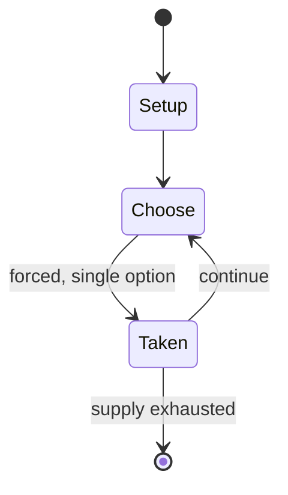

# Cry Havoc

*2016 board wargame*

`cry_havoc` &nbsp; state: **DEEPENED** &nbsp; method: **heuristic**

## Found layer (recorded, not trusted)

| field | value |
| --- | --- |
| wikidata | Q105846573 |
| wikipedia | Cry Havoc (2016 board game) |
| genres (source) | -- |
| instance of (source) | board wargame |
| country of origin | -- |

## Declared layer (orders bench work)

| field | value |
| --- | --- |
| year created | -- |
| epoch | -- |
| region | -- |
| media | BOARD, WARGAME |
| players | -- |
| age band | -- |
| exogenous process | -- |
| loss shape | -- |
| live axes | - |
| horizon | -- |
| scoring shape | -- |
| information | ASYMMETRIC |
| interaction | -- |
| turn structure | -- |
| tractability | SAMPLING_ONLY |
| randomness | -- |
| luck factor | 0.35 |
| rules complexity | 2.83 |
| strategic depth | 2.25 |
| novelty | 0.5245 |
| solved status | -- |
| strategies | area_control |
| algorithms | -- |

## Object model

```
Episode
  players      : ?
  turn_structure: ?
  horizon       : ?
  scoring       : ?

Board          -- spatial substrate; cells carry position and occupancy
Piece          -- movable token owned by a player
```

## State transition diagram



## Research item -- turn trace

```
# Cry Havoc -- simulated turn events
# generated from the DECLARED vector, not from a rulebook.
# structure: exo=None loss=None horizon=None scoring=None axes=-

t=0    SETUP        players=2  pot=0  capacity=6
t=1    FORCED       p1 single legal option taken (pot_gain=+1.8)
t=2    FORCED       p1 single legal option taken (pot_gain=+1.5)
t=3    FORCED       p1 single legal option taken (pot_gain=+1.4)
t=4    FORCED       p1 single legal option taken (pot_gain=+1.3)
t=5    ENDTURN      turn passes to p2
t=6    FORCED       p2 single legal option taken (pot_gain=+1.9)
t=7    FORCED       p2 single legal option taken (pot_gain=+1.3)
t=8    FORCED       p2 single legal option taken (pot_gain=+0.6)
t=9    FORCED       p2 single legal option taken (pot_gain=+1.4)
t=10   FORCED       p2 single legal option taken (pot_gain=+1.7)
t=11   FORCED       p2 single legal option taken (pot_gain=+0.7)
t=12   ENDTURN      turn passes to p1
t=13   FORCED       p1 single legal option taken (pot_gain=+0.7)
t=14   FORCED       p1 single legal option taken (pot_gain=+1.7)
t=15   FORCED       p1 single legal option taken (pot_gain=+1.5)
t=16   FORCED       p1 single legal option taken (pot_gain=+1.2)
t=17   FORCED       p1 single legal option taken (pot_gain=+0.8)
t=18   FORCED       p1 single legal option taken (pot_gain=+0.8)
t=19   FORCED       p1 single legal option taken (pot_gain=+1.1)
t=20   FORCED       p1 single legal option taken (pot_gain=+0.8)
t=21   FORCED       p1 single legal option taken (pot_gain=+0.7)
t=22   ENDTURN      turn passes to p2
t=23   FORCED       p2 single legal option taken (pot_gain=+1.8)
t=24   FORCED       p2 single legal option taken (pot_gain=+0.9)
t=25   FORCED       p2 single legal option taken (pot_gain=+1.7)
t=26   FORCED       p2 single legal option taken (pot_gain=+1.3)

terminal: VARIABLE
```

## Source extract

Cry Havoc is a 2016 science-fiction themed card-driven, asymmetric, area control wargame
published by Polish company Portal Games, designed by Grant Rodiek, Michał Oracz and Michał
Walczak. It won the 2016 Cardboard Republic Striker Laurel, 2016 Board Game Quest Awards Best
Tactical/Combat Game and 2017 Goblin Magnifico awards.   == References ==   == External links ==
Cry Havoc   at BoardGameGeek

<sub>Wikipedia, CC BY-SA. Retained as evidence for the structural
classification above. Every rule inferred from it is HYPOTHESIZED
until audited against a rulebook.</sub>
