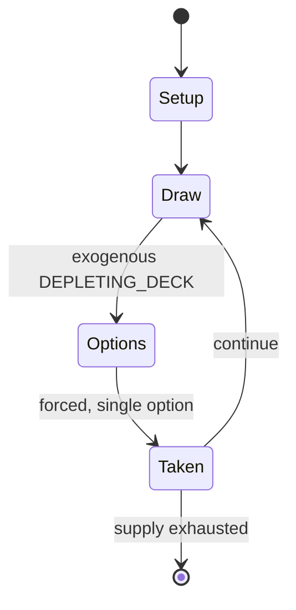

# Cuccù

*Italian card game*

`cucc` &nbsp; state: **DEEPENED** &nbsp; method: **heuristic**

## Found layer (recorded, not trusted)

| field | value |
| --- | --- |
| wikidata | Q118911729 |
| wikipedia | Cuccù |
| genres (source) | -- |
| instance of (source) | card game |
| country of origin | Italy |

## Declared layer (orders bench work)

| field | value |
| --- | --- |
| year created | -- |
| epoch | -- |
| region | EUROPE_SOUTH |
| media | CARD |
| players | -- |
| age band | -- |
| exogenous process | DEPLETING_DECK |
| loss shape | OPPORTUNITY_ONLY |
| live axes | BLUFF, TRADE |
| horizon | -- |
| scoring shape | -- |
| information | IMPERFECT |
| interaction | SOLITAIRE |
| turn structure | -- |
| tractability | EXACT_WITH_CUT |
| randomness | DECK_SHUFFLE |
| luck factor | 0.48 |
| rules complexity | 2.46 |
| strategic depth | 2.25 |
| novelty | 0.7644 |
| solved status | -- |
| strategies | spatial_packing |
| algorithms | -- |

## Object model

```
Episode
  players      : ?
  turn_structure: ?
  horizon       : ?
  scoring       : ?

Deck           -- ordered multiset, drawn without replacement
Hand           -- private multiset held by one player
DiscardPile    -- public accumulation of spent cards
Belief         -- what an observer is induced to think is true
Offer          -- proposed exchange between two agents
```

## State transition diagram



## Research item -- turn trace

```
# Cuccù -- simulated turn events
# generated from the DECLARED vector, not from a rulebook.
# structure: exo=DEPLETING_DECK loss=OPPORTUNITY_ONLY horizon=None scoring=None axes=BLUFF,TRADE

t=0    SETUP        players=2  pot=0  capacity=4
t=1    DRAW         p1 draw from deck -> outcome #3  (p=0.079)
t=2    FORCED       p1 single legal option taken (pot_gain=+1.0)
t=3    TRADE        p1 offers 2:1 exchange to p2
t=4    BLUFF        p1 represents a holding it does not have
t=5    DRAW         p1 draw from deck -> outcome #2  (p=0.281)
t=6    FORCED       p1 single legal option taken (pot_gain=+1.6)
t=7    BLUFF        p1 represents a holding it does not have
t=8    ENDTURN      turn passes to p2
t=9    DRAW         p2 draw from deck -> outcome #2  (p=0.151)
t=10   FORCED       p2 single legal option taken (pot_gain=+1.3)
t=11   DRAW         p2 draw from deck -> outcome #5  (p=0.242)
t=12   FORCED       p2 single legal option taken (pot_gain=+0.8)
t=13   DRAW         p2 draw from deck -> outcome #1  (p=0.213)
t=14   FORCED       p2 single legal option taken (pot_gain=+0.8)
t=15   TRADE        p2 offers 2:1 exchange to p1
t=16   DRAW         p2 draw from deck -> outcome #3  (p=0.258)
t=17   FORCED       p2 single legal option taken (pot_gain=+1.1)
t=18   TRADE        p2 offers 2:1 exchange to p1
t=19   DRAW         p2 draw from deck -> outcome #6  (p=0.285)
t=20   FORCED       p2 single legal option taken (pot_gain=+1.3)
t=21   DRAW         p2 draw from deck -> outcome #6  (p=0.232)
t=22   FORCED       p2 single legal option taken (pot_gain=+0.7)
t=23   TRADE        p2 offers 2:1 exchange to p1
t=24   DRAW         p2 draw from deck -> outcome #6  (p=0.285)
t=25   FORCED       p2 single legal option taken (pot_gain=+0.5)
t=26   TRADE        p2 offers 2:1 exchange to p1

terminal: VARIABLE
```

## Conditions

| kind | threshold | effect | trigger |
| --- | --- | --- | --- |
| WIN | -- | -- | The last player left in is the winner and sweeps the pool. |

## Source extract

Cuccù or Cucù ("Cuckoo") is an Italian card game, over 300 years old, that is playable by two to
twenty players and which uses a special pack of 40 cards. It is a comparing game in which there
is only one winner, and is unusual in that each player only receives one card.   == History ==
The origins of Cuccù lie in the French card game of Mécontent (Malcontent) whose first
references date to the early 16th century. The game, which is still played today, was also known
as Hère but eventually the name Coucou ("Cuckoo") prevailed. The game migrated to Italy, where
the earliest mention of "Malcontento" dates to 1547, but it was in the early 18th century that
the first dedicated decks for what became known as Cuccù (Cuccù, Cucco, Cucu' or Stu) appeared;
the pack consisting of 38 cards. These special Cuccù packs are the earliest surviving examples
of a family of non-suited packs, sometimes referred to as the Cambio family. They originally had
38 cards divided into two more-or-less identical sets of cards, each set comprising eleven
numeral cards, with Roman numerals from 0 (low) to X (high), and eight picture cards, the lion
of the modern pack being the missing card. The oldest known rule

<sub>Wikipedia, CC BY-SA. Retained as evidence for the structural
classification above. Every rule inferred from it is HYPOTHESIZED
until audited against a rulebook.</sub>
