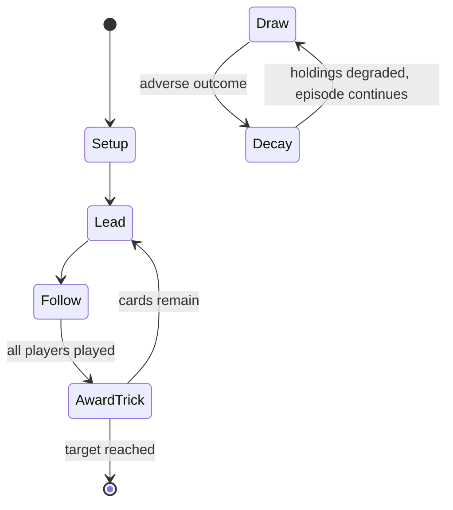

# Cucumber

*card game*

`cucumber` &nbsp; state: **DEEPENED** &nbsp; method: **heuristic**

## Found layer (recorded, not trusted)

| field | value |
| --- | --- |
| wikidata | Q17343013 |
| wikipedia | Cucumber (card game) |
| genres (source) | -- |
| instance of (source) | card game, trick-taking game |
| country of origin | -- |

## Declared layer (orders bench work)

| field | value |
| --- | --- |
| year created | -- |
| epoch | -- |
| region | -- |
| media | CARD |
| players | -- |
| age band | -- |
| exogenous process | DEPLETING_DECK |
| loss shape | PARTIAL_DECAY |
| live axes | - |
| horizon | RACE_TO_TARGET |
| scoring shape | NEGATIVE_AVOIDANCE |
| information | -- |
| interaction | -- |
| turn structure | TRICK_ROUND |
| tractability | EXACT_WITH_CUT |
| randomness | DECK_DEPLETING |
| luck factor | 0.48 |
| rules complexity | 1.79 |
| strategic depth | 2.25 |
| novelty | 0.8073 |
| solved status | -- |
| strategies | spatial_packing |
| algorithms | -- |

## Object model

```
Episode
  players      : ?
  turn_structure: TRICK_ROUND
  horizon       : RACE_TO_TARGET
  scoring       : NEGATIVE_AVOIDANCE

Deck           -- ordered multiset, drawn without replacement
Hand           -- private multiset held by one player
DiscardPile    -- public accumulation of spent cards
```

## State transition diagram



## Research item -- turn trace

```
# Cucumber -- simulated turn events
# generated from the DECLARED vector, not from a rulebook.
# structure: exo=DEPLETING_DECK loss=PARTIAL_DECAY horizon=RACE_TO_TARGET scoring=NEGATIVE_AVOIDANCE axes=-

t=0    SETUP        players=2  pot=0  capacity=5
t=1    DRAW         p1 draw from deck -> outcome #4  (p=0.048)
t=2    FORCED       p1 single legal option taken (pot_gain=+1.2)
t=3    ENDTURN      turn passes to p2
t=4    DRAW         p2 draw from deck -> outcome #6  (p=0.175)
t=5    FORCED       p2 single legal option taken (pot_gain=+1.8)
t=6    DRAW         p2 draw from deck -> outcome #5  (p=0.278)
t=7    FORCED       p2 single legal option taken (pot_gain=+0.9)
t=8    DRAW         p2 draw from deck -> outcome #1  (p=0.296)
t=9    FORCED       p2 single legal option taken (pot_gain=+0.8)
t=10   DRAW         p2 draw from deck -> outcome #1  (p=0.269)
t=11   FORCED       p2 single legal option taken (pot_gain=+1.0)
t=12   DRAW         p2 draw from deck -> outcome #6  (p=0.205)
t=13   FORCED       p2 single legal option taken (pot_gain=+0.9)
t=14   DRAW         p2 draw from deck -> outcome #6  (p=0.195)
t=15   FORCED       p2 single legal option taken (pot_gain=+0.8)
t=16   ENDTURN      turn passes to p1
t=17   DRAW         p1 draw from deck -> outcome #5  (p=0.155)
t=18   FORCED       p1 single legal option taken (pot_gain=+2.0)
t=19   DRAW         p1 draw from deck -> outcome #5  (p=0.175)
t=20   FORCED       p1 single legal option taken (pot_gain=+2.0)
t=21   DRAW         p1 draw from deck -> outcome #1  (p=0.052)
t=22   FORCED       p1 single legal option taken (pot_gain=+1.4)
t=23   ENDTURN      turn passes to p2
t=24   DRAW         p2 draw from deck -> outcome #2  (p=0.181)
t=25   FORCED       p2 single legal option taken (pot_gain=+0.8)
t=26   ENDTURN      turn passes to p1

terminal: RACE_TO_TARGET
```

## Conditions

| kind | threshold | effect | trigger |
| --- | --- | --- | --- |
| ELIMINATE | 30 points | out of the game | Once a player accumulates a total of 30 points or more, that player is out of the game. |
| WIN | 21 points | -- | Points: the first player to reach 21 points is 'cucumber' and loses the game. |
| BOUNDARY | 3 cards | -- | Cards: the dealer chooses how many cards are dealt to each player, but they must receive the same and at least 3 cards each. |
| BOUNDARY | -- | -- | A player can only do this once and may only do so if there are at least 3 other players still in. |
| PENALTY | -- | -- | In the last trick, the player who takes it by playing the highest card, scores penalty points to the value of that card, numerals scoring their face value, and the courts as follows: Jack 11, Queen 12, King, 13 and Ace 1 |
| PENALTY | -- | -- | If two or more players play the highest card to the last trick, they each score the penalty points due. |
| PENALTY | -- | -- | A player who is 'cucumbered' (i.e. reaches, not exceeds, 30 and drops out), may buy himself back in by paying a stake, but starts with a score equal to that of the player with the highest number of penalty points. |

## Source extract

Cucumber (Danish: Agurk, Swedish: Gurka) is a north European card game of Swedish origin for two
or more players. The goal of the game is to avoid taking the last trick. David Parlett describes
it as a "delightful Baltic gambling game".   == History and distribution == According to John
McLeod, the game may have originated in the 1940s as a way of playing Krypkille with a standard
52-card pack as opposed to the traditional Swedish Kille cards. Today the game is played in
different national variants under different names: as Agurk in Denmark, Gurka in Norway and
Sweden, Ogórek in Poland, Kurkku and Mätäpesä in Finland, and Gúrka in Iceland.   == Cards ==
Cucumber is played with a regular pack of French-suited playing cards without the Jokers. The
Ace is the highest, the Deuce, the lowest card. Suits are irrelevant.   == Rules == The basic
Danish rules are as follows: Deal and play are clockwise. Each player receives seven cards and
any remaining cards are set aside. Forehand leads to the first trick and everyone has to head
the trick if able, which they can do by playing a card of a higher or equal rank. A player who
cannot head the trick, plays the lowest card held. The player who

<sub>Wikipedia, CC BY-SA. Retained as evidence for the structural
classification above. Every rule inferred from it is HYPOTHESIZED
until audited against a rulebook.</sub>
