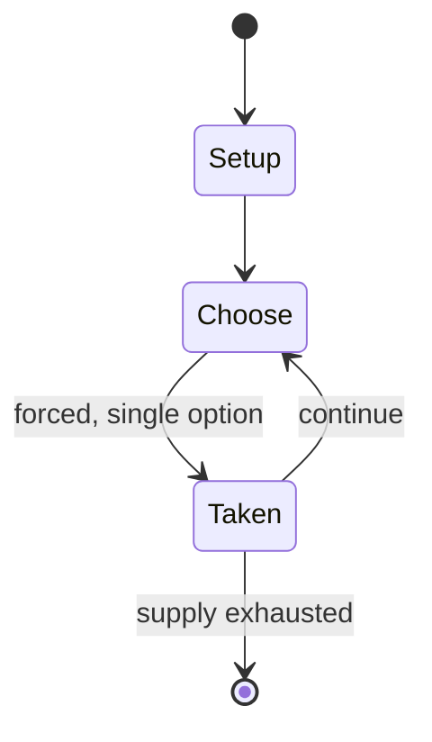

# Cue Ball Wizard

*pinball game*

`cue_ball_wizard` &nbsp; state: **DEEPENED** &nbsp; method: **heuristic**

## Found layer (recorded, not trusted)

| field | value |
| --- | --- |
| wikidata | Q20875565 |
| wikipedia | Cue Ball Wizard |
| genres (source) | -- |
| instance of (source) | video game |
| country of origin | -- |

## Declared layer (orders bench work)

| field | value |
| --- | --- |
| year created | 1992 |
| epoch | DIGITAL |
| region | -- |
| media | VIDEO |
| players | -- |
| age band | -- |
| exogenous process | -- |
| loss shape | -- |
| live axes | - |
| horizon | -- |
| scoring shape | -- |
| information | -- |
| interaction | -- |
| turn structure | -- |
| tractability | SAMPLING_ONLY |
| randomness | -- |
| luck factor | 0.35 |
| rules complexity | 1.7 |
| strategic depth | 2.0 |
| novelty | 0.0914 |
| solved status | -- |
| strategies | -- |
| algorithms | -- |

## Object model

```
Episode
  players      : ?
  turn_structure: ?
  horizon       : ?
  scoring       : ?

WorldState     -- simulation state advanced by the engine
Avatar         -- player-controlled agent
Clock          -- frame or tick counter
```

## State transition diagram



## Research item -- turn trace

```
# Cue Ball Wizard -- simulated turn events
# generated from the DECLARED vector, not from a rulebook.
# structure: exo=None loss=None horizon=None scoring=None axes=-

t=0    SETUP        players=2  pot=0  capacity=8
t=1    FORCED       p1 single legal option taken (pot_gain=+1.3)
t=2    FORCED       p1 single legal option taken (pot_gain=+1.1)
t=3    FORCED       p1 single legal option taken (pot_gain=+1.2)
t=4    FORCED       p1 single legal option taken (pot_gain=+0.7)
t=5    FORCED       p1 single legal option taken (pot_gain=+1.2)
t=6    ENDTURN      turn passes to p2
t=7    FORCED       p2 single legal option taken (pot_gain=+0.6)
t=8    FORCED       p2 single legal option taken (pot_gain=+1.8)
t=9    ENDTURN      turn passes to p1
t=10   FORCED       p1 single legal option taken (pot_gain=+0.6)
t=11   ENDTURN      turn passes to p2
t=12   FORCED       p2 single legal option taken (pot_gain=+1.1)
t=13   FORCED       p2 single legal option taken (pot_gain=+1.4)
t=14   FORCED       p2 single legal option taken (pot_gain=+1.7)
t=15   FORCED       p2 single legal option taken (pot_gain=+0.9)
t=16   FORCED       p2 single legal option taken (pot_gain=+1.1)
t=17   FORCED       p2 single legal option taken (pot_gain=+0.7)
t=18   FORCED       p2 single legal option taken (pot_gain=+1.7)
t=19   FORCED       p2 single legal option taken (pot_gain=+1.6)
t=20   FORCED       p2 single legal option taken (pot_gain=+0.9)
t=21   FORCED       p2 single legal option taken (pot_gain=+0.8)
t=22   FORCED       p2 single legal option taken (pot_gain=+0.6)
t=23   ENDTURN      turn passes to p1
t=24   FORCED       p1 single legal option taken (pot_gain=+1.3)
t=25   FORCED       p1 single legal option taken (pot_gain=+1.0)
t=26   ENDTURN      turn passes to p2

terminal: VARIABLE
```

## Source extract

Cue Ball Wizard is a pinball machine designed by Jon Norris and released in December 18 1992 by
Gottlieb. It features a cue sports theme and was advertised with the slogan "Gottlieb Presents
CUE BALL WIZARD!".   == Design == Cue Ball Wizard has a two and three ball Multiball and an
oscillating captive ball kicker at the upper playfield. Its most noticeable feature, a full-
sized captive cue ball that can be used to hit two elevated targets, is placed below on the
lower playfield. Due to the low cost of this cue ball feature, the budget for the game enabled
an elevated motorized turret to be added. The ramp is the game's most important shot, as it has
to be hit once to light it up for the wagon wheel award.   == Gameplay == The wagon wheel
contains all the modes the player must complete to reach Pool Ball Mania status. The game
includes two video modes. For one of these the player chooses an award from one of three
curtains, but the award is predetermined making the choice meaningless. In the other video mode
the player attempts to catch a series of four balls in a slow moving receptacle.   == Digital
versions == Cue Ball Wizard is one of seven Gottlieb tables recreated and released

<sub>Wikipedia, CC BY-SA. Retained as evidence for the structural
classification above. Every rule inferred from it is HYPOTHESIZED
until audited against a rulebook.</sub>
