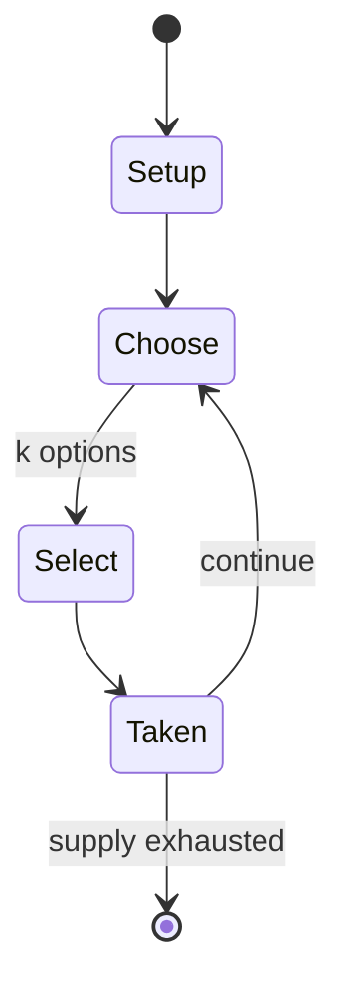

# Cups

*board game*

`cups` &nbsp; state: **DEEPENED** &nbsp; method: **heuristic**

## Found layer (recorded, not trusted)

| field | value |
| --- | --- |
| wikidata | Q1144394 |
| wikipedia | Cups (game) |
| genres (source) | -- |
| instance of (source) | board game, mancala |
| country of origin | -- |

## Declared layer (orders bench work)

| field | value |
| --- | --- |
| year created | 1965 |
| epoch | MODERN |
| region | -- |
| media | BOARD, MANCALA |
| players | 2 |
| age band | -- |
| exogenous process | -- |
| loss shape | -- |
| live axes | SELECT, SPATIAL |
| horizon | VARIABLE |
| scoring shape | -- |
| information | -- |
| interaction | COMPETITIVE |
| turn structure | -- |
| tractability | SAMPLING_ONLY |
| randomness | -- |
| luck factor | 0.35 |
| rules complexity | 2.37 |
| strategic depth | 2.25 |
| novelty | 0.0938 |
| solved status | -- |
| strategies | probability_estimation |
| algorithms | -- |

## Object model

```
Episode
  players      : 2
  turn_structure: ?
  horizon       : VARIABLE
  scoring       : ?

Board          -- spatial substrate; cells carry position and occupancy
Piece          -- movable token owned by a player
Pits           -- cyclic array of counts
Store          -- player's banked seeds
OptionSet      -- the choices available after an exogenous draw
Placement      -- position subject to geometric legality
```

## State transition diagram



## Research item -- turn trace

```
# Cups -- simulated turn events
# generated from the DECLARED vector, not from a rulebook.
# structure: exo=None loss=None horizon=VARIABLE scoring=None axes=SELECT,SPATIAL

t=0    SETUP        players=2  pot=0  capacity=7
t=1    SELECT       p1 2 options; take #2  (pot_gain=+1.3, capacity=-1)
t=2    SELECT       p1 4 options; take #1  (pot_gain=+2.6, capacity=-0)
t=3    SELECT       p1 4 options; take #1  (pot_gain=+2.8, capacity=-0)
t=4    SPATIAL      p1 places at (5,0); adjacency legal
t=5    ENDTURN      turn passes to p2
t=6    SELECT       p2 2 options; take #1  (pot_gain=+1.2, capacity=-2)
t=7    SELECT       p2 3 options; take #3  (pot_gain=+0.7, capacity=-1)
t=8    SPATIAL      p2 places at (1,3); adjacency legal
t=9    SELECT       p2 4 options; take #2  (pot_gain=+1.3, capacity=-0)
t=10   SELECT       p2 1 options; take #1  (pot_gain=+1.8, capacity=-0)
t=11   SPATIAL      p2 places at (5,5); adjacency legal
t=12   SELECT       p2 1 options; take #1  (pot_gain=+1.9, capacity=-2)
t=13   ENDTURN      turn passes to p1
t=14   SELECT       p1 2 options; take #2  (pot_gain=+0.8, capacity=-0)
t=15   SPATIAL      p1 places at (5,7); adjacency legal
t=16   SELECT       p1 3 options; take #3  (pot_gain=+3.4, capacity=-2)
t=17   SPATIAL      p1 places at (6,7); adjacency legal
t=18   SELECT       p1 2 options; take #2  (pot_gain=+0.6, capacity=-2)
t=19   SPATIAL      p1 places at (1,4); adjacency legal
t=20   SELECT       p1 2 options; take #2  (pot_gain=+3.4, capacity=-0)
t=21   SPATIAL      p1 places at (5,3); adjacency legal
t=22   SELECT       p1 4 options; take #2  (pot_gain=+2.1, capacity=-1)
t=23   SELECT       p1 1 options; take #1  (pot_gain=+1.8, capacity=-2)
t=24   SPATIAL      p1 places at (5,0); adjacency legal
t=25   SELECT       p1 1 options; take #1  (pot_gain=+2.3, capacity=-2)
t=26   SPATIAL      p1 places at (3,7); adjacency legal

terminal: VARIABLE
```

## Conditions

| kind | threshold | effect | trigger |
| --- | --- | --- | --- |
| TERMINATE | -- | -- | The game ends when neither player can make a move: a turn is always made if one is possible. |

## Source extract

Cups is a contemporary American two-ranked single-lap member of the ancient game family of
Mancala. It was one of several games invented in 1965 by father and son Arthur Amberstone and
Wald Amberstone who were both co-founders of the New York Gamers Association (N.Y.G.A.). They
also invented Power, and High Deck, a card game based on medieval society. At the time, both
were working as basket makers as well as game designers in New York City. This game was first
published in A Gamut of Games by Sid Sackson in 1969. Wald Amberstone co-founded the Tarot
School in 1995 along with his wife Ruth Amberstone.   == Rules ==   === Equipment ===  The Cups
board is constructed from ten containers: eight small containers called cups and two large
containers called pots. In addition to these, 80 beans are needed. Traditionally, the game is
played with odds and ends, jars, drinking cups and assorted items serving as the beans.   ===
Setup === Each player has four cups in front of them and a pot at the end of every row on the
furthest right. Each of the player's four cups is aligned adjacent to one of the other player's
four cups. Each player receives forty beans as his stock and sits across from

<sub>Wikipedia, CC BY-SA. Retained as evidence for the structural
classification above. Every rule inferred from it is HYPOTHESIZED
until audited against a rulebook.</sub>
