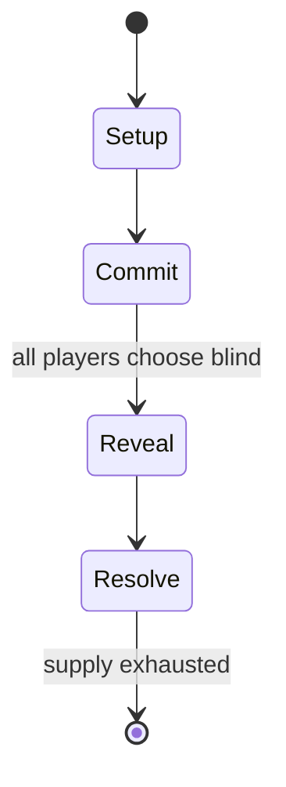

# Cyberpunk 2020

*tabletop role-playing game, sequel of Cyberpunk*

`cyberpunk_2020` &nbsp; state: **DEEPENED** &nbsp; method: **heuristic**

## Found layer (recorded, not trusted)

| field | value |
| --- | --- |
| wikidata | Q1034675 |
| wikipedia | Cyberpunk (role-playing game) |
| genres (source) | cyberpunk, tabletop role-playing game |
| instance of (source) | tabletop role-playing game, version, edition or translation |
| country of origin | United States |

## Declared layer (orders bench work)

| field | value |
| --- | --- |
| year created | 2022 |
| epoch | CONTEMPORARY |
| region | NORTH_AMERICA |
| media | CARD, COLLECTIBLE, MINIATURES, RPG |
| players | 1-4 |
| age band | -- |
| exogenous process | -- |
| loss shape | -- |
| live axes | ORDER |
| horizon | -- |
| scoring shape | SURVIVAL |
| information | -- |
| interaction | COOPERATIVE |
| turn structure | SIMULTANEOUS |
| tractability | SAMPLING_ONLY |
| randomness | DICE, SIMULTANEOUS_CHOICE |
| luck factor | 0.58 |
| rules complexity | 3.84 |
| strategic depth | 2.12 |
| novelty | 0.7077 |
| solved status | -- |
| strategies | route_optimisation |
| algorithms | -- |

## Object model

```
Episode
  players      : 1-4
  turn_structure: SIMULTANEOUS
  horizon       : ?
  scoring       : SURVIVAL

Deck           -- ordered multiset, drawn without replacement
Hand           -- private multiset held by one player
DiscardPile    -- public accumulation of spent cards
Character      -- persistent stat block owned by a player
GameMaster     -- adjudicating agent outside the scoring loop
Scenario       -- authored state the players traverse
Sequence       -- the permutation under the player's control
```

## State transition diagram



## Research item -- turn trace

```
# Cyberpunk 2020 -- simulated turn events
# generated from the DECLARED vector, not from a rulebook.
# structure: exo=None loss=None horizon=None scoring=SURVIVAL axes=ORDER

t=0    SETUP        players=1  pot=0  capacity=3
t=1    FORCED       p1 single legal option taken (pot_gain=+1.4)
t=2    FORCED       p1 single legal option taken (pot_gain=+1.6)
t=3    FORCED       p1 single legal option taken (pot_gain=+1.3)
t=4    FORCED       p1 single legal option taken (pot_gain=+0.6)
t=5    FORCED       p1 single legal option taken (pot_gain=+1.7)
t=6    FORCED       p1 single legal option taken (pot_gain=+1.4)
t=7    FORCED       p1 single legal option taken (pot_gain=+1.5)
t=8    FORCED       p1 single legal option taken (pot_gain=+1.5)
t=9    FORCED       p1 single legal option taken (pot_gain=+1.7)
t=10   FORCED       p1 single legal option taken (pot_gain=+1.1)
t=11   ENDTURN      turn passes to p1
t=12   FORCED       p1 single legal option taken (pot_gain=+0.9)
t=13   FORCED       p1 single legal option taken (pot_gain=+1.4)
t=14   FORCED       p1 single legal option taken (pot_gain=+1.6)
t=15   FORCED       p1 single legal option taken (pot_gain=+1.3)
t=16   FORCED       p1 single legal option taken (pot_gain=+0.6)
t=17   FORCED       p1 single legal option taken (pot_gain=+1.6)
t=18   FORCED       p1 single legal option taken (pot_gain=+1.4)
t=19   FORCED       p1 single legal option taken (pot_gain=+1.3)
t=20   ENDTURN      turn passes to p1
t=21   FORCED       p1 single legal option taken (pot_gain=+1.3)
t=22   FORCED       p1 single legal option taken (pot_gain=+0.7)
t=23   FORCED       p1 single legal option taken (pot_gain=+1.2)
t=24   FORCED       p1 single legal option taken (pot_gain=+1.5)
t=25   FORCED       p1 single legal option taken (pot_gain=+0.6)
t=26   ENDTURN      turn passes to p1

terminal: VARIABLE
```

## Source extract

Cyberpunk is a tabletop role-playing game in the dystopian science fiction genre, written by
Mike Pondsmith and first published by R. Talsorian Games in 1988. It is typically referred to by
its second or fourth edition names, Cyberpunk 2020 and Cyberpunk Red, in order to distinguish it
from the cyberpunk genre after which it is named.   == History ==  Cyberpunk was designed by
Mike Pondsmith as an attempt to replicate the gritty realism of 1980s cyberpunk science fiction.
In particular, Walter Jon Williams' novel Hardwired was an inspiration, and Williams helped
playtest the game. Another key influence was the film Blade Runner. Many also assume William
Gibson's Neuromancer was an influence; however, Pondsmith did not read the novel until a later
date. Other sources included the film Streets of Fire and the anime Bubblegum Crisis.   ===
First edition ===  The original version of Cyberpunk was published in 1988 by R. Talsorian
Games. The game components of the boxed set consist of a 44-page Handbook, a 38-page Sourcebook,
a 20-page Combat Book, four pages of game aids and two ten-sided dice. A number of rules
supplements were subsequently published in 1989:  Rockerboy (sourcebook f

<sub>Wikipedia, CC BY-SA. Retained as evidence for the structural
classification above. Every rule inferred from it is HYPOTHESIZED
until audited against a rulebook.</sub>
