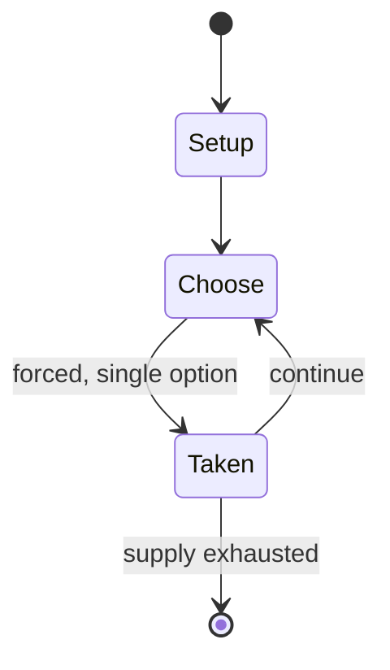

# Dōbutsu shōgi

*3×4 shogi variant*

`d_butsu_sh_gi` &nbsp; state: **DEEPENED** &nbsp; method: **heuristic**

## Found layer (recorded, not trusted)

| field | value |
| --- | --- |
| wikidata | Q1272695 |
| wikipedia | Dōbutsu shōgi |
| genres (source) | -- |
| instance of (source) | board game, shogi variant |
| country of origin | Japan |

## Declared layer (orders bench work)

| field | value |
| --- | --- |
| year created | -- |
| epoch | -- |
| region | EAST_ASIA |
| media | BOARD |
| players | 2 |
| age band | -- |
| exogenous process | -- |
| loss shape | -- |
| live axes | - |
| horizon | -- |
| scoring shape | WINNER_TAKE_ALL |
| information | -- |
| interaction | COMPETITIVE |
| turn structure | -- |
| tractability | SAMPLING_ONLY |
| randomness | -- |
| luck factor | 0.35 |
| rules complexity | 1.8 |
| strategic depth | 2.0 |
| novelty | 0.5614 |
| solved status | -- |
| strategies | -- |
| algorithms | -- |

## Object model

```
Episode
  players      : 2
  turn_structure: ?
  horizon       : ?
  scoring       : WINNER_TAKE_ALL

Board          -- spatial substrate; cells carry position and occupancy
Piece          -- movable token owned by a player
```

## State transition diagram



## Research item -- turn trace

```
# Dōbutsu shōgi -- simulated turn events
# generated from the DECLARED vector, not from a rulebook.
# structure: exo=None loss=None horizon=None scoring=WINNER_TAKE_ALL axes=-

t=0    SETUP        players=2  pot=0  capacity=6
t=1    FORCED       p1 single legal option taken (pot_gain=+1.2)
t=2    FORCED       p1 single legal option taken (pot_gain=+0.7)
t=3    FORCED       p1 single legal option taken (pot_gain=+1.7)
t=4    FORCED       p1 single legal option taken (pot_gain=+0.8)
t=5    FORCED       p1 single legal option taken (pot_gain=+1.6)
t=6    FORCED       p1 single legal option taken (pot_gain=+1.7)
t=7    FORCED       p1 single legal option taken (pot_gain=+1.8)
t=8    ENDTURN      turn passes to p2
t=9    FORCED       p2 single legal option taken (pot_gain=+1.5)
t=10   FORCED       p2 single legal option taken (pot_gain=+1.2)
t=11   FORCED       p2 single legal option taken (pot_gain=+2.0)
t=12   ENDTURN      turn passes to p1
t=13   FORCED       p1 single legal option taken (pot_gain=+1.9)
t=14   FORCED       p1 single legal option taken (pot_gain=+0.7)
t=15   FORCED       p1 single legal option taken (pot_gain=+0.8)
t=16   FORCED       p1 single legal option taken (pot_gain=+1.1)
t=17   FORCED       p1 single legal option taken (pot_gain=+0.8)
t=18   FORCED       p1 single legal option taken (pot_gain=+1.1)
t=19   FORCED       p1 single legal option taken (pot_gain=+1.1)
t=20   FORCED       p1 single legal option taken (pot_gain=+0.7)
t=21   FORCED       p1 single legal option taken (pot_gain=+0.8)
t=22   FORCED       p1 single legal option taken (pot_gain=+1.8)
t=23   FORCED       p1 single legal option taken (pot_gain=+1.3)
t=24   FORCED       p1 single legal option taken (pot_gain=+1.1)
t=25   FORCED       p1 single legal option taken (pot_gain=+1.6)
t=26   ENDTURN      turn passes to p2

terminal: VARIABLE
```

## Conditions

| kind | threshold | effect | trigger |
| --- | --- | --- | --- |
| WIN | -- | -- | It is played on a 3×4 board and generally follows the rules of standard shogi, including drops, except that pieces can only move one square at a time, and the king reaching the enemy camp as an additional way to win the  |
| WIN | -- | -- | There are two ways to win the game: capturing ("catching") the opponent's Lion, and advancing one's own Lion into the promotion zone (farthest rank), as long as doing so does not place one's Lion in check. |

## Source extract

Dōbutsu shōgi (どうぶつしょうぎ; "animal shogi") is a small shogi variant for young children. It was
invented by women's professional shogi player Madoka Kitao (北尾 まどか, Kitao Madoka), partially to
attract young girls to the game. The pieces were designed by fellow women's professional shogi
player Maiko Fujita (藤田 麻衣子, Fujita Maiko). It is played on a 3×4 board and generally follows
the rules of standard shogi, including drops, except that pieces can only move one square at a
time, and the king reaching the enemy camp as an additional way to win the game. The pieces are
square, like children's blocks, have cartoon figures of the relevant animal rather than kanji to
identify them, and often have dots on the sides and corners of the directions the pieces can
move. The game has been marketed overseas as "Let's Catch the Lion!"   == Play ==  Each player
starts the game with four pieces:  A Lion (king) in the center of the home row ("forest") A
Giraffe (rook) to the right of the king An Elephant (bishop) to the left of the king A Chick
(pawn) in front of the king Each moves as in standard shogi, but is limited to moving one square
per turn. If the Chick advances two squares to reach the final r

<sub>Wikipedia, CC BY-SA. Retained as evidence for the structural
classification above. Every rule inferred from it is HYPOTHESIZED
until audited against a rulebook.</sub>
