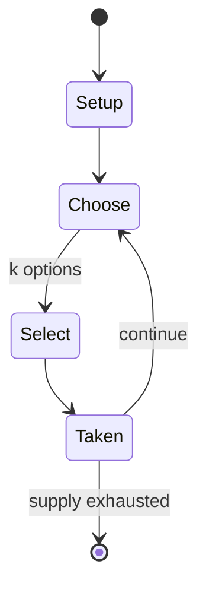

# Dai dai shogi

*17x17 variant of Japanese chess*

`dai_dai_shogi` &nbsp; state: **DEEPENED** &nbsp; method: **heuristic**

## Found layer (recorded, not trusted)

| field | value |
| --- | --- |
| wikidata | Q869301 |
| wikipedia | Dai dai shogi |
| genres (source) | -- |
| instance of (source) | shogi variant |
| country of origin | Japan |

## Declared layer (orders bench work)

| field | value |
| --- | --- |
| year created | -- |
| epoch | -- |
| region | EAST_ASIA |
| media | - |
| players | 2 |
| age band | -- |
| exogenous process | NONE |
| loss shape | OPPORTUNITY_ONLY |
| live axes | COMMIT_BLIND, SELECT, SPATIAL |
| horizon | -- |
| scoring shape | SET_COLLECTION_CONVEX |
| information | PERFECT |
| interaction | SOLITAIRE |
| turn structure | -- |
| tractability | SAMPLING_ONLY |
| randomness | NONE |
| luck factor | 0.02 |
| rules complexity | 2.93 |
| strategic depth | 3.15 |
| novelty | 0.674 |
| solved status | -- |
| strategies | memory_recall, set_collection, signalling |
| algorithms | -- |

## Object model

```
Episode
  players      : 2
  turn_structure: ?
  horizon       : ?
  scoring       : SET_COLLECTION_CONVEX

SealedChoice   -- irrevocable choice made without observation
OptionSet      -- the choices available after an exogenous draw
Placement      -- position subject to geometric legality
```

## State transition diagram



## Research item -- turn trace

```
# Dai dai shogi -- simulated turn events
# generated from the DECLARED vector, not from a rulebook.
# structure: exo=NONE loss=OPPORTUNITY_ONLY horizon=None scoring=SET_COLLECTION_CONVEX axes=COMMIT_BLIND,SELECT,SPATIAL

t=0    SETUP        players=2  pot=0  capacity=4
t=1    SELECT       p1 3 options; take #3  (pot_gain=+1.5, capacity=-1)
t=2    SPATIAL      p1 places at (6,2); adjacency legal
t=3    SELECT       p1 4 options; take #2  (pot_gain=+2.2, capacity=-0)
t=4    SPATIAL      p1 places at (3,2); adjacency legal
t=5    SELECT       p1 1 options; take #1  (pot_gain=+2.7, capacity=-0)
t=6    SPATIAL      p1 places at (1,6); adjacency legal
t=7    SELECT       p1 1 options; take #1  (pot_gain=+1.4, capacity=-0)
t=8    SELECT       p1 2 options; take #2  (pot_gain=+2.6, capacity=-1)
t=9    SELECT       p1 3 options; take #3  (pot_gain=+1.7, capacity=-2)
t=10   SELECT       p1 4 options; take #1  (pot_gain=+1.0, capacity=-0)
t=11   ENDTURN      turn passes to p2
t=12   SELECT       p2 3 options; take #2  (pot_gain=+1.3, capacity=-1)
t=13   SPATIAL      p2 places at (5,3); adjacency legal
t=14   SELECT       p2 3 options; take #3  (pot_gain=+2.2, capacity=-0)
t=15   SPATIAL      p2 places at (1,5); adjacency legal
t=16   ENDTURN      turn passes to p1
t=17   SELECT       p1 4 options; take #1  (pot_gain=+1.7, capacity=-1)
t=18   SPATIAL      p1 places at (2,2); adjacency legal
t=19   SELECT       p1 1 options; take #1  (pot_gain=+3.4, capacity=-2)
t=20   ENDTURN      turn passes to p2
t=21   SELECT       p2 1 options; take #1  (pot_gain=+2.0, capacity=-2)
t=22   SELECT       p2 2 options; take #1  (pot_gain=+1.8, capacity=-1)
t=23   ENDTURN      turn passes to p1
t=24   SELECT       p1 4 options; take #2  (pot_gain=+0.5, capacity=-2)
t=25   SELECT       p1 3 options; take #1  (pot_gain=+3.4, capacity=-0)
t=26   SELECT       p1 2 options; take #1  (pot_gain=+1.7, capacity=-1)

terminal: VARIABLE
```

## Conditions

| kind | threshold | effect | trigger |
| --- | --- | --- | --- |
| WIN | -- | -- | If a player's king is in check and no legal move by that player will get the king out of check, the checking move is also a mate, and effectively wins the game. |
| WIN | -- | -- | A player who captures the opponent's king wins the game. |

## Source extract

Dai dai shōgi (大大将棋 'huge chess') is a large board variant of shogi (Japanese chess).  The game
dates back to the 15th century and is based on the earlier dai shogi.  Apart from its size, the
major difference is in the range of the pieces and the "promotion by capture" rule. It is the
smallest board variant to use this rule. Because of the terse and often incomplete wording of
the historical sources for the large shogi variants, except for chu shogi and to a lesser extent
dai shogi (which were at some points of time the most prestigious forms of shogi being played),
the historical rules of dai dai shogi are not clear. Different sources often differ
significantly in the moves attributed to the pieces, and the degree of contradiction (summarised
below with the listing of most known alternative moves) is such that it is likely impossible to
reconstruct the "true historical rules" with any degree of certainty, if there ever was such a
thing. It is not clear if the game was ever played much historically, as the few sets that were
made seem to have been intended only for display.   == Rules of the game ==   === Objective ===
The objective is to capture the opponent's king.  Unlike standa

<sub>Wikipedia, CC BY-SA. Retained as evidence for the structural
classification above. Every rule inferred from it is HYPOTHESIZED
until audited against a rulebook.</sub>
