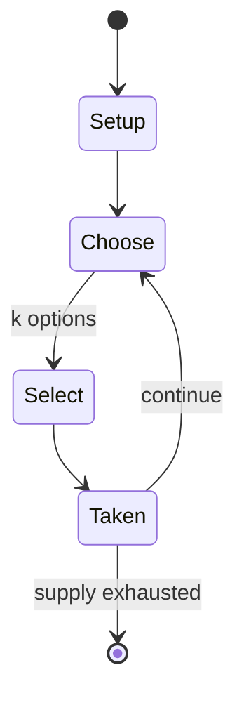

# Dai shogi

*15x15 grid variant of Japanese chess*

`dai_shogi` &nbsp; state: **DEEPENED** &nbsp; method: **heuristic**

## Found layer (recorded, not trusted)

| field | value |
| --- | --- |
| wikidata | Q851294 |
| wikipedia | Dai shogi |
| genres (source) | -- |
| instance of (source) | shogi variant |
| country of origin | Japan |

## Declared layer (orders bench work)

| field | value |
| --- | --- |
| year created | -- |
| epoch | -- |
| region | EAST_ASIA |
| media | BOARD |
| players | 2 |
| age band | -- |
| exogenous process | NONE |
| loss shape | OPPORTUNITY_ONLY |
| live axes | SELECT, SPATIAL |
| horizon | -- |
| scoring shape | SET_COLLECTION_CONVEX |
| information | PERFECT |
| interaction | COMPETITIVE |
| turn structure | -- |
| tractability | EXACT_WITH_CUT |
| randomness | NONE |
| luck factor | 0.02 |
| rules complexity | 2.69 |
| strategic depth | 3.15 |
| novelty | 0.7475 |
| solved status | -- |
| strategies | memory_recall, set_collection, signalling |
| algorithms | -- |

## Object model

```
Episode
  players      : 2
  turn_structure: ?
  horizon       : ?
  scoring       : SET_COLLECTION_CONVEX

Board          -- spatial substrate; cells carry position and occupancy
Piece          -- movable token owned by a player
OptionSet      -- the choices available after an exogenous draw
Placement      -- position subject to geometric legality
```

## State transition diagram



## Research item -- turn trace

```
# Dai shogi -- simulated turn events
# generated from the DECLARED vector, not from a rulebook.
# structure: exo=NONE loss=OPPORTUNITY_ONLY horizon=None scoring=SET_COLLECTION_CONVEX axes=SELECT,SPATIAL

t=0    SETUP        players=2  pot=0  capacity=6
t=1    SELECT       p1 3 options; take #1  (pot_gain=+3.1, capacity=-1)
t=2    SELECT       p1 3 options; take #1  (pot_gain=+0.7, capacity=-1)
t=3    SELECT       p1 4 options; take #3  (pot_gain=+1.6, capacity=-1)
t=4    SPATIAL      p1 places at (2,0); adjacency legal
t=5    SELECT       p1 1 options; take #1  (pot_gain=+1.9, capacity=-1)
t=6    SELECT       p1 4 options; take #1  (pot_gain=+2.0, capacity=-1)
t=7    SELECT       p1 2 options; take #2  (pot_gain=+1.4, capacity=-0)
t=8    SPATIAL      p1 places at (1,3); adjacency legal
t=9    ENDTURN      turn passes to p2
t=10   SELECT       p2 4 options; take #4  (pot_gain=+1.7, capacity=-2)
t=11   SELECT       p2 4 options; take #3  (pot_gain=+2.4, capacity=-0)
t=12   SELECT       p2 3 options; take #2  (pot_gain=+0.9, capacity=-0)
t=13   SPATIAL      p2 places at (5,4); adjacency legal
t=14   SELECT       p2 1 options; take #1  (pot_gain=+2.9, capacity=-2)
t=15   SELECT       p2 4 options; take #4  (pot_gain=+0.8, capacity=-0)
t=16   SELECT       p2 4 options; take #2  (pot_gain=+3.0, capacity=-0)
t=17   SELECT       p2 2 options; take #1  (pot_gain=+0.5, capacity=-0)
t=18   SPATIAL      p2 places at (3,1); adjacency legal
t=19   SELECT       p2 1 options; take #1  (pot_gain=+3.3, capacity=-0)
t=20   SELECT       p2 2 options; take #2  (pot_gain=+1.4, capacity=-0)
t=21   SPATIAL      p2 places at (1,0); adjacency legal
t=22   SELECT       p2 1 options; take #1  (pot_gain=+1.4, capacity=-1)
t=23   SPATIAL      p2 places at (2,6); adjacency legal
t=24   ENDTURN      turn passes to p1
t=25   SELECT       p1 3 options; take #1  (pot_gain=+0.9, capacity=-2)
t=26   SELECT       p1 3 options; take #1  (pot_gain=+2.1, capacity=-2)
t=27   ENDTURN      turn passes to p2

terminal: VARIABLE
```

## Conditions

| kind | threshold | effect | trigger |
| --- | --- | --- | --- |
| WIN | -- | -- | If a player's king or prince is in check and no legal move by that player will get it out of check, the checking move is also mate, and effectively wins the game. |
| WIN | -- | -- | A player who captures the opponent's sole remaining king or prince wins the game. |
| BOUNDARY | -- | -- | Note that certain pieces have the ability to pass in certain situations – a lion, when at least one square immediately adjacent to it is unoccupied; a horned falcon, when the square immediately in front of it is unoccupi |

## Source extract

Dai shogi (大将棋, large chess) or Kamakura dai shogi (鎌倉大将棋) is a board game native to Japan. It
derived from Heian era shogi, and is similar to standard shogi (sometimes called Japanese chess)
in its rules and game play. Dai shogi is only one of several large board shogi variants. Its
name means large shogi, from a time when there were three sizes of shogi games. Early versions
of dai shogi can be traced back to the Kamakura period, from about AD 1230. It was the
historical basis for the later, much more popular variant chu shogi, which shrinks the board and
removes the weakest pieces.   == History == Fujiwara no Yorinaga, tutor to the crown prince,
recorded playing dai shogi, in his diary, the Taiki, written between 1135 and 1155 AD. The
Nichūreki, an encyclopedia compiled in the 12th century by Miyoshi Tameyasu, described the rules
for both dai shogi and Heian dai shogi, an ancestor of standard shogi played on a 13 × 13 board.
== Rules of the game == Other than the additional pieces (the iron and stone generals, knights,
angry boars, cat swords, evil wolves, violent oxen, and flying dragons, which all promote to
gold generals), the rules of dai shogi are thought to have correspo

<sub>Wikipedia, CC BY-SA. Retained as evidence for the structural
classification above. Every rule inferred from it is HYPOTHESIZED
until audited against a rulebook.</sub>
