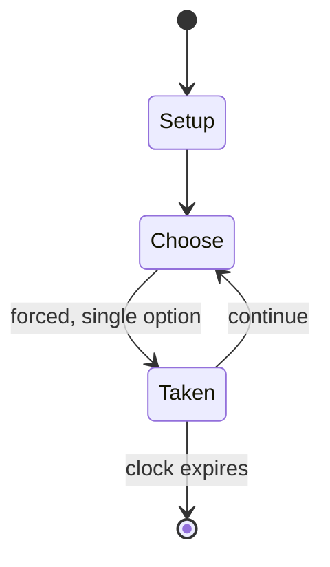

# Damath

*two-player educational board game*

`damath` &nbsp; state: **DEEPENED** &nbsp; method: **heuristic**

## Found layer (recorded, not trusted)

| field | value |
| --- | --- |
| wikidata | Q25339298 |
| wikipedia | Damath |
| genres (source) | -- |
| instance of (source) | board game |
| country of origin | Philippines |

## Declared layer (orders bench work)

| field | value |
| --- | --- |
| year created | -- |
| epoch | -- |
| region | SOUTHEAST_ASIA |
| media | BOARD |
| players | -- |
| age band | -- |
| exogenous process | -- |
| loss shape | -- |
| live axes | - |
| horizon | CLOCK_LIMITED |
| scoring shape | LINEAR_ACCUMULATION |
| information | -- |
| interaction | COMPETITIVE |
| turn structure | -- |
| tractability | SAMPLING_ONLY |
| randomness | -- |
| luck factor | 0.35 |
| rules complexity | 1.78 |
| strategic depth | 2.0 |
| novelty | 0.6353 |
| solved status | -- |
| strategies | -- |
| algorithms | -- |

## Object model

```
Episode
  players      : ?
  turn_structure: ?
  horizon       : CLOCK_LIMITED
  scoring       : LINEAR_ACCUMULATION

Board          -- spatial substrate; cells carry position and occupancy
Piece          -- movable token owned by a player
```

## State transition diagram



## Research item -- turn trace

```
# Damath -- simulated turn events
# generated from the DECLARED vector, not from a rulebook.
# structure: exo=None loss=None horizon=CLOCK_LIMITED scoring=LINEAR_ACCUMULATION axes=-

t=0    SETUP        players=2  pot=0  capacity=5
t=1    FORCED       p1 single legal option taken (pot_gain=+0.9)
t=2    FORCED       p1 single legal option taken (pot_gain=+1.8)
t=3    FORCED       p1 single legal option taken (pot_gain=+1.7)
t=4    FORCED       p1 single legal option taken (pot_gain=+1.8)
t=5    FORCED       p1 single legal option taken (pot_gain=+1.4)
t=6    FORCED       p1 single legal option taken (pot_gain=+1.5)
t=7    FORCED       p1 single legal option taken (pot_gain=+0.8)
t=8    FORCED       p1 single legal option taken (pot_gain=+1.4)
t=9    ENDTURN      turn passes to p2
t=10   FORCED       p2 single legal option taken (pot_gain=+0.6)
t=11   FORCED       p2 single legal option taken (pot_gain=+1.9)
t=12   FORCED       p2 single legal option taken (pot_gain=+0.9)
t=13   FORCED       p2 single legal option taken (pot_gain=+2.0)
t=14   FORCED       p2 single legal option taken (pot_gain=+1.9)
t=15   FORCED       p2 single legal option taken (pot_gain=+0.7)
t=16   FORCED       p2 single legal option taken (pot_gain=+0.8)
t=17   FORCED       p2 single legal option taken (pot_gain=+1.3)
t=18   ENDTURN      turn passes to p1
t=19   FORCED       p1 single legal option taken (pot_gain=+1.2)
t=20   FORCED       p1 single legal option taken (pot_gain=+0.5)
t=21   ENDTURN      turn passes to p2
t=22   FORCED       p2 single legal option taken (pot_gain=+1.2)
t=23   FORCED       p2 single legal option taken (pot_gain=+1.0)
t=24   ENDTURN      turn passes to p1
t=25   FORCED       p1 single legal option taken (pot_gain=+1.9)
t=26   FORCED       p1 single legal option taken (pot_gain=+1.3)

terminal: CLOCK_LIMITED
```

## Source extract

Damath is a two-player educational board game combining the board game "Dama" (Filipino
checkers) and math. It is used as a teaching tool for both elementary and high school
mathematics. Every piece has a corresponding number and each even (white) square on board has a
mathematical symbol. The game is commonly played in all elementary and secondary schools in the
Philippines.   == History == Damath was invented by Jesus Huenda, a teacher in the province of
Sorsogon, Philippines, who had encountered problems in teaching math using traditional teaching
methods. Inspired in part by an investigatory project called “Dama de Numero” submitted by a
student (Emilio Hina Jr.) in 1975, Huenda overhauled the game and introduced it to his class,
who enjoyed playing. Damath became popular and in 1980, the first Damath tournament was held in
Sorsogon. The next year, Huenda received a gold medallion from the late President Ferdinand
Marcos for his contributions in the field of teaching mathematics. The game reached its peak
popularity in the 1990s, when it made the rounds of several mathematics education conventions
all over the world such as the 10th Conference of the Mathematical Association of

<sub>Wikipedia, CC BY-SA. Retained as evidence for the structural
classification above. Every rule inferred from it is HYPOTHESIZED
until audited against a rulebook.</sub>
