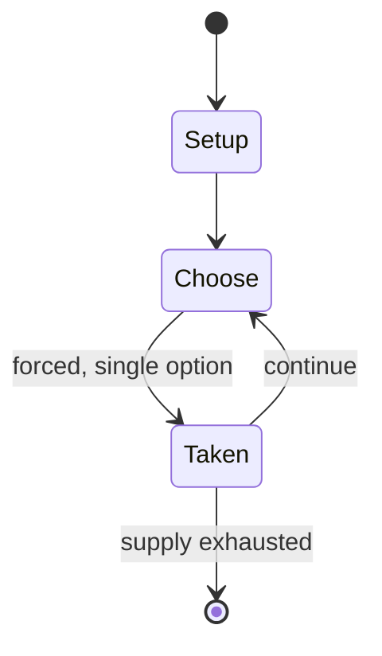

# dandi biyo

*game played in Nepal*

`dandi_biyo` &nbsp; state: **DEEPENED** &nbsp; method: **heuristic**

## Found layer (recorded, not trusted)

| field | value |
| --- | --- |
| wikidata | Q5215719 |
| wikipedia | Dandi biyo |
| genres (source) | -- |
| instance of (source) | children's game |
| country of origin | Nepal |

## Declared layer (orders bench work)

| field | value |
| --- | --- |
| year created | -- |
| epoch | -- |
| region | SOUTH_ASIA |
| media | SPORT |
| players | -- |
| age band | CHILD |
| exogenous process | -- |
| loss shape | -- |
| live axes | - |
| horizon | -- |
| scoring shape | LINEAR_ACCUMULATION |
| information | -- |
| interaction | SOLITAIRE |
| turn structure | -- |
| tractability | SAMPLING_ONLY |
| randomness | -- |
| luck factor | 0.35 |
| rules complexity | 1.87 |
| strategic depth | 2.0 |
| novelty | 0.5594 |
| solved status | -- |
| strategies | -- |
| algorithms | -- |

## Object model

```
Episode
  players      : ?
  turn_structure: ?
  horizon       : ?
  scoring       : LINEAR_ACCUMULATION

Pitch          -- bounded physical region
Player         -- embodied agent with a foul count
Clock          -- counts down; stoppages are rule events
Official       -- detects infractions and applies penalties
```

## State transition diagram



## Research item -- turn trace

```
# dandi biyo -- simulated turn events
# generated from the DECLARED vector, not from a rulebook.
# structure: exo=None loss=None horizon=None scoring=LINEAR_ACCUMULATION axes=-

t=0    SETUP        players=2  pot=0  capacity=5
t=1    FORCED       p1 single legal option taken (pot_gain=+1.5)
t=2    ENDTURN      turn passes to p2
t=3    FORCED       p2 single legal option taken (pot_gain=+1.3)
t=4    FORCED       p2 single legal option taken (pot_gain=+0.6)
t=5    FORCED       p2 single legal option taken (pot_gain=+1.4)
t=6    ENDTURN      turn passes to p1
t=7    FORCED       p1 single legal option taken (pot_gain=+1.6)
t=8    FORCED       p1 single legal option taken (pot_gain=+0.6)
t=9    FORCED       p1 single legal option taken (pot_gain=+0.9)
t=10   ENDTURN      turn passes to p2
t=11   FORCED       p2 single legal option taken (pot_gain=+1.6)
t=12   FORCED       p2 single legal option taken (pot_gain=+0.8)
t=13   FORCED       p2 single legal option taken (pot_gain=+1.7)
t=14   ENDTURN      turn passes to p1
t=15   FORCED       p1 single legal option taken (pot_gain=+1.9)
t=16   ENDTURN      turn passes to p2
t=17   FORCED       p2 single legal option taken (pot_gain=+1.9)
t=18   ENDTURN      turn passes to p1
t=19   FORCED       p1 single legal option taken (pot_gain=+1.7)
t=20   ENDTURN      turn passes to p2
t=21   FORCED       p2 single legal option taken (pot_gain=+1.8)
t=22   ENDTURN      turn passes to p1
t=23   FORCED       p1 single legal option taken (pot_gain=+0.7)
t=24   ENDTURN      turn passes to p2
t=25   FORCED       p2 single legal option taken (pot_gain=+1.5)
t=26   FORCED       p2 single legal option taken (pot_gain=+1.4)

terminal: VARIABLE
```

## Source extract

Dandi biyo (Nepali: डन्डी बियो, pronounced [ˈɖʌɳɖi ˈbijo] )  is a game played in Nepal which was
considered the de facto national game until 23 May 2017, when volleyball was declared as the
national sport. Dandi biyo is played with a stick (dandi) about 2 feet (61 cm) long and a wooden
pin (biyo) about 6 inches (15 cm) long. The pin is a small wooden stick with pointed ends. The
game is similar to the Indian game gilli danda. The government has not implemented any policies
for the preservation of dandi biyo, and with decreasing players the game is expected to be
extinct soon.   == Gameplay ==  Dandi biyo is played by two or more players. The wooden pin is
laid across a four-inch (10 cm) deep hole in the ground. One player puts one end of the stick
inside the hole and holds the other end. The player jerks the stick against the pin to launch
the pin into the air while other players called 'fielders' try to catch the pin. If one of the
fielders catch the pin in the air, the turn is over and the catcher takes the stick. If the pin
instead hits the ground, that player plays to score. One of the fielders then throws the pin
into the hole while the player tries to hit and throw the pin aw

<sub>Wikipedia, CC BY-SA. Retained as evidence for the structural
classification above. Every rule inferred from it is HYPOTHESIZED
until audited against a rulebook.</sub>
