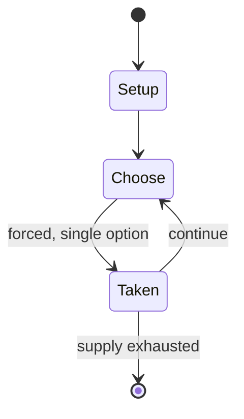

# Danger from the Deep

*2003 video game*

`danger_from_the_deep` &nbsp; state: **DEEPENED** &nbsp; method: **heuristic**

## Found layer (recorded, not trusted)

| field | value |
| --- | --- |
| wikidata | Q1159590 |
| wikipedia | Danger from the Deep |
| genres (source) | simulation video game |
| instance of (source) | video game |
| country of origin | -- |

## Declared layer (orders bench work)

| field | value |
| --- | --- |
| year created | 2003 |
| epoch | CONTEMPORARY |
| region | -- |
| media | VIDEO |
| players | -- |
| age band | -- |
| exogenous process | -- |
| loss shape | -- |
| live axes | - |
| horizon | -- |
| scoring shape | -- |
| information | -- |
| interaction | -- |
| turn structure | -- |
| tractability | SAMPLING_ONLY |
| randomness | -- |
| luck factor | 0.35 |
| rules complexity | 1.62 |
| strategic depth | 2.0 |
| novelty | 0.0896 |
| solved status | -- |
| strategies | -- |
| algorithms | -- |

## Object model

```
Episode
  players      : ?
  turn_structure: ?
  horizon       : ?
  scoring       : ?

WorldState     -- simulation state advanced by the engine
Avatar         -- player-controlled agent
Clock          -- frame or tick counter
```

## State transition diagram



## Research item -- turn trace

```
# Danger from the Deep -- simulated turn events
# generated from the DECLARED vector, not from a rulebook.
# structure: exo=None loss=None horizon=None scoring=None axes=-

t=0    SETUP        players=2  pot=0  capacity=6
t=1    FORCED       p1 single legal option taken (pot_gain=+1.0)
t=2    FORCED       p1 single legal option taken (pot_gain=+0.9)
t=3    FORCED       p1 single legal option taken (pot_gain=+1.8)
t=4    FORCED       p1 single legal option taken (pot_gain=+1.3)
t=5    FORCED       p1 single legal option taken (pot_gain=+1.9)
t=6    FORCED       p1 single legal option taken (pot_gain=+1.9)
t=7    ENDTURN      turn passes to p2
t=8    FORCED       p2 single legal option taken (pot_gain=+2.0)
t=9    FORCED       p2 single legal option taken (pot_gain=+0.5)
t=10   ENDTURN      turn passes to p1
t=11   FORCED       p1 single legal option taken (pot_gain=+1.1)
t=12   FORCED       p1 single legal option taken (pot_gain=+0.9)
t=13   ENDTURN      turn passes to p2
t=14   FORCED       p2 single legal option taken (pot_gain=+0.6)
t=15   FORCED       p2 single legal option taken (pot_gain=+0.8)
t=16   FORCED       p2 single legal option taken (pot_gain=+1.6)
t=17   ENDTURN      turn passes to p1
t=18   FORCED       p1 single legal option taken (pot_gain=+1.2)
t=19   FORCED       p1 single legal option taken (pot_gain=+1.8)
t=20   FORCED       p1 single legal option taken (pot_gain=+1.1)
t=21   FORCED       p1 single legal option taken (pot_gain=+1.5)
t=22   FORCED       p1 single legal option taken (pot_gain=+0.8)
t=23   FORCED       p1 single legal option taken (pot_gain=+0.9)
t=24   FORCED       p1 single legal option taken (pot_gain=+0.6)
t=25   FORCED       p1 single legal option taken (pot_gain=+1.4)
t=26   ENDTURN      turn passes to p2

terminal: VARIABLE
```

## Conditions

| kind | threshold | effect | trigger |
| --- | --- | --- | --- |
| PENALTY | -- | -- | Danger from the Deep, often abbreviated as DftD, is an open-source World War II German U-boat simulation for PC, striving for technical and historical accuracy. |

## Source extract

Danger from the Deep, often abbreviated as DftD, is an open-source World War II German U-boat
simulation for PC, striving for technical and historical accuracy.   == Development == The
project was registered in 2003 on sourceforge.net and is since then developed as open source
software under the GPLv2. In 2004 it reached beta status. The game targets Multi-platform,
supporting FreeBSD, OpenBSD, Mac OS X, Linux distributions, and Microsoft Windows by utilizing
SDL and OpenGL. Hardware addressed is OpenGL 1.5 (while recommending "OpenGL 2.0 or greater")
with around 256 MB of RAM, 1 GHz processor and common PC input devices (keyboard, mouse).
Development is intermittent. As of June 11 2020 the latest commit to the Git repo was May 10,
2020.  The last downloadable release was May 8, 2010   == Reception == A Linux Journal review
from 2010 received DftD quite positive. In 2004 The Wargamer recommended the game to "serious
sim gamers" which should "head over to Danger from the Deep's official web site and take a
look.". In 2011 an Ars Technica article on the history of simulation games noted Danger from the
Deep as: "These days, submarine sims [...] are kept alive by the open-source Dange

<sub>Wikipedia, CC BY-SA. Retained as evidence for the structural
classification above. Every rule inferred from it is HYPOTHESIZED
until audited against a rulebook.</sub>
