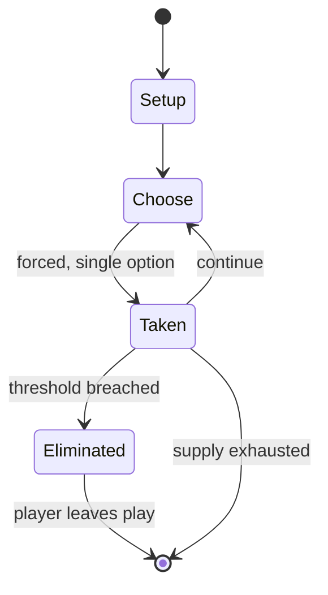

# Dara (game)

`dara_game` &nbsp; state: **DEEPENED** &nbsp; method: **heuristic**

## Found layer (recorded, not trusted)

| field | value |
| --- | --- |
| wikidata | Q5221971 |
| wikipedia | Dara (game) |
| genres (source) | -- |
| instance of (source) | -- |
| country of origin | -- |

## Declared layer (orders bench work)

| field | value |
| --- | --- |
| year created | -- |
| epoch | -- |
| region | -- |
| media | ABSTRACT, BOARD |
| players | -- |
| age band | -- |
| exogenous process | -- |
| loss shape | ELIMINATION |
| live axes | SPATIAL |
| horizon | -- |
| scoring shape | -- |
| information | -- |
| interaction | SOLITAIRE |
| turn structure | PHASE_STRUCTURED |
| tractability | SAMPLING_ONLY |
| randomness | -- |
| luck factor | 0.35 |
| rules complexity | 2.81 |
| strategic depth | 2.0 |
| novelty | 0.5656 |
| solved status | -- |
| strategies | -- |
| algorithms | -- |

## Object model

```
Episode
  players      : ?
  turn_structure: PHASE_STRUCTURED
  horizon       : ?
  scoring       : ?

Board          -- spatial substrate; cells carry position and occupancy
Piece          -- movable token owned by a player
Placement      -- position subject to geometric legality
```

## State transition diagram



## Research item -- turn trace

```
# Dara (game) -- simulated turn events
# generated from the DECLARED vector, not from a rulebook.
# structure: exo=None loss=ELIMINATION horizon=None scoring=None axes=SPATIAL

t=0    SETUP        players=2  pot=0  capacity=3
t=1    FORCED       p1 single legal option taken (pot_gain=+1.3)
t=2    FORCED       p1 single legal option taken (pot_gain=+0.9)
t=3    FORCED       p1 single legal option taken (pot_gain=+1.6)
t=4    FORCED       p1 single legal option taken (pot_gain=+1.1)
t=5    ENDTURN      turn passes to p2
t=6    FORCED       p2 single legal option taken (pot_gain=+1.1)
t=7    FORCED       p2 single legal option taken (pot_gain=+1.0)
t=8    FORCED       p2 single legal option taken (pot_gain=+1.3)
t=9    FORCED       p2 single legal option taken (pot_gain=+0.9)
t=10   FORCED       p2 single legal option taken (pot_gain=+1.0)
t=11   SPATIAL      p2 places at (5,4); adjacency legal
t=12   FORCED       p2 single legal option taken (pot_gain=+0.8)
t=13   SPATIAL      p2 places at (4,1); adjacency legal
t=14   FORCED       p2 single legal option taken (pot_gain=+1.7)
t=15   SPATIAL      p2 places at (3,5); adjacency legal
t=16   FORCED       p2 single legal option taken (pot_gain=+1.6)
t=17   SPATIAL      p2 places at (5,3); adjacency legal
t=18   FORCED       p2 single legal option taken (pot_gain=+0.8)
t=19   SPATIAL      p2 places at (4,2); adjacency legal
t=20   FORCED       p2 single legal option taken (pot_gain=+0.5)
t=21   ENDTURN      turn passes to p1
t=22   FORCED       p1 single legal option taken (pot_gain=+1.4)
t=23   FORCED       p1 single legal option taken (pot_gain=+1.8)
t=24   FORCED       p1 single legal option taken (pot_gain=+0.7)
t=25   FORCED       p1 single legal option taken (pot_gain=+0.9)
t=26   FORCED       p1 single legal option taken (pot_gain=+1.3)
t=27   SPATIAL      p1 places at (6,7); adjacency legal

terminal: VARIABLE
```

## Conditions

| kind | threshold | effect | trigger |
| --- | --- | --- | --- |
| WIN | 2 pieces | -- | If a player can no longer make three-in-a-rows with their remaining pieces (e.g. if the player only has two pieces left), that player is the loser, and the other player is the winner. |
| ELIMINATE | -- | -- | To form three-in-a-rows, and eliminate enough of your opponent's pieces so that they can no longer form three-in-a-rows. |

## Source extract

Dara is a two-player abstract strategy board game played in several countries of West Africa. In
Nigeria it is played by the Dakarkari people. It is popular in Niger among the Zarma, who call
it dili, and it is also played in Burkina Faso. In the Hausa language (Niger and Nigeria), the
game is called doki which means horse. It is an alignment game related to tic-tac-toe, but far
more complex. The game was invented in the 19th century or earlier. The game is also known as
derrah and is very similar to Wali and Dama Tuareg.   == Goal == To form three-in-a-rows, and
eliminate enough of your opponent's pieces so that they can no longer form three-in-a-rows.   ==
Equipment == The board is a 5x6 square board. Each player has 12 pieces. One player plays Black
and the other plays White, however, any two colors will do. In Niger, people simply dig out 30
holes in the sand; one side takes doum nuts, the other short sticks.   == Game play and rules ==
Players decide among themselves who starts first. The board is empty in the beginning. Players
take turn placing their stones onto the empty cells of the square board. This is known as Phase
1 of the game or the Drop phase. After all 24 stones h

<sub>Wikipedia, CC BY-SA. Retained as evidence for the structural
classification above. Every rule inferred from it is HYPOTHESIZED
until audited against a rulebook.</sub>
