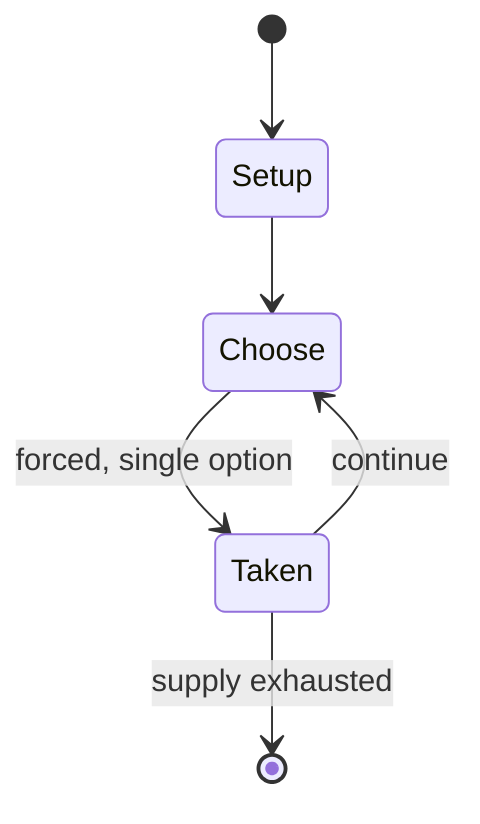

# Dark Emperor

*board game*

`dark_emperor` &nbsp; state: **DEEPENED** &nbsp; method: **heuristic**

## Found layer (recorded, not trusted)

| field | value |
| --- | --- |
| wikidata | Q104858564 |
| wikipedia | Dark Emperor |
| genres (source) | -- |
| instance of (source) | board game |
| country of origin | -- |

## Declared layer (orders bench work)

| field | value |
| --- | --- |
| year created | 1985 |
| epoch | DIGITAL |
| region | -- |
| media | BOARD |
| players | -- |
| age band | -- |
| exogenous process | -- |
| loss shape | -- |
| live axes | NEGOTIATE |
| horizon | -- |
| scoring shape | -- |
| information | -- |
| interaction | NEGOTIATION |
| turn structure | STRICT_TURN |
| tractability | INTRACTABLE |
| randomness | DICE |
| luck factor | 0.58 |
| rules complexity | 2.5 |
| strategic depth | 1.87 |
| novelty | 0.9045 |
| solved status | -- |
| strategies | -- |
| algorithms | -- |

## Object model

```
Episode
  players      : ?
  turn_structure: STRICT_TURN
  horizon       : ?
  scoring       : ?

Board          -- spatial substrate; cells carry position and occupancy
Piece          -- movable token owned by a player
Agreement      -- non-binding or binding commitment between agents
```

## State transition diagram



## Research item -- turn trace

```
# Dark Emperor -- simulated turn events
# generated from the DECLARED vector, not from a rulebook.
# structure: exo=None loss=None horizon=None scoring=None axes=NEGOTIATE

t=0    SETUP        players=2  pot=0  capacity=5
t=1    FORCED       p1 single legal option taken (pot_gain=+1.2)
t=2    FORCED       p1 single legal option taken (pot_gain=+0.9)
t=3    FORCED       p1 single legal option taken (pot_gain=+0.9)
t=4    FORCED       p1 single legal option taken (pot_gain=+1.1)
t=5    FORCED       p1 single legal option taken (pot_gain=+0.9)
t=6    FORCED       p1 single legal option taken (pot_gain=+0.5)
t=7    FORCED       p1 single legal option taken (pot_gain=+0.5)
t=8    FORCED       p1 single legal option taken (pot_gain=+0.8)
t=9    FORCED       p1 single legal option taken (pot_gain=+1.4)
t=10   FORCED       p1 single legal option taken (pot_gain=+1.6)
t=11   FORCED       p1 single legal option taken (pot_gain=+0.9)
t=12   FORCED       p1 single legal option taken (pot_gain=+1.4)
t=13   ENDTURN      turn passes to p2
t=14   FORCED       p2 single legal option taken (pot_gain=+1.1)
t=15   FORCED       p2 single legal option taken (pot_gain=+0.8)
t=16   ENDTURN      turn passes to p1
t=17   FORCED       p1 single legal option taken (pot_gain=+0.7)
t=18   FORCED       p1 single legal option taken (pot_gain=+0.9)
t=19   FORCED       p1 single legal option taken (pot_gain=+0.6)
t=20   ENDTURN      turn passes to p2
t=21   FORCED       p2 single legal option taken (pot_gain=+1.7)
t=22   ENDTURN      turn passes to p1
t=23   FORCED       p1 single legal option taken (pot_gain=+1.6)
t=24   ENDTURN      turn passes to p2
t=25   FORCED       p2 single legal option taken (pot_gain=+0.8)
t=26   FORCED       p2 single legal option taken (pot_gain=+1.7)

terminal: VARIABLE
```

## Conditions

| kind | threshold | effect | trigger |
| --- | --- | --- | --- |
| WIN | 14 turns | -- | If neither side claims an immediate victory by the end of 14 turns, then the player with the most production from their kingdoms or conquered nations is the winner. |

## Source extract

Dark Emperor is a fantasy combat board game published by Avalon Hill in 1985.   == Description
== Dark Emperor is a two-player board game in which one player takes on the role of an evil
necromancer and his vampires intent on claiming the wealth of Loslon, and the other player takes
the part of the heroes trying to prevent this.   === Components === The game has the following
components:  16-page rulebook die-cut cardboard counters game board map of Loslon   === Gameplay
=== All countries on the map begin as neutral. Both players try to recruit neutral countries to
their cause, as well as three magical monsters, and six companies of mercenaries. If diplomacy
fails, the Necromancer can use military force to conquer a country. A player's kingdoms define
total production of goods, which in turn defines how many soldiers can be supported.    ===
Victory conditions === The Necromancer immediately wins if he conquers the Empire of
Ahautsieron. The Kingdom immediately wins if the Necromancer is permanently slain by one of two
magical weapons. If neither side claims an immediate victory by the end of 14 turns, then the
player with the most production from their kingdoms or conquered nation

<sub>Wikipedia, CC BY-SA. Retained as evidence for the structural
classification above. Every rule inferred from it is HYPOTHESIZED
until audited against a rulebook.</sub>
