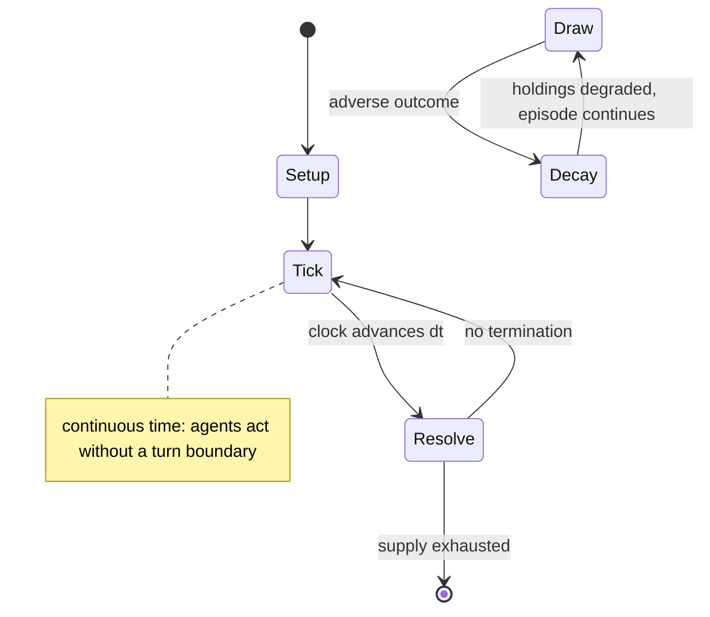

# Darkfall

*2009 video game*

`darkfall` &nbsp; state: **DEEPENED** &nbsp; method: **heuristic**

## Found layer (recorded, not trusted)

| field | value |
| --- | --- |
| wikidata | Q2319194 |
| wikipedia | Darkfall |
| genres (source) | massively multiplayer online role-playing game |
| instance of (source) | video game |
| country of origin | -- |

## Declared layer (orders bench work)

| field | value |
| --- | --- |
| year created | 2015 |
| epoch | CONTEMPORARY |
| region | -- |
| media | RPG, VIDEO |
| players | -- |
| age band | -- |
| exogenous process | CONTINUOUS_TIME |
| loss shape | PARTIAL_DECAY |
| live axes | SELECT |
| horizon | -- |
| scoring shape | RACE_POSITION |
| information | -- |
| interaction | -- |
| turn structure | REAL_TIME |
| tractability | SAMPLING_ONLY |
| randomness | REAL_TIME_PHYSICAL |
| luck factor | 0.3 |
| rules complexity | 3.23 |
| strategic depth | 2.25 |
| novelty | 0.7392 |
| solved status | -- |
| strategies | coalition_forming |
| algorithms | -- |

## Object model

```
Episode
  players      : ?
  turn_structure: REAL_TIME
  horizon       : ?
  scoring       : RACE_POSITION

Character      -- persistent stat block owned by a player
GameMaster     -- adjudicating agent outside the scoring loop
Scenario       -- authored state the players traverse
WorldState     -- simulation state advanced by the engine
Avatar         -- player-controlled agent
Clock          -- frame or tick counter
OptionSet      -- the choices available after an exogenous draw
```

## State transition diagram



## Research item -- clock trace

```
# Darkfall -- simulated clock trace (no turn boundary)
# generated from the DECLARED vector, not from a rulebook.
# structure: exo=CONTINUOUS_TIME loss=PARTIAL_DECAY horizon=None scoring=RACE_POSITION axes=SELECT

clk=0.000s  START        agents=4  clock=free running
clk=1.229s  ACTION       a3 acts continuously; no turn boundary crossed
clk=2.339s  ACTION       a2 acts continuously; no turn boundary crossed
clk=4.320s  STOPPAGE     clock halts; state frozen
clk=6.955s  CONTEST      a1 and a2 contend for the same resource
clk=9.682s  CONTEST      a2 and a3 contend for the same resource
clk=10.699s  INFRACTION   a4 commits infraction (count=1)
clk=12.890s  STOPPAGE     clock halts; state frozen
clk=13.830s  ACTION       a2 acts continuously; no turn boundary crossed
clk=15.119s  ACTION       a4 acts continuously; no turn boundary crossed
clk=16.752s  INFRACTION   a2 commits infraction (count=1)
clk=19.356s  CONTEST      a4 and a1 contend for the same resource
clk=19.557s  SCORE        a1 scores (+3)
clk=21.968s  ACTION       a2 acts continuously; no turn boundary crossed
clk=23.448s  SCORE        a2 scores (+1)
clk=24.393s  INFRACTION   a2 commits infraction (count=2)
clk=25.266s  ACTION       a2 acts continuously; no turn boundary crossed
clk=26.419s  SCORE        a3 scores (+2)
clk=28.629s  ACTION       a4 acts continuously; no turn boundary crossed
clk=29.533s  ACTION       a3 acts continuously; no turn boundary crossed
clk=31.572s  CONTEST      a4 and a1 contend for the same resource
clk=34.205s  STOPPAGE     clock halts; state frozen
clk=35.591s  SCORE        a4 scores (+1)
clk=38.247s  SCORE        a2 scores (+1)
clk=38.528s  ACTION       a3 acts continuously; no turn boundary crossed
clk=39.375s  ACTION       a1 acts continuously; no turn boundary crossed
clk=40.891s  ACTION       a1 acts continuously; no turn boundary crossed

note: elapsed time, not move count, is the episode's ordering variable.
```

## Conditions

| kind | threshold | effect | trigger |
| --- | --- | --- | --- |
| BOUNDARY | -- | -- | The ability to fully loot other players is a significant departure from other, contemporary MMORPGs, such as World of Warcraft and EverQuest II, in which the quest for better gear is the primary driving force of player c |
| PENALTY | -- | -- | Declaring war against a clan will prevent players of the declaring clan from sustaining alignment penalties (as well as gains) associated with attacking and killing players of the opposing clan, regardless of race. |
| PENALTY | -- | -- | Clans that are at war with each other may kill each other freely without alignment penalties. |

## Source extract

Darkfall was a massively multiplayer online role-playing game (MMORPG) developed by Aventurine
SA that combined real-time action and strategy in a fantasy setting. The game featured
unrestricted PvP, full looting, a large, dynamic game world, and a player-skill dependent combat
system free of the class and level systems that typify most MMORPGs. Darkfall had a 3D world
environment and contained mild violence. The official Darkfall servers were closed on 15
November 2012. Aventurine has since sold the license of Darkfall Online to two independent
companies, Ub3rgames and Big Picture Games.   == Development history (2001 to 2012) == On 29
August 2001, Razorwax announced the development of Darkfall and launched its official website.
The Razorwax development team was based in Oslo, Norway, and initially consisted of five
members: Claus Grovdal (Lead Design and Producer), Ricki Sickenger (Lead Tools and Game Logic
Programmer), Henning Ludvigsen (Art Director), Kjetil Helland (Lead 3D/Client Programmer), and
Erik Sperling Johansen (Lead Server Programmer). Approximately 14 months later, in October 2002,
the Razorwax team was integrated into Aventurine SA, a newly formed company based in

<sub>Wikipedia, CC BY-SA. Retained as evidence for the structural
classification above. Every rule inferred from it is HYPOTHESIZED
until audited against a rulebook.</sub>
