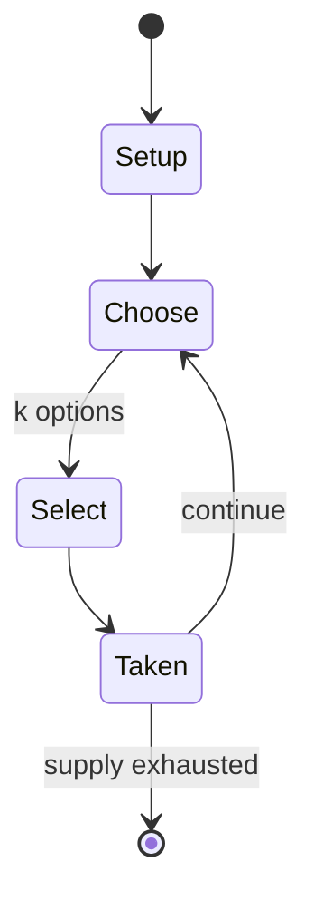

# Das Bohnenspiel

*German mancala game*

`das_bohnenspiel` &nbsp; state: **DEEPENED** &nbsp; method: **heuristic**

## Found layer (recorded, not trusted)

| field | value |
| --- | --- |
| wikidata | Q391802 |
| wikipedia | Das Bohnenspiel |
| genres (source) | -- |
| instance of (source) | board game, mancala |
| country of origin | -- |

## Declared layer (orders bench work)

| field | value |
| --- | --- |
| year created | -- |
| epoch | -- |
| region | -- |
| media | MANCALA |
| players | 2 |
| age band | -- |
| exogenous process | -- |
| loss shape | -- |
| live axes | SELECT |
| horizon | -- |
| scoring shape | -- |
| information | -- |
| interaction | COMPETITIVE |
| turn structure | -- |
| tractability | SAMPLING_ONLY |
| randomness | -- |
| luck factor | 0.35 |
| rules complexity | 2.0 |
| strategic depth | 2.0 |
| novelty | 0.3553 |
| solved status | -- |
| strategies | -- |
| algorithms | -- |

## Object model

```
Episode
  players      : 2
  turn_structure: ?
  horizon       : ?
  scoring       : ?

Pits           -- cyclic array of counts
Store          -- player's banked seeds
OptionSet      -- the choices available after an exogenous draw
```

## State transition diagram



## Research item -- turn trace

```
# Das Bohnenspiel -- simulated turn events
# generated from the DECLARED vector, not from a rulebook.
# structure: exo=None loss=None horizon=None scoring=None axes=SELECT

t=0    SETUP        players=2  pot=0  capacity=6
t=1    SELECT       p1 1 options; take #1  (pot_gain=+2.4, capacity=-1)
t=2    SELECT       p1 2 options; take #1  (pot_gain=+3.2, capacity=-0)
t=3    ENDTURN      turn passes to p2
t=4    SELECT       p2 1 options; take #1  (pot_gain=+2.4, capacity=-1)
t=5    SELECT       p2 3 options; take #1  (pot_gain=+0.5, capacity=-0)
t=6    SELECT       p2 2 options; take #1  (pot_gain=+3.2, capacity=-1)
t=7    SELECT       p2 1 options; take #1  (pot_gain=+1.3, capacity=-0)
t=8    SELECT       p2 1 options; take #1  (pot_gain=+1.5, capacity=-1)
t=9    ENDTURN      turn passes to p1
t=10   SELECT       p1 1 options; take #1  (pot_gain=+0.8, capacity=-0)
t=11   SELECT       p1 1 options; take #1  (pot_gain=+3.1, capacity=-2)
t=12   SELECT       p1 4 options; take #1  (pot_gain=+3.4, capacity=-2)
t=13   SELECT       p1 1 options; take #1  (pot_gain=+1.0, capacity=-2)
t=14   SELECT       p1 4 options; take #1  (pot_gain=+1.3, capacity=-2)
t=15   ENDTURN      turn passes to p2
t=16   SELECT       p2 4 options; take #2  (pot_gain=+3.1, capacity=-0)
t=17   ENDTURN      turn passes to p1
t=18   SELECT       p1 1 options; take #1  (pot_gain=+0.6, capacity=-1)
t=19   SELECT       p1 3 options; take #1  (pot_gain=+2.9, capacity=-2)
t=20   SELECT       p1 2 options; take #2  (pot_gain=+2.0, capacity=-1)
t=21   SELECT       p1 3 options; take #2  (pot_gain=+1.3, capacity=-1)
t=22   SELECT       p1 2 options; take #1  (pot_gain=+1.4, capacity=-2)
t=23   SELECT       p1 4 options; take #2  (pot_gain=+3.1, capacity=-0)
t=24   SELECT       p1 3 options; take #3  (pot_gain=+3.3, capacity=-0)
t=25   SELECT       p1 3 options; take #3  (pot_gain=+2.6, capacity=-2)
t=26   SELECT       p1 1 options; take #1  (pot_gain=+2.3, capacity=-0)

terminal: VARIABLE
```

## Conditions

| kind | threshold | effect | trigger |
| --- | --- | --- | --- |
| TERMINATE | -- | -- | If the player whose turn it is to move cannot move, the game ends and all beans on the board go to the other player. |
| BOUNDARY | -- | -- | The player whose turn it is to play chooses any one of his pits which contains at least one bean. |

## Source extract

Bohnenspiel ("the bean game") is a German mancala game described in the 1937 Deutsche
Spielhandbuch.   == Rules ==  The field consists of two rows of six pits each. The game starts
with six beans in each pit. Each player "owns" the six pits closest to himself. The player whose
turn it is to play chooses any one of his pits which contains at least one bean. He removes all
the beans from this pit and sows them counterclockwise. Sowing is accomplished by selecting a
pit, removing all the pieces from that pit, and dropping them one by one in each subsequent pit
(leaving out the stores), until all have been used. If the last bean ends up in a pit which,
after sowing, contains exactly two, four, or six beans (but no other number), all beans in this
pit are captured. If any capture is made, the preceding pit is checked (and its beans possibly
captured) according to the same rule, and so forth. If the player whose turn it is to move
cannot move, the game ends and all beans on the board go to the other player. The goal is to
capture more beans than the opponent.   == History == The Bohnenspiel was first mentioned by
Fritz Jahn his book Old German Games (1917). In it he describes a 1908 trip

<sub>Wikipedia, CC BY-SA. Retained as evidence for the structural
classification above. Every rule inferred from it is HYPOTHESIZED
until audited against a rulebook.</sub>
