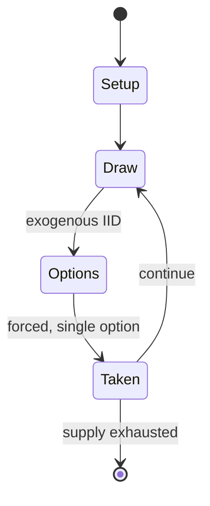

# Dayakattai

`dayakattai` &nbsp; state: **DEEPENED** &nbsp; method: **heuristic**

## Found layer (recorded, not trusted)

| field | value |
| --- | --- |
| wikidata | Q5243012 |
| wikipedia | Dayakattai |
| genres (source) | -- |
| instance of (source) | -- |
| country of origin | -- |

## Declared layer (orders bench work)

| field | value |
| --- | --- |
| year created | -- |
| epoch | -- |
| region | -- |
| media | BOARD, DICE |
| players | -- |
| age band | -- |
| exogenous process | IID |
| loss shape | -- |
| live axes | - |
| horizon | -- |
| scoring shape | -- |
| information | -- |
| interaction | COMPETITIVE |
| turn structure | STRICT_TURN |
| tractability | EXACT_WITH_CUT |
| randomness | DICE |
| luck factor | 0.58 |
| rules complexity | 1.81 |
| strategic depth | 1.87 |
| novelty | 0.6774 |
| solved status | -- |
| strategies | -- |
| algorithms | -- |

## Object model

```
Episode
  players      : ?
  turn_structure: STRICT_TURN
  horizon       : ?
  scoring       : ?

Board          -- spatial substrate; cells carry position and occupancy
Piece          -- movable token owned by a player
DicePool       -- n dice, each an iid categorical draw
Roll           -- realised outcome of a pool
```

## State transition diagram



## Research item -- turn trace

```
# Dayakattai -- simulated turn events
# generated from the DECLARED vector, not from a rulebook.
# structure: exo=IID loss=None horizon=None scoring=None axes=-

t=0    SETUP        players=2  pot=0  capacity=5
t=1    DRAW         p1 roll from d6 pool -> outcome #2  (p=0.289)
t=2    FORCED       p1 single legal option taken (pot_gain=+0.8)
t=3    ENDTURN      turn passes to p2
t=4    DRAW         p2 roll from d6 pool -> outcome #2  (p=0.280)
t=5    FORCED       p2 single legal option taken (pot_gain=+1.8)
t=6    DRAW         p2 roll from d6 pool -> outcome #2  (p=0.261)
t=7    FORCED       p2 single legal option taken (pot_gain=+1.2)
t=8    ENDTURN      turn passes to p1
t=9    DRAW         p1 roll from d6 pool -> outcome #2  (p=0.010)
t=10   FORCED       p1 single legal option taken (pot_gain=+0.8)
t=11   DRAW         p1 roll from d6 pool -> outcome #3  (p=0.111)
t=12   FORCED       p1 single legal option taken (pot_gain=+1.4)
t=13   DRAW         p1 roll from d6 pool -> outcome #4  (p=0.048)
t=14   FORCED       p1 single legal option taken (pot_gain=+1.2)
t=15   DRAW         p1 roll from d6 pool -> outcome #5  (p=0.158)
t=16   FORCED       p1 single legal option taken (pot_gain=+1.2)
t=17   ENDTURN      turn passes to p2
t=18   DRAW         p2 roll from d6 pool -> outcome #3  (p=0.082)
t=19   FORCED       p2 single legal option taken (pot_gain=+0.5)
t=20   DRAW         p2 roll from d6 pool -> outcome #3  (p=0.185)
t=21   FORCED       p2 single legal option taken (pot_gain=+0.9)
t=22   DRAW         p2 roll from d6 pool -> outcome #6  (p=0.280)
t=23   FORCED       p2 single legal option taken (pot_gain=+1.5)
t=24   DRAW         p2 roll from d6 pool -> outcome #4  (p=0.098)
t=25   FORCED       p2 single legal option taken (pot_gain=+1.3)
t=26   DRAW         p2 roll from d6 pool -> outcome #5  (p=0.002)
t=27   FORCED       p2 single legal option taken (pot_gain=+1.9)

terminal: VARIABLE
```

## Conditions

| kind | threshold | effect | trigger |
| --- | --- | --- | --- |
| WIN | 12 coins | -- | The first player to move all 12 coins to pazham is the winner. |
| WIN | -- | -- | Once the inner lap is completed, an outer lap must be completed before the player can move to the outer edge and win the game. |
| BOUNDARY | -- | -- | The pieces in this safe place cannot be cut, and only if a team cuts at least one of the other team's pieces can it enter the pazham zone. |

## Source extract

Dayakattai or Dayaboss is a Tamil dice game played by 2 or 4 people (or multiples) by forming
teams. It originated in Tamil Nadu (a southern state of India) and is comparable to another dice
game from the country called Pachisi. Dayakattai takes many different forms.   == Etymology ==
The word "Daya" is derived from the Tamil word தாயம் ("Thayam," meaning first stone).   ==
Equipment == The game uses a pair of long square cuboid dice, called the Dayakattai. These dice
also go by names such as Daayam and Daala. They are typically made of brass and have dots
punched onto the long faces (1, 2, 3, 0). Each player starts with twelve or six coins/chips at a
'home' in the center of the game board.   == Gameplay ==  Dhaayam [தாயம்] is a traditional game
of Tamil Nadu. Players take turns rolling the Dayakattai. When a player rolls a Dayam (0 on one
die and 1 on another), they move one of their pieces one space out of the "home", rolls again
and advances their piece by the number indicated by the dice. In order to move all the pieces
out of the home, Daayam must be rolled for each one.   Pieces advance first along the side of
the player and then in a clockwise direction. When a player rolls

<sub>Wikipedia, CC BY-SA. Retained as evidence for the structural
classification above. Every rule inferred from it is HYPOTHESIZED
until audited against a rulebook.</sub>
