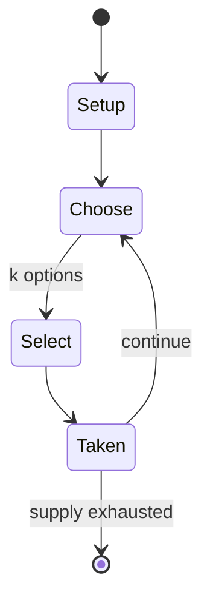

# Dazzeloids

`dazzeloids` &nbsp; state: **DEEPENED** &nbsp; method: **heuristic**

## Found layer (recorded, not trusted)

| field | value |
| --- | --- |
| wikidata | Q28126777 |
| wikipedia | Dazzeloids |
| genres (source) | -- |
| instance of (source) | -- |
| country of origin | -- |

## Declared layer (orders bench work)

| field | value |
| --- | --- |
| year created | -- |
| epoch | -- |
| region | -- |
| media | - |
| players | -- |
| age band | -- |
| exogenous process | -- |
| loss shape | -- |
| live axes | SELECT |
| horizon | -- |
| scoring shape | -- |
| information | -- |
| interaction | -- |
| turn structure | -- |
| tractability | SAMPLING_ONLY |
| randomness | -- |
| luck factor | 0.35 |
| rules complexity | 2.07 |
| strategic depth | 2.0 |
| novelty | 0.0914 |
| solved status | -- |
| strategies | -- |
| algorithms | -- |

## Object model

```
Episode
  players      : ?
  turn_structure: ?
  horizon       : ?
  scoring       : ?

OptionSet      -- the choices available after an exogenous draw
```

## State transition diagram



## Research item -- turn trace

```
# Dazzeloids -- simulated turn events
# generated from the DECLARED vector, not from a rulebook.
# structure: exo=None loss=None horizon=None scoring=None axes=SELECT

t=0    SETUP        players=2  pot=0  capacity=8
t=1    SELECT       p1 3 options; take #3  (pot_gain=+3.0, capacity=-1)
t=2    SELECT       p1 2 options; take #2  (pot_gain=+0.6, capacity=-1)
t=3    SELECT       p1 3 options; take #2  (pot_gain=+2.7, capacity=-0)
t=4    SELECT       p1 2 options; take #1  (pot_gain=+2.4, capacity=-2)
t=5    SELECT       p1 1 options; take #1  (pot_gain=+0.8, capacity=-2)
t=6    SELECT       p1 4 options; take #2  (pot_gain=+1.8, capacity=-1)
t=7    SELECT       p1 1 options; take #1  (pot_gain=+3.5, capacity=-0)
t=8    SELECT       p1 1 options; take #1  (pot_gain=+1.3, capacity=-1)
t=9    SELECT       p1 4 options; take #3  (pot_gain=+0.8, capacity=-0)
t=10   SELECT       p1 1 options; take #1  (pot_gain=+3.0, capacity=-1)
t=11   ENDTURN      turn passes to p2
t=12   SELECT       p2 3 options; take #2  (pot_gain=+1.2, capacity=-0)
t=13   SELECT       p2 2 options; take #2  (pot_gain=+0.6, capacity=-0)
t=14   SELECT       p2 1 options; take #1  (pot_gain=+1.5, capacity=-0)
t=15   SELECT       p2 4 options; take #2  (pot_gain=+3.2, capacity=-0)
t=16   SELECT       p2 4 options; take #1  (pot_gain=+0.8, capacity=-1)
t=17   SELECT       p2 3 options; take #2  (pot_gain=+2.1, capacity=-1)
t=18   SELECT       p2 3 options; take #2  (pot_gain=+2.5, capacity=-1)
t=19   SELECT       p2 1 options; take #1  (pot_gain=+2.1, capacity=-0)
t=20   SELECT       p2 1 options; take #1  (pot_gain=+2.4, capacity=-1)
t=21   SELECT       p2 4 options; take #1  (pot_gain=+1.1, capacity=-1)
t=22   SELECT       p2 2 options; take #2  (pot_gain=+3.2, capacity=-0)
t=23   SELECT       p2 1 options; take #1  (pot_gain=+1.9, capacity=-2)
t=24   SELECT       p2 3 options; take #2  (pot_gain=+0.7, capacity=-2)
t=25   SELECT       p2 4 options; take #4  (pot_gain=+1.3, capacity=-1)
t=26   SELECT       p2 3 options; take #3  (pot_gain=+2.1, capacity=-2)
t=27   ENDTURN      turn passes to p1

terminal: VARIABLE
```

## Source extract

Dazzeloids is a 1994 children's CD-ROM game created by Rodney Alan Greenblat, who also made
PaRappa the Rapper. It features Anne Dilly Whim, and her team of boredom banishers fighting the
forces of mediocrity set by the Mediogre and his geeky assistant, Pin Bleeper.   == Plot == In a
fictional place called Boredomtown, a little kid named Jeremy had become a brain-washed zombie,
from watching too much television. Unless Yendor Talbeneerg, Titan Rose, or Stinkabod Lame can
help. First they go on a ride on the Dazzelwagon to Jeremy's home. Then the reader can decide
where the story will go. Yendor can use the brain fun stimulation device to cure Jeremy's brain,
while Titan Rose can smash the victim's TV and read him some poems. As for Stinkabod, he can do
a silly dance. Jeremy's mom thanks the Dazzeloids and gives them a feast. Whatever the reader
chooses, it's a different snack each time. One morning, Stinkabod's hamster had been diseased by
the Fuzzy Rodent Flu. So Anne Dilly Whim calls the police, and they say the pet shop was there
10 minutes, and later it wasn't. All thanks to the Mediogre and his assistant, Pin Bleeper. So
Yendor, Titan, and Stinkabod explore the lot where the p

<sub>Wikipedia, CC BY-SA. Retained as evidence for the structural
classification above. Every rule inferred from it is HYPOTHESIZED
until audited against a rulebook.</sub>
