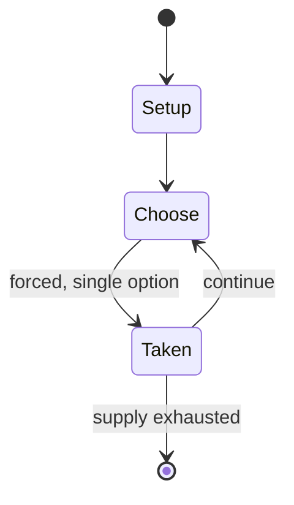

# Dead pool

`dead_pool` &nbsp; state: **DEEPENED** &nbsp; method: **heuristic**

## Found layer (recorded, not trusted)

| field | value |
| --- | --- |
| wikidata | Q3397848 |
| wikipedia | Dead pool |
| genres (source) | -- |
| instance of (source) | -- |
| country of origin | -- |

## Declared layer (orders bench work)

| field | value |
| --- | --- |
| year created | -- |
| epoch | -- |
| region | -- |
| media | - |
| players | -- |
| age band | -- |
| exogenous process | -- |
| loss shape | -- |
| live axes | - |
| horizon | -- |
| scoring shape | -- |
| information | -- |
| interaction | -- |
| turn structure | -- |
| tractability | SAMPLING_ONLY |
| randomness | DICE |
| luck factor | 0.58 |
| rules complexity | 1.62 |
| strategic depth | 1.87 |
| novelty | 0.0896 |
| solved status | -- |
| strategies | -- |
| algorithms | -- |

## Object model

```
Episode
  players      : ?
  turn_structure: ?
  horizon       : ?
  scoring       : ?

State          -- opaque; no medium or axis evidence was found
Player         -- an agent that selects among legal successors
```

## State transition diagram



## Research item -- turn trace

```
# Dead pool -- simulated turn events
# generated from the DECLARED vector, not from a rulebook.
# structure: exo=None loss=None horizon=None scoring=None axes=-

t=0    SETUP        players=2  pot=0  capacity=4
t=1    FORCED       p1 single legal option taken (pot_gain=+1.7)
t=2    ENDTURN      turn passes to p2
t=3    FORCED       p2 single legal option taken (pot_gain=+1.5)
t=4    FORCED       p2 single legal option taken (pot_gain=+1.0)
t=5    FORCED       p2 single legal option taken (pot_gain=+1.0)
t=6    FORCED       p2 single legal option taken (pot_gain=+1.5)
t=7    FORCED       p2 single legal option taken (pot_gain=+1.4)
t=8    FORCED       p2 single legal option taken (pot_gain=+1.8)
t=9    FORCED       p2 single legal option taken (pot_gain=+0.6)
t=10   FORCED       p2 single legal option taken (pot_gain=+1.2)
t=11   FORCED       p2 single legal option taken (pot_gain=+1.8)
t=12   FORCED       p2 single legal option taken (pot_gain=+1.0)
t=13   FORCED       p2 single legal option taken (pot_gain=+1.5)
t=14   ENDTURN      turn passes to p1
t=15   FORCED       p1 single legal option taken (pot_gain=+1.2)
t=16   FORCED       p1 single legal option taken (pot_gain=+1.8)
t=17   FORCED       p1 single legal option taken (pot_gain=+1.7)
t=18   ENDTURN      turn passes to p2
t=19   FORCED       p2 single legal option taken (pot_gain=+1.3)
t=20   FORCED       p2 single legal option taken (pot_gain=+1.3)
t=21   FORCED       p2 single legal option taken (pot_gain=+0.5)
t=22   FORCED       p2 single legal option taken (pot_gain=+0.6)
t=23   FORCED       p2 single legal option taken (pot_gain=+1.2)
t=24   FORCED       p2 single legal option taken (pot_gain=+1.6)
t=25   FORCED       p2 single legal option taken (pot_gain=+0.9)
t=26   FORCED       p2 single legal option taken (pot_gain=+1.1)

terminal: VARIABLE
```

## Source extract

A dead pool, also known as a deadpool or death pool, is a game of prediction which involves
guessing when someone will die. Sometimes it is a bet where money is involved.   == Modern
application == In the early 20th century, dead pools were popular in dangerous sports such as
motorsport, for example the first edition of the Indianapolis 500.   === Variants === A modern
dead pool typically has players choose celebrities they think will die within the year. Most
begin on January 1 and run for 12 months, though variations exist. In 2000, the website Fucked
Company described itself as a "dot-com dead pool", inviting users to predict which Internet
startups would fail during the dot com bust. The site folded in 2007 after years of being
targeted by strategic lawsuits against public participation. Because of the high body count in
the first seven seasons of the popular fantasy television series Game of Thrones, dead pools
were launched for its final season.   === Modern dead pools === Websites including Derby Dead
Pool and Rotten.com have hosted  celebrity dead pools. Matt Sedensky described the practice in
an AP News article: "Players scour newspapers and Web sites for news on celebriti

<sub>Wikipedia, CC BY-SA. Retained as evidence for the structural
classification above. Every rule inferred from it is HYPOTHESIZED
until audited against a rulebook.</sub>
