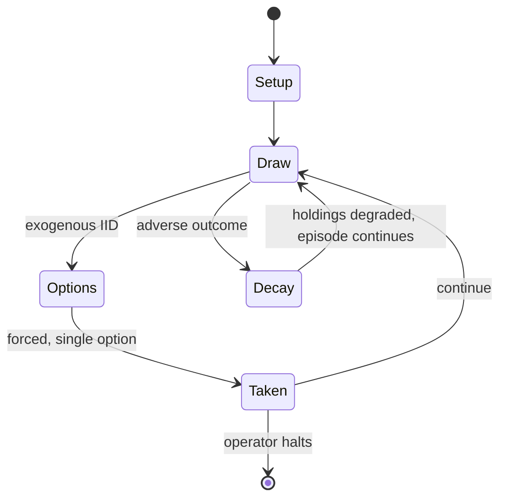

# Deception (board game)

`deception_board_game` &nbsp; state: **DEEPENED** &nbsp; method: **heuristic**

## Found layer (recorded, not trusted)

| field | value |
| --- | --- |
| wikidata | Q60785433 |
| wikipedia | Deception (board game) |
| genres (source) | -- |
| instance of (source) | -- |
| country of origin | -- |

## Declared layer (orders bench work)

| field | value |
| --- | --- |
| year created | 2015 |
| epoch | CONTEMPORARY |
| region | -- |
| media | BOARD, DICE |
| players | 4-12 |
| age band | -- |
| exogenous process | IID |
| loss shape | PARTIAL_DECAY |
| live axes | BLUFF |
| horizon | OPEN_ENDED |
| scoring shape | -- |
| information | IMPERFECT |
| interaction | TRAITOR |
| turn structure | -- |
| tractability | EXACT_WITH_CUT |
| randomness | DICE, HIDDEN_INFO |
| luck factor | 0.63 |
| rules complexity | 3.0 |
| strategic depth | 2.04 |
| novelty | 0.9855 |
| solved status | -- |
| strategies | deduction |
| algorithms | -- |

## Object model

```
Episode
  players      : 4-12
  turn_structure: ?
  horizon       : OPEN_ENDED
  scoring       : ?

Board          -- spatial substrate; cells carry position and occupancy
Piece          -- movable token owned by a player
DicePool       -- n dice, each an iid categorical draw
Roll           -- realised outcome of a pool
Belief         -- what an observer is induced to think is true
```

## State transition diagram



## Research item -- turn trace

```
# Deception (board game) -- simulated turn events
# generated from the DECLARED vector, not from a rulebook.
# structure: exo=IID loss=PARTIAL_DECAY horizon=OPEN_ENDED scoring=None axes=BLUFF

t=0    SETUP        players=4  pot=0  capacity=7
t=1    DRAW         p1 roll from d6 pool -> outcome #6  (p=0.284)
t=2    FORCED       p1 single legal option taken (pot_gain=+1.7)
t=3    BLUFF        p1 represents a holding it does not have
t=4    DRAW         p1 roll from d6 pool -> outcome #6  (p=0.059)
t=5    FORCED       p1 single legal option taken (pot_gain=+1.8)
t=6    BLUFF        p1 represents a holding it does not have
t=7    ENDTURN      turn passes to p2
t=8    DRAW         p2 roll from d6 pool -> outcome #6  (p=0.275)
t=9    FORCED       p2 single legal option taken (pot_gain=+1.9)
t=10   DRAW         p2 roll from d6 pool -> outcome #5  (p=0.040)
t=11   FORCED       p2 single legal option taken (pot_gain=+1.8)
t=12   DRAW         p2 roll from d6 pool -> outcome #4  (p=0.025)
t=13   FORCED       p2 single legal option taken (pot_gain=+1.0)
t=14   DRAW         p2 roll from d6 pool -> outcome #4  (p=0.209)
t=15   FORCED       p2 single legal option taken (pot_gain=+1.6)
t=16   BLUFF        p2 represents a holding it does not have
t=17   DRAW         p2 roll from d6 pool -> outcome #6  (p=0.072)
t=18   FORCED       p2 single legal option taken (pot_gain=+1.4)
t=19   DRAW         p2 roll from d6 pool -> outcome #6  (p=0.176)
t=20   FORCED       p2 single legal option taken (pot_gain=+1.2)
t=21   BLUFF        p2 represents a holding it does not have
t=22   DRAW         p2 roll from d6 pool -> outcome #1  (p=0.122)
t=23   FORCED       p2 single legal option taken (pot_gain=+1.7)
t=24   BLUFF        p2 represents a holding it does not have
t=25   DRAW         p2 roll from d6 pool -> outcome #4  (p=0.246)
t=26   FORCED       p2 single legal option taken (pot_gain=+1.1)
t=27   BLUFF        p2 represents a holding it does not have

terminal: OPEN_ENDED
```

## Source extract

Deception: Murder in Hong Kong is a board game for 4 to 12 players designed by Tobey Ho and
published by Grey Fox games in 2015. Set as a detective investigation scene, in Deception
players find themselves in a scenario of intrigue and murder, deduction and deception. Players
take on the roles of investigators attempting to solve a murder case, but one of the
investigators is actually the killer. Different roles are randomly assigned at the start of
play. As the investigators attempt to deduce the truth, the murderer's team must deceive and
mislead. The game was originally released via Kickstarter, raising over $65000. Deception
received positive reviews, and was awarded with the Dice Tower Seal of Excellence.   == Gameplay
== In Deception: Murder in Hong Kong, each player first receives a secret role: Forensic
Scientist, Witness, Investigator, Murderer, or Accomplice. Everyone then closes their eyes
except for the forensic scientist, who instructs the murderer to open his eyes. The murderer
does so, revealing himself to the scientist, and he points to one of the five murder weapons in
front of them and one of their five pieces of evidence. The Scientist has the solution but can
ex

<sub>Wikipedia, CC BY-SA. Retained as evidence for the structural
classification above. Every rule inferred from it is HYPOTHESIZED
until audited against a rulebook.</sub>
