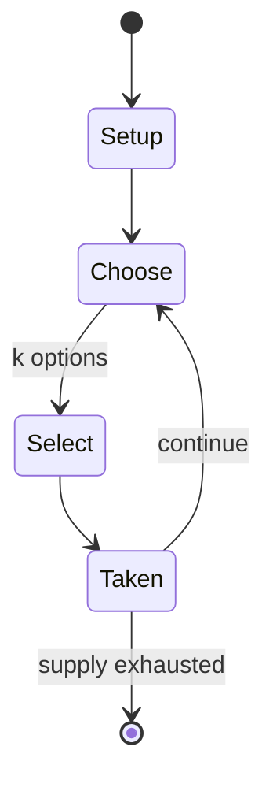

# Dezaemon 3D

*1998 video game and game construction kit*

`dezaemon_3d` &nbsp; state: **DEEPENED** &nbsp; method: **heuristic**

## Found layer (recorded, not trusted)

| field | value |
| --- | --- |
| wikidata | Q3025655 |
| wikipedia | Dezaemon 3D |
| genres (source) | shoot 'em up |
| instance of (source) | game creation system, video game |
| country of origin | Japan |

## Declared layer (orders bench work)

| field | value |
| --- | --- |
| year created | 2024 |
| epoch | CONTEMPORARY |
| region | EAST_ASIA |
| media | VIDEO |
| players | -- |
| age band | -- |
| exogenous process | -- |
| loss shape | -- |
| live axes | SELECT |
| horizon | -- |
| scoring shape | -- |
| information | -- |
| interaction | -- |
| turn structure | -- |
| tractability | SAMPLING_ONLY |
| randomness | -- |
| luck factor | 0.35 |
| rules complexity | 2.36 |
| strategic depth | 2.0 |
| novelty | 0.0914 |
| solved status | -- |
| strategies | -- |
| algorithms | -- |

## Object model

```
Episode
  players      : ?
  turn_structure: ?
  horizon       : ?
  scoring       : ?

WorldState     -- simulation state advanced by the engine
Avatar         -- player-controlled agent
Clock          -- frame or tick counter
OptionSet      -- the choices available after an exogenous draw
```

## State transition diagram



## Research item -- turn trace

```
# Dezaemon 3D -- simulated turn events
# generated from the DECLARED vector, not from a rulebook.
# structure: exo=None loss=None horizon=None scoring=None axes=SELECT

t=0    SETUP        players=2  pot=0  capacity=7
t=1    SELECT       p1 3 options; take #2  (pot_gain=+1.6, capacity=-1)
t=2    SELECT       p1 4 options; take #1  (pot_gain=+2.3, capacity=-2)
t=3    SELECT       p1 2 options; take #2  (pot_gain=+1.5, capacity=-2)
t=4    SELECT       p1 3 options; take #2  (pot_gain=+3.2, capacity=-1)
t=5    SELECT       p1 3 options; take #1  (pot_gain=+1.7, capacity=-1)
t=6    SELECT       p1 2 options; take #2  (pot_gain=+0.8, capacity=-0)
t=7    ENDTURN      turn passes to p2
t=8    SELECT       p2 1 options; take #1  (pot_gain=+3.1, capacity=-0)
t=9    SELECT       p2 1 options; take #1  (pot_gain=+2.7, capacity=-2)
t=10   ENDTURN      turn passes to p1
t=11   SELECT       p1 1 options; take #1  (pot_gain=+2.0, capacity=-1)
t=12   SELECT       p1 3 options; take #3  (pot_gain=+2.5, capacity=-1)
t=13   SELECT       p1 2 options; take #2  (pot_gain=+1.3, capacity=-2)
t=14   SELECT       p1 4 options; take #4  (pot_gain=+1.7, capacity=-2)
t=15   ENDTURN      turn passes to p2
t=16   SELECT       p2 3 options; take #1  (pot_gain=+3.2, capacity=-0)
t=17   SELECT       p2 1 options; take #1  (pot_gain=+1.6, capacity=-0)
t=18   SELECT       p2 2 options; take #1  (pot_gain=+0.6, capacity=-2)
t=19   SELECT       p2 1 options; take #1  (pot_gain=+0.9, capacity=-0)
t=20   SELECT       p2 2 options; take #2  (pot_gain=+1.4, capacity=-0)
t=21   SELECT       p2 3 options; take #1  (pot_gain=+1.1, capacity=-2)
t=22   SELECT       p2 4 options; take #4  (pot_gain=+0.6, capacity=-2)
t=23   SELECT       p2 2 options; take #1  (pot_gain=+2.5, capacity=-0)
t=24   SELECT       p2 1 options; take #1  (pot_gain=+2.3, capacity=-0)
t=25   ENDTURN      turn passes to p1
t=26   SELECT       p1 3 options; take #2  (pot_gain=+1.2, capacity=-1)

terminal: VARIABLE
```

## Source extract

Dezaemon 3D (Japanese: デザエモン3D) is a vertical scrolling shooter video game and game editor
released by Athena only in Japan for the Nintendo 64 in 1998. It is part of the Dezaemon series
that started on the Famicom. The game editor allows players to design their own shooting levels
similar to those shown in Star Soldier: Vanishing Earth. The game has many options, such as
creating the stage boss or adding a custom soundtrack for each level. It was originally
developed alongside an ultimately unreleased accompanying expansion disk title for the 64DD. It
includes two sample games: "SOLID GEAR", and "USAGI-san" (Mr. Rabbit). An English fan
translation patch was released in 2024.   == Reception ==  N64 Magazine  noted the difficulty of
use in English "without any English instructions", but that "as Solid Gear ably demonstrates,
Dezaemon is perfectly capable of producing a commercial-standard shooter", and that "given an
English translation...we'd buy it just for the music editor." While IGN64 did not give it a full
review, their coverage called it a "high quality creativity app"  and placed it second on their
list of "Top Nintendo 64 Imports" after Sin & Punishment, lamenting that Nint

<sub>Wikipedia, CC BY-SA. Retained as evidence for the structural
classification above. Every rule inferred from it is HYPOTHESIZED
until audited against a rulebook.</sub>
