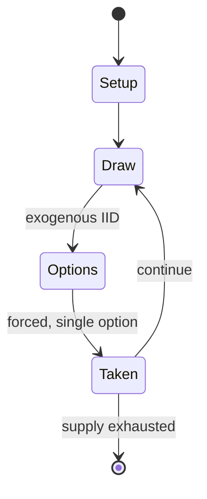

# Dicemaster: Cities of Doom

*1996 collectible dice game*

`dicemaster_cities_of_doom` &nbsp; state: **DEEPENED** &nbsp; method: **heuristic**

## Found layer (recorded, not trusted)

| field | value |
| --- | --- |
| wikidata | Q135910252 |
| wikipedia | Dicemaster: Cities of Doom |
| genres (source) | -- |
| instance of (source) | dice game |
| country of origin | -- |

## Declared layer (orders bench work)

| field | value |
| --- | --- |
| year created | -- |
| epoch | -- |
| region | -- |
| media | DICE |
| players | -- |
| age band | -- |
| exogenous process | IID |
| loss shape | -- |
| live axes | - |
| horizon | -- |
| scoring shape | -- |
| information | -- |
| interaction | -- |
| turn structure | -- |
| tractability | EXACT_WITH_CUT |
| randomness | DICE |
| luck factor | 0.58 |
| rules complexity | 1.67 |
| strategic depth | 2.12 |
| novelty | 0.6405 |
| solved status | -- |
| strategies | route_optimisation |
| algorithms | -- |

## Object model

```
Episode
  players      : ?
  turn_structure: ?
  horizon       : ?
  scoring       : ?

DicePool       -- n dice, each an iid categorical draw
Roll           -- realised outcome of a pool
```

## State transition diagram



## Research item -- turn trace

```
# Dicemaster: Cities of Doom -- simulated turn events
# generated from the DECLARED vector, not from a rulebook.
# structure: exo=IID loss=None horizon=None scoring=None axes=-

t=0    SETUP        players=2  pot=0  capacity=8
t=1    DRAW         p1 roll from d6 pool -> outcome #1  (p=0.104)
t=2    FORCED       p1 single legal option taken (pot_gain=+1.6)
t=3    DRAW         p1 roll from d6 pool -> outcome #5  (p=0.151)
t=4    FORCED       p1 single legal option taken (pot_gain=+1.2)
t=5    DRAW         p1 roll from d6 pool -> outcome #4  (p=0.104)
t=6    FORCED       p1 single legal option taken (pot_gain=+1.8)
t=7    ENDTURN      turn passes to p2
t=8    DRAW         p2 roll from d6 pool -> outcome #5  (p=0.179)
t=9    FORCED       p2 single legal option taken (pot_gain=+1.4)
t=10   ENDTURN      turn passes to p1
t=11   DRAW         p1 roll from d6 pool -> outcome #3  (p=0.183)
t=12   FORCED       p1 single legal option taken (pot_gain=+0.6)
t=13   DRAW         p1 roll from d6 pool -> outcome #2  (p=0.118)
t=14   FORCED       p1 single legal option taken (pot_gain=+1.5)
t=15   DRAW         p1 roll from d6 pool -> outcome #1  (p=0.274)
t=16   FORCED       p1 single legal option taken (pot_gain=+0.6)
t=17   DRAW         p1 roll from d6 pool -> outcome #2  (p=0.169)
t=18   FORCED       p1 single legal option taken (pot_gain=+1.0)
t=19   DRAW         p1 roll from d6 pool -> outcome #4  (p=0.017)
t=20   FORCED       p1 single legal option taken (pot_gain=+1.0)
t=21   ENDTURN      turn passes to p2
t=22   DRAW         p2 roll from d6 pool -> outcome #5  (p=0.144)
t=23   FORCED       p2 single legal option taken (pot_gain=+1.4)
t=24   DRAW         p2 roll from d6 pool -> outcome #2  (p=0.236)
t=25   FORCED       p2 single legal option taken (pot_gain=+1.6)
t=26   DRAW         p2 roll from d6 pool -> outcome #4  (p=0.205)
t=27   FORCED       p2 single legal option taken (pot_gain=+0.6)

terminal: VARIABLE
```

## Source extract

Dicemaster: Cities of Doom is a 1996 collectible dice game published by Iron Crown Enterprises.
== Gameplay == Dicemaster: Cities of Doom is a game in which dungeon-crawling board game tropes
are blended with dice mechanics. It transforms classic gaming elements into a colorful array of
dice, with players taking on familiar fantasy roles to chase mystical runes and summon a
legendary book. Gameplay is structured around constructing and traversing adventure routes with
location dice, battling monsters, and managing resources via Action dice. These dice determine
movement, magic, and interference tactics, and are also key to discovering runes. Combat
emphasizes strategic rerolling of special dice, with risk-reward dynamics like losing dice to
"burning skull" faces. Additional complexity arises through mechanics like weapon upgrades, rune
theft, and monster enhancements.   == Publication history == Wilds of Doom was the inaugural
expansion for Cities of Doom.   == Reception == Steve Faragher reviewed Dicemaster: Cities of
Doom for Arcane magazine, rating it a 7 out of 10 overall, and stated that "Cities of Doom is a
good, fun game, but it's perhaps a bit disappointing that its subje

<sub>Wikipedia, CC BY-SA. Retained as evidence for the structural
classification above. Every rule inferred from it is HYPOTHESIZED
until audited against a rulebook.</sub>
