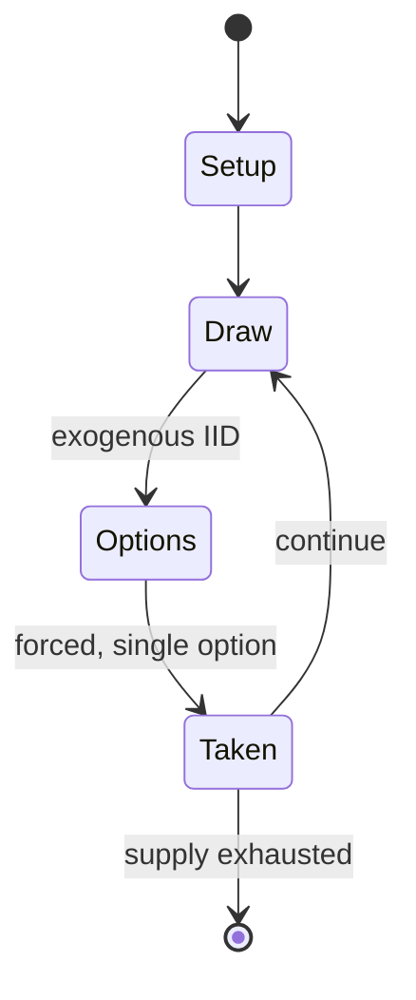

# Dicemaster: Wilds of Doom

`dicemaster_wilds_of_doom` &nbsp; state: **DEEPENED** &nbsp; method: **heuristic**

## Found layer (recorded, not trusted)

| field | value |
| --- | --- |
| wikidata | Q135910253 |
| wikipedia | Dicemaster: Wilds of Doom |
| genres (source) | -- |
| instance of (source) | dice game |
| country of origin | -- |

## Declared layer (orders bench work)

| field | value |
| --- | --- |
| year created | -- |
| epoch | -- |
| region | -- |
| media | DICE |
| players | -- |
| age band | -- |
| exogenous process | IID |
| loss shape | -- |
| live axes | - |
| horizon | -- |
| scoring shape | -- |
| information | -- |
| interaction | -- |
| turn structure | -- |
| tractability | EXACT_WITH_CUT |
| randomness | DICE |
| luck factor | 0.58 |
| rules complexity | 2.05 |
| strategic depth | 1.87 |
| novelty | 0.6405 |
| solved status | -- |
| strategies | -- |
| algorithms | -- |

## Object model

```
Episode
  players      : ?
  turn_structure: ?
  horizon       : ?
  scoring       : ?

DicePool       -- n dice, each an iid categorical draw
Roll           -- realised outcome of a pool
```

## State transition diagram



## Research item -- turn trace

```
# Dicemaster: Wilds of Doom -- simulated turn events
# generated from the DECLARED vector, not from a rulebook.
# structure: exo=IID loss=None horizon=None scoring=None axes=-

t=0    SETUP        players=2  pot=0  capacity=8
t=1    DRAW         p1 roll from d6 pool -> outcome #2  (p=0.199)
t=2    FORCED       p1 single legal option taken (pot_gain=+1.3)
t=3    DRAW         p1 roll from d6 pool -> outcome #6  (p=0.199)
t=4    FORCED       p1 single legal option taken (pot_gain=+1.6)
t=5    ENDTURN      turn passes to p2
t=6    DRAW         p2 roll from d6 pool -> outcome #2  (p=0.055)
t=7    FORCED       p2 single legal option taken (pot_gain=+1.1)
t=8    DRAW         p2 roll from d6 pool -> outcome #5  (p=0.195)
t=9    FORCED       p2 single legal option taken (pot_gain=+0.7)
t=10   DRAW         p2 roll from d6 pool -> outcome #3  (p=0.121)
t=11   FORCED       p2 single legal option taken (pot_gain=+1.6)
t=12   DRAW         p2 roll from d6 pool -> outcome #3  (p=0.223)
t=13   FORCED       p2 single legal option taken (pot_gain=+1.4)
t=14   DRAW         p2 roll from d6 pool -> outcome #2  (p=0.118)
t=15   FORCED       p2 single legal option taken (pot_gain=+1.4)
t=16   ENDTURN      turn passes to p1
t=17   DRAW         p1 roll from d6 pool -> outcome #1  (p=0.269)
t=18   FORCED       p1 single legal option taken (pot_gain=+1.1)
t=19   DRAW         p1 roll from d6 pool -> outcome #3  (p=0.210)
t=20   FORCED       p1 single legal option taken (pot_gain=+0.7)
t=21   DRAW         p1 roll from d6 pool -> outcome #1  (p=0.144)
t=22   FORCED       p1 single legal option taken (pot_gain=+1.4)
t=23   DRAW         p1 roll from d6 pool -> outcome #5  (p=0.187)
t=24   FORCED       p1 single legal option taken (pot_gain=+0.8)
t=25   DRAW         p1 roll from d6 pool -> outcome #3  (p=0.165)
t=26   FORCED       p1 single legal option taken (pot_gain=+1.6)

terminal: VARIABLE
```

## Source extract

Dicemaster: Wilds of Doom is a 1996 collectible dice game supplement published by Iron Crown
Enterprises for Dicemaster: Cities of Doom.   == Gameplay == Dicemaster: Wilds of Doom is a
supplement in which 26 additional dice are featured, and which is designed for use by two
players sharing a single set. It aims to enrich the original game's mechanics by intensifying
monster battles—introducing multi-round creature combat and special dice for enemies. New
features also include turn-limiting rules and advanced weapon upgrades for characters, layered
atop increased overall complexity.   == Publication history == Wilds of Doom is the inaugural
expansion for Cities of Doom.   == Reception == Steve Faragher reviewed Dicemaster: Wilds of
Doom for Arcane magazine, rating it a 6 out of 10 overall, and stated that "in practice they
tend to make the straightforwardly fun basic game just too cumbersome and the large quantities
of dice-rolling required stop being amusing and become a chore. If you just love complex games,
this could be something you may enjoy. Otherwise, though, it tends to detract from the simple
fun which is COD's greatest."   == Reviews == Backstab #3   == References ==

<sub>Wikipedia, CC BY-SA. Retained as evidence for the structural
classification above. Every rule inferred from it is HYPOTHESIZED
until audited against a rulebook.</sub>
