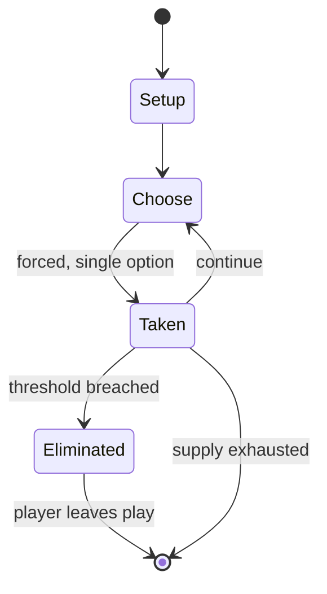

# Dieppe

*board wargame published in 1977*

`dieppe` &nbsp; state: **DEEPENED** &nbsp; method: **heuristic**

## Found layer (recorded, not trusted)

| field | value |
| --- | --- |
| wikidata | Q111948310 |
| wikipedia | Dieppe (board game) |
| genres (source) | -- |
| instance of (source) | board wargame |
| country of origin | -- |

## Declared layer (orders bench work)

| field | value |
| --- | --- |
| year created | 1977 |
| epoch | DIGITAL |
| region | -- |
| media | WARGAME |
| players | -- |
| age band | -- |
| exogenous process | -- |
| loss shape | ELIMINATION |
| live axes | SPATIAL |
| horizon | -- |
| scoring shape | -- |
| information | -- |
| interaction | COMPETITIVE |
| turn structure | PHASE_STRUCTURED |
| tractability | SAMPLING_ONLY |
| randomness | DICE |
| luck factor | 0.58 |
| rules complexity | 4.03 |
| strategic depth | 1.87 |
| novelty | 0.5965 |
| solved status | -- |
| strategies | -- |
| algorithms | -- |

## Object model

```
Episode
  players      : ?
  turn_structure: PHASE_STRUCTURED
  horizon       : ?
  scoring       : ?

Placement      -- position subject to geometric legality
```

## State transition diagram



## Research item -- turn trace

```
# Dieppe -- simulated turn events
# generated from the DECLARED vector, not from a rulebook.
# structure: exo=None loss=ELIMINATION horizon=None scoring=None axes=SPATIAL

t=0    SETUP        players=2  pot=0  capacity=7
t=1    FORCED       p1 single legal option taken (pot_gain=+1.6)
t=2    SPATIAL      p1 places at (6,7); adjacency legal
t=3    ENDTURN      turn passes to p2
t=4    FORCED       p2 single legal option taken (pot_gain=+1.3)
t=5    FORCED       p2 single legal option taken (pot_gain=+0.6)
t=6    FORCED       p2 single legal option taken (pot_gain=+1.7)
t=7    ENDTURN      turn passes to p1
t=8    FORCED       p1 single legal option taken (pot_gain=+0.8)
t=9    SPATIAL      p1 places at (7,6); adjacency legal
t=10   FORCED       p1 single legal option taken (pot_gain=+1.9)
t=11   FORCED       p1 single legal option taken (pot_gain=+1.8)
t=12   SPATIAL      p1 places at (5,7); adjacency legal
t=13   ENDTURN      turn passes to p2
t=14   FORCED       p2 single legal option taken (pot_gain=+0.9)
t=15   SPATIAL      p2 places at (5,1); adjacency legal
t=16   ENDTURN      turn passes to p1
t=17   FORCED       p1 single legal option taken (pot_gain=+1.8)
t=18   SPATIAL      p1 places at (1,3); adjacency legal
t=19   FORCED       p1 single legal option taken (pot_gain=+1.6)
t=20   SPATIAL      p1 places at (4,1); adjacency legal
t=21   ENDTURN      turn passes to p2
t=22   FORCED       p2 single legal option taken (pot_gain=+1.9)
t=23   SPATIAL      p2 places at (7,2); adjacency legal
t=24   FORCED       p2 single legal option taken (pot_gain=+0.5)
t=25   FORCED       p2 single legal option taken (pot_gain=+1.7)
t=26   ENDTURN      turn passes to p1

terminal: VARIABLE
```

## Source extract

Dieppe, subtitled "An Operational Game of the Allied Raid on Fortress Europe, August 1942", is a
board wargame published by Simulations Canada in 1977 that is a simulation of Operation Jubilee,
the disastrous Dieppe Raid made by Canadian and British forces during World War II.   ==
Background == On 19 August 1942, a predominantly Canadian amphibious force landed at the German-
occupied port of Dieppe as a test of Allied invasion equipment and the ability to take and hold
a defended port. With incorrect intelligence, faulty timing and lack of surprise, the raid was a
total fiasco in which most of the men never got off the beach, and over half were wounded,
killed or taken prisoner.   == Description == Dieppe is a two-player wargame in which one player
controls the Allied landing forces, and the other player controls the German defenders.   ===
Components === The game box or ziplock bag contains:  21" x 27" paper hex grid map, scaled at
500 m (550 yd) per hex rules booklet 255 die-cut counters   === Scenarios === The game comes
with six scenarios. In all of them, the German units and their placement remain the same, but
Allied units differ in number and type.  Historical: The day as i

<sub>Wikipedia, CC BY-SA. Retained as evidence for the structural
classification above. Every rule inferred from it is HYPOTHESIZED
until audited against a rulebook.</sub>
