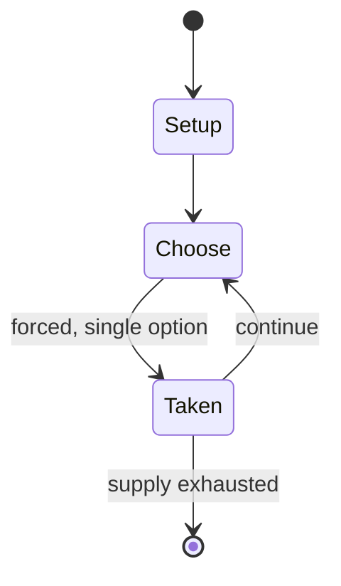

# DikuMUD

*Danish text-based virtual world (MUD)*

`dikumud` &nbsp; state: **DEEPENED** &nbsp; method: **heuristic**

## Found layer (recorded, not trusted)

| field | value |
| --- | --- |
| wikidata | Q3027935 |
| wikipedia | DikuMUD |
| genres (source) | MUD |
| instance of (source) | MUD, video game |
| country of origin | Denmark |

## Declared layer (orders bench work)

| field | value |
| --- | --- |
| year created | 1990 |
| epoch | DIGITAL |
| region | EUROPE_NORTH |
| media | RPG, VIDEO |
| players | -- |
| age band | -- |
| exogenous process | -- |
| loss shape | -- |
| live axes | - |
| horizon | -- |
| scoring shape | -- |
| information | -- |
| interaction | -- |
| turn structure | -- |
| tractability | SAMPLING_ONLY |
| randomness | -- |
| luck factor | 0.35 |
| rules complexity | 2.87 |
| strategic depth | 2.0 |
| novelty | 0.0914 |
| solved status | -- |
| strategies | -- |
| algorithms | -- |

## Object model

```
Episode
  players      : ?
  turn_structure: ?
  horizon       : ?
  scoring       : ?

Character      -- persistent stat block owned by a player
GameMaster     -- adjudicating agent outside the scoring loop
Scenario       -- authored state the players traverse
WorldState     -- simulation state advanced by the engine
Avatar         -- player-controlled agent
Clock          -- frame or tick counter
```

## State transition diagram



## Research item -- turn trace

```
# DikuMUD -- simulated turn events
# generated from the DECLARED vector, not from a rulebook.
# structure: exo=None loss=None horizon=None scoring=None axes=-

t=0    SETUP        players=2  pot=0  capacity=4
t=1    FORCED       p1 single legal option taken (pot_gain=+1.5)
t=2    FORCED       p1 single legal option taken (pot_gain=+0.5)
t=3    FORCED       p1 single legal option taken (pot_gain=+0.6)
t=4    FORCED       p1 single legal option taken (pot_gain=+1.6)
t=5    ENDTURN      turn passes to p2
t=6    FORCED       p2 single legal option taken (pot_gain=+0.6)
t=7    ENDTURN      turn passes to p1
t=8    FORCED       p1 single legal option taken (pot_gain=+1.6)
t=9    FORCED       p1 single legal option taken (pot_gain=+1.9)
t=10   FORCED       p1 single legal option taken (pot_gain=+1.7)
t=11   FORCED       p1 single legal option taken (pot_gain=+0.8)
t=12   FORCED       p1 single legal option taken (pot_gain=+1.9)
t=13   ENDTURN      turn passes to p2
t=14   FORCED       p2 single legal option taken (pot_gain=+0.5)
t=15   ENDTURN      turn passes to p1
t=16   FORCED       p1 single legal option taken (pot_gain=+0.6)
t=17   ENDTURN      turn passes to p2
t=18   FORCED       p2 single legal option taken (pot_gain=+0.6)
t=19   ENDTURN      turn passes to p1
t=20   FORCED       p1 single legal option taken (pot_gain=+1.8)
t=21   FORCED       p1 single legal option taken (pot_gain=+1.3)
t=22   FORCED       p1 single legal option taken (pot_gain=+1.8)
t=23   FORCED       p1 single legal option taken (pot_gain=+0.8)
t=24   FORCED       p1 single legal option taken (pot_gain=+1.5)
t=25   FORCED       p1 single legal option taken (pot_gain=+0.7)
t=26   FORCED       p1 single legal option taken (pot_gain=+1.6)
t=27   ENDTURN      turn passes to p2

terminal: VARIABLE
```

## Source extract

DikuMUD is a multiplayer text-based role-playing game, which is a type of multi-user domain
(MUD). It was written in 1990 and 1991 by Sebastian Hammer, Tom Madsen, Katja Nyboe, Michael
Seifert, and Hans Henrik Stærfeldt at DIKU (Datalogisk Institut Københavns Universitet)—the
department of computer science at the University of Copenhagen in Copenhagen, Denmark. Commonly
referred to as simply "Diku", the game was greatly inspired by AberMUD, though Diku became one
of the first multi-user games to become popular as a freely-available program for its gameplay
and similarity to Dungeons & Dragons. The gameplay style of the great preponderance of DikuMUDs
is hack and slash, which is seen proudly as emblematic of what DikuMUD stands for. Diku's source
code was first released in 1990.   == Development and history == DikuMUD was created by the
University of Copenhagen's Department of Computer Science among a group of student friends:
Katja Nyboe, Tom Madsen, Hans Henrik Staerfeldt, Michael Seifert, and Sebastian Hammer.
According to Richard Bartle, co-creator of the first MUD, DikuMUD's developers sought to create
a better version of AberMUD. Unlike TinyMUD and LPMUD, which encouraged live

<sub>Wikipedia, CC BY-SA. Retained as evidence for the structural
classification above. Every rule inferred from it is HYPOTHESIZED
until audited against a rulebook.</sub>
