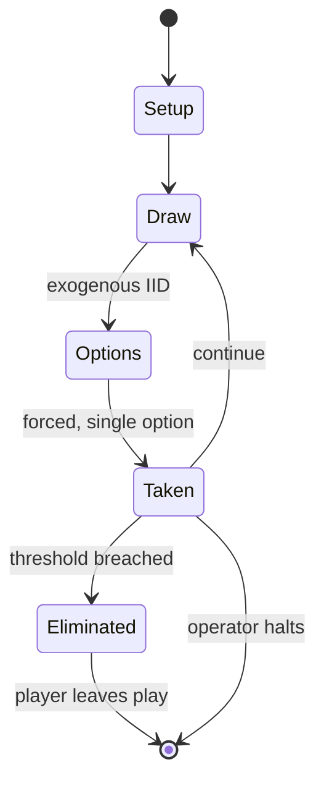

# Diplomacy (game)

`diplomacy_game` &nbsp; state: **DEEPENED** &nbsp; method: **heuristic**

## Found layer (recorded, not trusted)

| field | value |
| --- | --- |
| wikidata | Q1871 |
| wikipedia | Diplomacy (game) |
| genres (source) | -- |
| instance of (source) | -- |
| country of origin | -- |

## Declared layer (orders bench work)

| field | value |
| --- | --- |
| year created | 1959 |
| epoch | MODERN |
| region | -- |
| media | BOARD, DICE, VIDEO, WARGAME |
| players | 2-4 |
| age band | -- |
| exogenous process | IID |
| loss shape | ELIMINATION |
| live axes | BID, COMMIT_BLIND, NEGOTIATE, SPATIAL |
| horizon | OPEN_ENDED |
| scoring shape | -- |
| information | SIMULTANEOUS |
| interaction | SOLITAIRE |
| turn structure | PHASE_STRUCTURED |
| tractability | SAMPLING_ONLY |
| randomness | DICE, HIDDEN_INFO, SIMULTANEOUS_CHOICE |
| luck factor | 0.63 |
| rules complexity | 5.0 |
| strategic depth | 2.79 |
| novelty | 0.8349 |
| solved status | -- |
| strategies | area_control, coalition_forming, opponent_modelling, signalling |
| algorithms | -- |

## Object model

```
Episode
  players      : 2-4
  turn_structure: PHASE_STRUCTURED
  horizon       : OPEN_ENDED
  scoring       : ?

Board          -- spatial substrate; cells carry position and occupancy
Piece          -- movable token owned by a player
DicePool       -- n dice, each an iid categorical draw
Roll           -- realised outcome of a pool
WorldState     -- simulation state advanced by the engine
Avatar         -- player-controlled agent
Clock          -- frame or tick counter
Auction        -- priced competition resolving to one winner
SealedChoice   -- irrevocable choice made without observation
Agreement      -- non-binding or binding commitment between agents
Placement      -- position subject to geometric legality
```

## State transition diagram



## Research item -- turn trace

```
# Diplomacy (game) -- simulated turn events
# generated from the DECLARED vector, not from a rulebook.
# structure: exo=IID loss=ELIMINATION horizon=OPEN_ENDED scoring=None axes=BID,COMMIT_BLIND,NEGOTIATE,SPATIAL

t=0    SETUP        players=2  pot=0  capacity=7
t=1    DRAW         p1 roll from d6 pool -> outcome #3  (p=0.208)
t=2    FORCED       p1 single legal option taken (pot_gain=+1.6)
t=3    DRAW         p1 roll from d6 pool -> outcome #1  (p=0.166)
t=4    FORCED       p1 single legal option taken (pot_gain=+2.0)
t=5    DRAW         p1 roll from d6 pool -> outcome #1  (p=0.057)
t=6    FORCED       p1 single legal option taken (pot_gain=+0.6)
t=7    BID          p1 sealed bid of 8 against 1 rivals
t=8    DRAW         p1 roll from d6 pool -> outcome #6  (p=0.215)
t=9    FORCED       p1 single legal option taken (pot_gain=+1.2)
t=10   ENDTURN      turn passes to p2
t=11   DRAW         p2 roll from d6 pool -> outcome #2  (p=0.202)
t=12   FORCED       p2 single legal option taken (pot_gain=+1.7)
t=13   BID          p2 sealed bid of 6 against 1 rivals
t=14   DRAW         p2 roll from d6 pool -> outcome #3  (p=0.143)
t=15   FORCED       p2 single legal option taken (pot_gain=+1.7)
t=16   BID          p2 sealed bid of 4 against 1 rivals
t=17   DRAW         p2 roll from d6 pool -> outcome #1  (p=0.073)
t=18   FORCED       p2 single legal option taken (pot_gain=+0.7)
t=19   SPATIAL      p2 places at (4,7); adjacency legal
t=20   ENDTURN      turn passes to p1
t=21   DRAW         p1 roll from d6 pool -> outcome #4  (p=0.084)
t=22   FORCED       p1 single legal option taken (pot_gain=+1.5)
t=23   BID          p1 sealed bid of 1 against 1 rivals
t=24   SPATIAL      p1 places at (7,0); adjacency legal
t=25   DRAW         p1 roll from d6 pool -> outcome #3  (p=0.297)
t=26   FORCED       p1 single legal option taken (pot_gain=+1.9)
t=27   BID          p1 sealed bid of 1 against 1 rivals
t=28   SPATIAL      p1 places at (7,0); adjacency legal

terminal: OPEN_ENDED
```

## Conditions

| kind | threshold | effect | trigger |
| --- | --- | --- | --- |
| ELIMINATE | -- | eliminated | Players who have lost all of their Home centers may not build new units, while players controlling no supply centers are eliminated from the game. |
| ELIMINATE | -- | -- | Eliminate Italy and Germany (as described for Italy above). |
| BOUNDARY | -- | -- | After reaching the maximum number of pieces the players start the game with ownership of their starting provinces. |

## Source extract

Diplomacy is a strategic board game created by Allan B. Calhamer in 1954 and released
commercially in the United States in 1959. Its main distinctions from most board wargames are
its negotiation phases (players spend much of their time forming and betraying alliances with
other players and forming beneficial strategies) and the absence of dice and other game elements
that produce random effects. Set in Europe in the years leading to the First World War,
Diplomacy is designed to be played by seven players, but can be played with as few as two, each
controlling the armed forces of a major European power (or, with fewer players, multiple
powers). Each player aims to move their few starting units and defeat those of others to win
possession of a majority of strategic cities and provinces marked as "supply centers" on the
map; these supply centers allow players who control them to produce more units. Following each
round of player negotiations, each player can issue attack and support orders, which are then
executed during the movement phase. A player takes control of a province when the number of
provinces that are given orders to support the attacking province exceeds the number of p

<sub>Wikipedia, CC BY-SA. Retained as evidence for the structural
classification above. Every rule inferred from it is HYPOTHESIZED
until audited against a rulebook.</sub>
