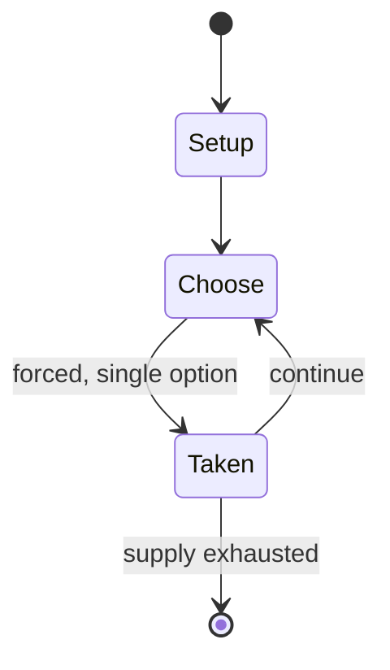

# Disney Lorcana

*collectible card game*

`disney_lorcana` &nbsp; state: **DEEPENED** &nbsp; method: **heuristic**

## Found layer (recorded, not trusted)

| field | value |
| --- | --- |
| wikidata | Q120664402 |
| wikipedia | Disney Lorcana |
| genres (source) | -- |
| instance of (source) | collectible card game |
| country of origin | -- |

## Declared layer (orders bench work)

| field | value |
| --- | --- |
| year created | 2023 |
| epoch | CONTEMPORARY |
| region | -- |
| media | CARD, COLLECTIBLE |
| players | 2-6 |
| age band | -- |
| exogenous process | -- |
| loss shape | -- |
| live axes | DISCARD, ORDER, TIMING, TRADE |
| horizon | VARIABLE |
| scoring shape | -- |
| information | -- |
| interaction | SOLITAIRE |
| turn structure | -- |
| tractability | SAMPLING_ONLY |
| randomness | -- |
| luck factor | 0.35 |
| rules complexity | 3.47 |
| strategic depth | 2.25 |
| novelty | 0.5522 |
| solved status | -- |
| strategies | spatial_packing |
| algorithms | -- |

## Object model

```
Episode
  players      : 2-6
  turn_structure: ?
  horizon       : VARIABLE
  scoring       : ?

Deck           -- ordered multiset, drawn without replacement
Hand           -- private multiset held by one player
DiscardPile    -- public accumulation of spent cards
DiscardChoice  -- what is given up to satisfy a limit
Sequence       -- the permutation under the player's control
Initiative     -- who acts, and when, relative to others
Offer          -- proposed exchange between two agents
```

## State transition diagram



## Research item -- turn trace

```
# Disney Lorcana -- simulated turn events
# generated from the DECLARED vector, not from a rulebook.
# structure: exo=None loss=None horizon=VARIABLE scoring=None axes=DISCARD,ORDER,TIMING,TRADE

t=0    SETUP        players=2  pot=0  capacity=3
t=1    FORCED       p1 single legal option taken (pot_gain=+0.7)
t=2    TRADE        p1 offers 2:1 exchange to p2
t=3    FORCED       p1 single legal option taken (pot_gain=+2.0)
t=4    TRADE        p1 offers 2:1 exchange to p2
t=5    DISCARD      p1 discards to hand limit
t=6    FORCED       p1 single legal option taken (pot_gain=+0.6)
t=7    FORCED       p1 single legal option taken (pot_gain=+1.6)
t=8    FORCED       p1 single legal option taken (pot_gain=+1.4)
t=9    FORCED       p1 single legal option taken (pot_gain=+1.1)
t=10   TRADE        p1 offers 2:1 exchange to p2
t=11   ENDTURN      turn passes to p2
t=12   FORCED       p2 single legal option taken (pot_gain=+0.6)
t=13   DISCARD      p2 discards to hand limit
t=14   FORCED       p2 single legal option taken (pot_gain=+1.5)
t=15   TRADE        p2 offers 2:1 exchange to p1
t=16   DISCARD      p2 discards to hand limit
t=17   FORCED       p2 single legal option taken (pot_gain=+0.6)
t=18   FORCED       p2 single legal option taken (pot_gain=+0.7)
t=19   ENDTURN      turn passes to p1
t=20   FORCED       p1 single legal option taken (pot_gain=+1.8)
t=21   DISCARD      p1 discards to hand limit
t=22   FORCED       p1 single legal option taken (pot_gain=+0.8)
t=23   DISCARD      p1 discards to hand limit
t=24   FORCED       p1 single legal option taken (pot_gain=+1.5)
t=25   FORCED       p1 single legal option taken (pot_gain=+2.0)
t=26   TRADE        p1 offers 2:1 exchange to p2
t=27   DISCARD      p1 discards to hand limit
t=28   ENDTURN      turn passes to p2

terminal: VARIABLE
```

## Conditions

| kind | threshold | effect | trigger |
| --- | --- | --- | --- |
| TERMINATE | 1 player | -- | The game ends when one player wins fifteen lore points instead of the usual twenty lore points. |
| BOUNDARY | 60 cards | -- | With decks made up of at least 60 cards, players produce "ink", a resource that allows cards representing characters, items, and song lyrics from Disney media to be summoned. |

## Source extract

Disney Lorcana is a collectible card game released by Ravensburger in collaboration with The
Walt Disney Company in August 2023. It is Ravensburger's first trading card game and features
characters from Walt Disney Animation Studios films and The Disney Afternoon series.
Ravensburger North America CEO Filip Francke described Lorcana as "probably the largest
investment that we have ever done into any type of project and initiative". The premier set,
"The First Chapter", was released to board game stores on August 18, 2023 and major retailers on
September 1, 2023.   == Development and release == In June 2023, shortly before the game's
release, Ravensburger and game co-designer Ryan Miller were sued by the latter's former
employer, Upper Deck Company. The suit alleged that Disney Lorcana used game design elements
from an unreleased trading card game, originally named Shell Beach and then renamed Rush of
Ikorr, which Miller worked on while at Upper Deck. Ravensburger filed a motion to dismiss the
lawsuit. At an early release event at Gen Con tabletop game convention, customers waited in
hours-long lines to purchase starter decks and booster packs. Cards with particularly high
rarity q

<sub>Wikipedia, CC BY-SA. Retained as evidence for the structural
classification above. Every rule inferred from it is HYPOTHESIZED
until audited against a rulebook.</sub>
