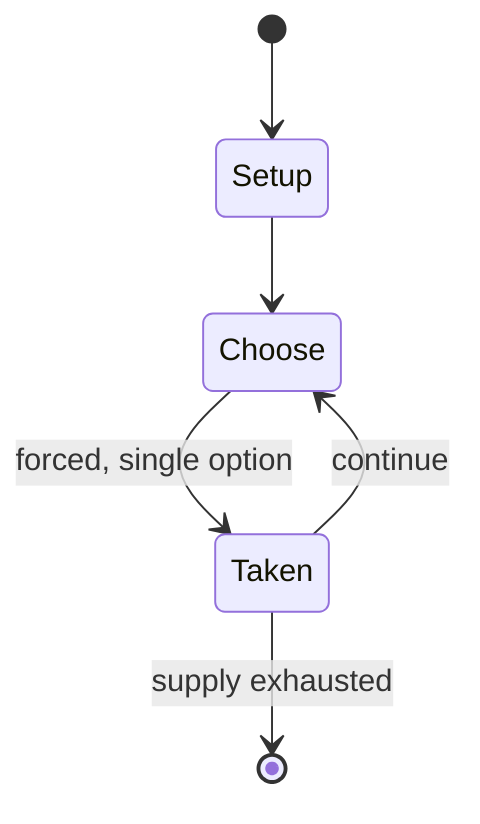

# Disney Tsum Tsum

*Japanese stuffed toys and mobile game*

`disney_tsum_tsum` &nbsp; state: **DEEPENED** &nbsp; method: **heuristic**

## Found layer (recorded, not trusted)

| field | value |
| --- | --- |
| wikidata | Q18149304 |
| wikipedia | Disney Tsum Tsum |
| genres (source) | puzzle video game |
| instance of (source) | stuffed toy, video game |
| country of origin | Japan |

## Declared layer (orders bench work)

| field | value |
| --- | --- |
| year created | 2013 |
| epoch | CONTEMPORARY |
| region | EAST_ASIA |
| media | VIDEO |
| players | -- |
| age band | -- |
| exogenous process | -- |
| loss shape | -- |
| live axes | - |
| horizon | -- |
| scoring shape | -- |
| information | -- |
| interaction | -- |
| turn structure | -- |
| tractability | SAMPLING_ONLY |
| randomness | -- |
| luck factor | 0.35 |
| rules complexity | 1.71 |
| strategic depth | 2.0 |
| novelty | 0.0896 |
| solved status | -- |
| strategies | -- |
| algorithms | -- |

## Object model

```
Episode
  players      : ?
  turn_structure: ?
  horizon       : ?
  scoring       : ?

WorldState     -- simulation state advanced by the engine
Avatar         -- player-controlled agent
Clock          -- frame or tick counter
```

## State transition diagram



## Research item -- turn trace

```
# Disney Tsum Tsum -- simulated turn events
# generated from the DECLARED vector, not from a rulebook.
# structure: exo=None loss=None horizon=None scoring=None axes=-

t=0    SETUP        players=2  pot=0  capacity=3
t=1    FORCED       p1 single legal option taken (pot_gain=+1.9)
t=2    FORCED       p1 single legal option taken (pot_gain=+1.5)
t=3    FORCED       p1 single legal option taken (pot_gain=+1.7)
t=4    ENDTURN      turn passes to p2
t=5    FORCED       p2 single legal option taken (pot_gain=+1.8)
t=6    FORCED       p2 single legal option taken (pot_gain=+1.3)
t=7    ENDTURN      turn passes to p1
t=8    FORCED       p1 single legal option taken (pot_gain=+1.9)
t=9    FORCED       p1 single legal option taken (pot_gain=+0.8)
t=10   FORCED       p1 single legal option taken (pot_gain=+1.9)
t=11   FORCED       p1 single legal option taken (pot_gain=+1.1)
t=12   FORCED       p1 single legal option taken (pot_gain=+1.6)
t=13   FORCED       p1 single legal option taken (pot_gain=+1.6)
t=14   FORCED       p1 single legal option taken (pot_gain=+2.0)
t=15   FORCED       p1 single legal option taken (pot_gain=+0.9)
t=16   FORCED       p1 single legal option taken (pot_gain=+0.7)
t=17   FORCED       p1 single legal option taken (pot_gain=+0.7)
t=18   FORCED       p1 single legal option taken (pot_gain=+1.7)
t=19   ENDTURN      turn passes to p2
t=20   FORCED       p2 single legal option taken (pot_gain=+1.1)
t=21   FORCED       p2 single legal option taken (pot_gain=+1.8)
t=22   FORCED       p2 single legal option taken (pot_gain=+1.3)
t=23   FORCED       p2 single legal option taken (pot_gain=+1.7)
t=24   FORCED       p2 single legal option taken (pot_gain=+1.6)
t=25   FORCED       p2 single legal option taken (pot_gain=+1.5)
t=26   FORCED       p2 single legal option taken (pot_gain=+0.9)
t=27   ENDTURN      turn passes to p1

terminal: VARIABLE
```

## Conditions

| kind | threshold | effect | trigger |
| --- | --- | --- | --- |
| BOUNDARY | -- | -- | Players must drag their finger on their phone's touchscreen to connect at least three Tsums in order to clear them from the playfield, clearing as many Tsums as possible before time runs out. |
| BOUNDARY | -- | -- | Clearing at least seven Tsums, or six when a specific boost is activated before a game, will also spawn a magical bubble, known as a bomb in the Japanese version, that immediately clears surrounding Tsums when tapped to  |

## Source extract

Disney Tsum Tsum (Japanese: ディズニー ツムツム, Hepburn: Dizunī Tsumutsumu) (pronounced (t)soom-(t)soom)
is a brand of Japanese collectible stuffed toy based upon Disney-owned characters. The name is
derived from the Japanese verb tsumu, meaning "to stack", as the rectangle-shaped toys are
designed to stack on top of each other, forming a pyramid shape. There are also vinyl versions
of Tsums manufactured by Jakks Pacific. The toys were first released in Japan in 2013 as a tie-
in to the Tsum Tsum arcade and mobile games, respectively developed by Konami and Line
Corporation. Disney began selling them in the United States in July 2014, and in Disneyland
Paris the following month. Around the same time, Disney released Tsum Tsum to the South Korean
market, giving away icons for use on online chat systems. As of 2014, 1.8 million Tsum Tsum toys
have been sold. As of February 2019, the franchise has reached around $2.5 billion in combined
mobile game and merchandise sales revenue. Disney Tsum Tsum Festival, a party game based on the
toyline developed by B.B. Studio and Hyde and published by Bandai Namco Entertainment, was
released for Nintendo Switch, allowing up to four players to play minigame

<sub>Wikipedia, CC BY-SA. Retained as evidence for the structural
classification above. Every rule inferred from it is HYPOTHESIZED
until audited against a rulebook.</sub>
