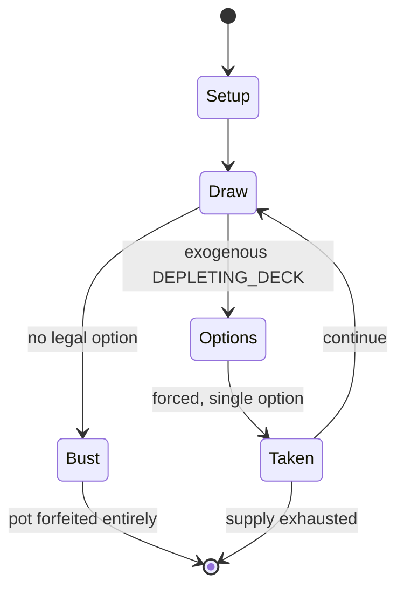

# Doctor Who – Battles in Time

*board game*

`doctor_who_battles_in_time` &nbsp; state: **DEEPENED** &nbsp; method: **heuristic**

## Found layer (recorded, not trusted)

| field | value |
| --- | --- |
| wikidata | Q5287474 |
| wikipedia | Doctor Who – Battles in Time |
| genres (source) | -- |
| instance of (source) | board game |
| country of origin | United Kingdom |

## Declared layer (orders bench work)

| field | value |
| --- | --- |
| year created | 2006 |
| epoch | CONTEMPORARY |
| region | EUROPE_WEST |
| media | BOARD, CARD |
| players | -- |
| age band | -- |
| exogenous process | DEPLETING_DECK |
| loss shape | TOTAL_RUIN |
| live axes | TRADE |
| horizon | VARIABLE |
| scoring shape | SET_COLLECTION_CONVEX |
| information | -- |
| interaction | SOLITAIRE |
| turn structure | TICK_BASED |
| tractability | SAMPLING_ONLY |
| randomness | HIDDEN_INFO |
| luck factor | 0.35 |
| rules complexity | 2.13 |
| strategic depth | 2.5 |
| novelty | 0.6938 |
| solved status | -- |
| strategies | set_collection, spatial_packing |
| algorithms | -- |

## Object model

```
Episode
  players      : ?
  turn_structure: TICK_BASED
  horizon       : VARIABLE
  scoring       : SET_COLLECTION_CONVEX

Board          -- spatial substrate; cells carry position and occupancy
Piece          -- movable token owned by a player
Deck           -- ordered multiset, drawn without replacement
Hand           -- private multiset held by one player
DiscardPile    -- public accumulation of spent cards
Offer          -- proposed exchange between two agents
```

## State transition diagram



## Research item -- clock trace

```
# Doctor Who – Battles in Time -- simulated clock trace (no turn boundary)
# generated from the DECLARED vector, not from a rulebook.
# structure: exo=DEPLETING_DECK loss=TOTAL_RUIN horizon=VARIABLE scoring=SET_COLLECTION_CONVEX axes=TRADE

clk=0.000s  START        agents=4  clock=free running
clk=1.664s  CONTEST      a3 and a4 contend for the same resource
clk=4.255s  ACTION       a1 acts continuously; no turn boundary crossed
clk=5.851s  CONTEST      a3 and a4 contend for the same resource
clk=8.301s  ACTION       a3 acts continuously; no turn boundary crossed
clk=10.063s  CONTEST      a3 and a4 contend for the same resource
clk=10.585s  ACTION       a3 acts continuously; no turn boundary crossed
clk=12.703s  ACTION       a1 acts continuously; no turn boundary crossed
clk=14.264s  STOPPAGE     clock halts; state frozen
clk=15.073s  SCORE        a2 scores (+1)
clk=17.905s  CONTEST      a4 and a1 contend for the same resource
clk=20.577s  ACTION       a4 acts continuously; no turn boundary crossed
clk=23.464s  CONTEST      a2 and a3 contend for the same resource
clk=24.480s  ACTION       a4 acts continuously; no turn boundary crossed
clk=27.369s  ACTION       a3 acts continuously; no turn boundary crossed
clk=28.659s  ACTION       a1 acts continuously; no turn boundary crossed
clk=29.364s  SCORE        a4 scores (+1)
clk=30.731s  ACTION       a1 acts continuously; no turn boundary crossed
clk=32.508s  CONTEST      a1 and a2 contend for the same resource
clk=33.911s  ACTION       a1 acts continuously; no turn boundary crossed
clk=34.402s  CONTEST      a1 and a2 contend for the same resource
clk=37.357s  ACTION       a4 acts continuously; no turn boundary crossed
clk=37.729s  STOPPAGE     clock halts; state frozen
clk=39.366s  ACTION       a4 acts continuously; no turn boundary crossed
clk=40.501s  ACTION       a1 acts continuously; no turn boundary crossed
clk=41.850s  CONTEST      a3 and a4 contend for the same resource
clk=44.531s  ACTION       a4 acts continuously; no turn boundary crossed

note: elapsed time, not move count, is the episode's ordering variable.
```

## Conditions

| kind | threshold | effect | trigger |
| --- | --- | --- | --- |
| TERMINATE | 1 player | -- | The game ends when one player has lost all of their cards. |
| BOUNDARY | 15 cards | -- | In this variation, the deck should be composed of at least 15 cards per player. |
| BOUNDARY | -- | -- | The maximum number of bonus cards that may be taken on each deck is 2. |

## Source extract

Doctor Who – Battles in Time is a trading card game and fortnightly magazine originally from the
partwork publishers GE Fabbri, who acquired the license to produce Battles in Time. The game and
magazine were first released in mid-April 2006 in two 'test-regions' in the United Kingdom and
was made available across the UK on 20 September 2006. The magazine was released in Australia a
few months later. However, only in South Australia was it made available in newsagents; in the
rest of Australia it was available by subscription with the distributor only. The subscription
and back issue services have now been removed from the official website. Battles in Time
magazines are no longer available and the last issue (number 70) was released on 13 May 2009.
In October 2025 it was announced that Battles in Time would be relaunched by Heathside Trading
and BBC Studios to coincide with the 20th Anniversary of the original release. A reintroduction
set was released in late April 2026.   == Test Run == The test series was run in the Westcountry
and Grampian television areas of the UK at a test market to see if Battles in Time would be
popular. It released 7 pilot Magazines and a "test set" versi

<sub>Wikipedia, CC BY-SA. Retained as evidence for the structural
classification above. Every rule inferred from it is HYPOTHESIZED
until audited against a rulebook.</sub>
