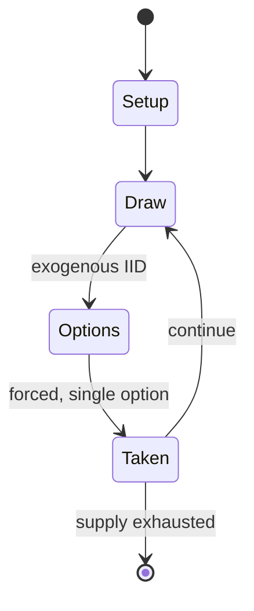

# Dominoes

`dominoes` &nbsp; state: **DEEPENED** &nbsp; method: **heuristic**

## Found layer (recorded, not trusted)

| field | value |
| --- | --- |
| wikidata | Q32907 |
| wikipedia | Dominoes |
| genres (source) | -- |
| instance of (source) | -- |
| country of origin | -- |

## Declared layer (orders bench work)

| field | value |
| --- | --- |
| year created | -- |
| epoch | -- |
| region | -- |
| media | CARD, DICE, TILE |
| players | -- |
| age band | -- |
| exogenous process | IID |
| loss shape | -- |
| live axes | - |
| horizon | VARIABLE |
| scoring shape | LINEAR_ACCUMULATION |
| information | -- |
| interaction | COMPETITIVE |
| turn structure | -- |
| tractability | EXACT_WITH_CUT |
| randomness | DICE, SPINNER |
| luck factor | 0.7 |
| rules complexity | 2.16 |
| strategic depth | 2.18 |
| novelty | 0.7383 |
| solved status | -- |
| strategies | blocking, spatial_packing |
| algorithms | -- |

## Object model

```
Episode
  players      : ?
  turn_structure: ?
  horizon       : VARIABLE
  scoring       : LINEAR_ACCUMULATION

Deck           -- ordered multiset, drawn without replacement
Hand           -- private multiset held by one player
DiscardPile    -- public accumulation of spent cards
DicePool       -- n dice, each an iid categorical draw
Roll           -- realised outcome of a pool
TileBag        -- unordered draw source
Layout         -- placed tiles and their adjacencies
```

## State transition diagram



## Research item -- turn trace

```
# Dominoes -- simulated turn events
# generated from the DECLARED vector, not from a rulebook.
# structure: exo=IID loss=None horizon=VARIABLE scoring=LINEAR_ACCUMULATION axes=-

t=0    SETUP        players=2  pot=0  capacity=6
t=1    DRAW         p1 roll from d6 pool -> outcome #5  (p=0.179)
t=2    FORCED       p1 single legal option taken (pot_gain=+1.9)
t=3    DRAW         p1 roll from d6 pool -> outcome #3  (p=0.093)
t=4    FORCED       p1 single legal option taken (pot_gain=+0.7)
t=5    DRAW         p1 roll from d6 pool -> outcome #6  (p=0.154)
t=6    FORCED       p1 single legal option taken (pot_gain=+1.4)
t=7    DRAW         p1 roll from d6 pool -> outcome #2  (p=0.185)
t=8    FORCED       p1 single legal option taken (pot_gain=+0.5)
t=9    DRAW         p1 roll from d6 pool -> outcome #1  (p=0.293)
t=10   FORCED       p1 single legal option taken (pot_gain=+0.6)
t=11   DRAW         p1 roll from d6 pool -> outcome #1  (p=0.104)
t=12   FORCED       p1 single legal option taken (pot_gain=+1.7)
t=13   ENDTURN      turn passes to p2
t=14   DRAW         p2 roll from d6 pool -> outcome #2  (p=0.187)
t=15   FORCED       p2 single legal option taken (pot_gain=+0.8)
t=16   DRAW         p2 roll from d6 pool -> outcome #5  (p=0.156)
t=17   FORCED       p2 single legal option taken (pot_gain=+1.7)
t=18   DRAW         p2 roll from d6 pool -> outcome #6  (p=0.210)
t=19   FORCED       p2 single legal option taken (pot_gain=+0.8)
t=20   ENDTURN      turn passes to p1
t=21   DRAW         p1 roll from d6 pool -> outcome #5  (p=0.050)
t=22   FORCED       p1 single legal option taken (pot_gain=+1.9)
t=23   DRAW         p1 roll from d6 pool -> outcome #3  (p=0.112)
t=24   FORCED       p1 single legal option taken (pot_gain=+0.5)
t=25   DRAW         p1 roll from d6 pool -> outcome #1  (p=0.151)
t=26   FORCED       p1 single legal option taken (pot_gain=+1.8)

terminal: VARIABLE
```

## Conditions

| kind | threshold | effect | trigger |
| --- | --- | --- | --- |
| TERMINATE | 1 player | -- | The game ends when one player wins by playing their last tile, or when the game is blocked because neither player can play. |
| BOUNDARY | 55 tiles | -- | Each progressively larger set increases the maximum number of pips on an end by three; so the common extended sets are double-nine (55 tiles), double-12 (91 tiles), double-15 (136 tiles), and double-18 (190 tiles), which |
| WIN | -- | -- | If both teams have the same points, the team that started wins the round. |
| TERMINATE | -- | -- | Similar to a normal blocking game, the game ends when a player empties their hand or the game is blocked. |
| TERMINATE | -- | -- | A set of games ends when any player reaches a set number of points, in which they win. |
| TERMINATE | -- | -- | The game ends when one of the players has no tiles left or when the game is blocked. |
| TERMINATE | -- | -- | The game ends when one of the pair's total score exceeds a set number of points. |
| BOUNDARY | -- | -- | i.e. the number of tiles multiplied by the maximum pip-count (n) |

## Source extract

Dominoes are a family of tile-based games played with pieces. Each domino is a rectangular tile,
usually with a line dividing its face into two square ends. Each end is marked with a number of
spots (also called pips or dots) or is blank. The backs of the tiles in a set are
indistinguishable, either blank or having some common design. The gaming pieces make up a domino
set, sometimes called a deck or pack.  The traditional European domino set consists of 28 tiles,
also known as pieces, bones, rocks, stones, men, cards or just dominoes, featuring all
combinations of spot counts between zero and six. A domino set is a generic gaming device,
similar to playing cards or dice, in that a variety of games can be played with a set. Another
form of entertainment using domino pieces is the practice of domino toppling.  The earliest
mention of dominoes is from Song dynasty China found in the text Former Events in Wulin by Zhou
Mi (1232–1298). Modern dominoes first appeared in France during the mid-18th century, but they
differ from Chinese dominoes in a number of respects, and there is no confirmed link between the
two. European dominoes may have developed independently, or Italian missionari

<sub>Wikipedia, CC BY-SA. Retained as evidence for the structural
classification above. Every rule inferred from it is HYPOTHESIZED
until audited against a rulebook.</sub>
