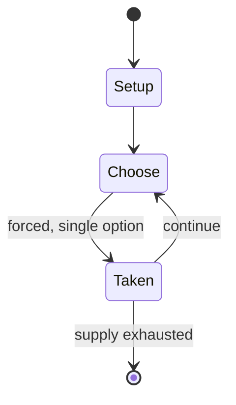

# Doom Trooper

*card game*

`doom_trooper` &nbsp; state: **DEEPENED** &nbsp; method: **heuristic**

## Found layer (recorded, not trusted)

| field | value |
| --- | --- |
| wikidata | Q3036919 |
| wikipedia | Doomtrooper |
| genres (source) | -- |
| instance of (source) | collectible card game |
| country of origin | United States |

## Declared layer (orders bench work)

| field | value |
| --- | --- |
| year created | 1994 |
| epoch | DIGITAL |
| region | NORTH_AMERICA |
| media | CARD, COLLECTIBLE |
| players | -- |
| age band | -- |
| exogenous process | -- |
| loss shape | -- |
| live axes | - |
| horizon | -- |
| scoring shape | SET_COLLECTION_CONVEX |
| information | -- |
| interaction | COMPETITIVE |
| turn structure | -- |
| tractability | SAMPLING_ONLY |
| randomness | HIDDEN_INFO |
| luck factor | 0.35 |
| rules complexity | 2.2 |
| strategic depth | 2.25 |
| novelty | 0.482 |
| solved status | -- |
| strategies | spatial_packing |
| algorithms | -- |

## Object model

```
Episode
  players      : ?
  turn_structure: ?
  horizon       : ?
  scoring       : SET_COLLECTION_CONVEX

Deck           -- ordered multiset, drawn without replacement
Hand           -- private multiset held by one player
DiscardPile    -- public accumulation of spent cards
```

## State transition diagram



## Research item -- turn trace

```
# Doom Trooper -- simulated turn events
# generated from the DECLARED vector, not from a rulebook.
# structure: exo=None loss=None horizon=None scoring=SET_COLLECTION_CONVEX axes=-

t=0    SETUP        players=2  pot=0  capacity=7
t=1    FORCED       p1 single legal option taken (pot_gain=+1.6)
t=2    FORCED       p1 single legal option taken (pot_gain=+0.6)
t=3    FORCED       p1 single legal option taken (pot_gain=+1.5)
t=4    FORCED       p1 single legal option taken (pot_gain=+0.7)
t=5    FORCED       p1 single legal option taken (pot_gain=+1.9)
t=6    FORCED       p1 single legal option taken (pot_gain=+1.9)
t=7    ENDTURN      turn passes to p2
t=8    FORCED       p2 single legal option taken (pot_gain=+1.0)
t=9    FORCED       p2 single legal option taken (pot_gain=+1.7)
t=10   ENDTURN      turn passes to p1
t=11   FORCED       p1 single legal option taken (pot_gain=+0.6)
t=12   FORCED       p1 single legal option taken (pot_gain=+1.9)
t=13   FORCED       p1 single legal option taken (pot_gain=+0.8)
t=14   FORCED       p1 single legal option taken (pot_gain=+1.1)
t=15   FORCED       p1 single legal option taken (pot_gain=+0.6)
t=16   ENDTURN      turn passes to p2
t=17   FORCED       p2 single legal option taken (pot_gain=+1.5)
t=18   FORCED       p2 single legal option taken (pot_gain=+1.1)
t=19   ENDTURN      turn passes to p1
t=20   FORCED       p1 single legal option taken (pot_gain=+1.9)
t=21   FORCED       p1 single legal option taken (pot_gain=+1.7)
t=22   FORCED       p1 single legal option taken (pot_gain=+0.7)
t=23   ENDTURN      turn passes to p2
t=24   FORCED       p2 single legal option taken (pot_gain=+1.9)
t=25   FORCED       p2 single legal option taken (pot_gain=+1.1)
t=26   FORCED       p2 single legal option taken (pot_gain=+0.9)

terminal: VARIABLE
```

## Source extract

Doomtrooper, also known as Doom Trooper, is an out-of-print collectible card game designed by
Bryan Winter and was released in 1994 or January 1995. It was originally published by Target
Games and Heartbreaker Hobbies.  It is based on concepts from the Swedish Mutant Chronicles
franchise. Players use warriors to attack and gain either Promotion Points or Destiny Points.
Promotion points can be used to win; Destiny Points are used to purchase more warriors and
equipment. There are 13 different card types and over 1100 different cards available. The game
was later migrated to a digital version that was successfully funded on Kickstarter.   == Sets
== Basic Set (First Edition) in limited, unlimited and revised unlimited editions Inquisition
(April 1995) Warzone (1995) Mortificator (1995) Golgotha (1996) Apocalypse (1996) Paradise Lost
(1997) Ragnarok (never released) The basic set of the game consisted of 337 cards sold in
60-card starter decks and 16-card booster packs. The starter decks included 2 rare cards and 13
uncommon cards; the booster packs included 1 rare card and 3 uncommon cards. The 170-card
expansion set Inquisition was released in April 1995 and sold in 8-card booster

<sub>Wikipedia, CC BY-SA. Retained as evidence for the structural
classification above. Every rule inferred from it is HYPOTHESIZED
until audited against a rulebook.</sub>
