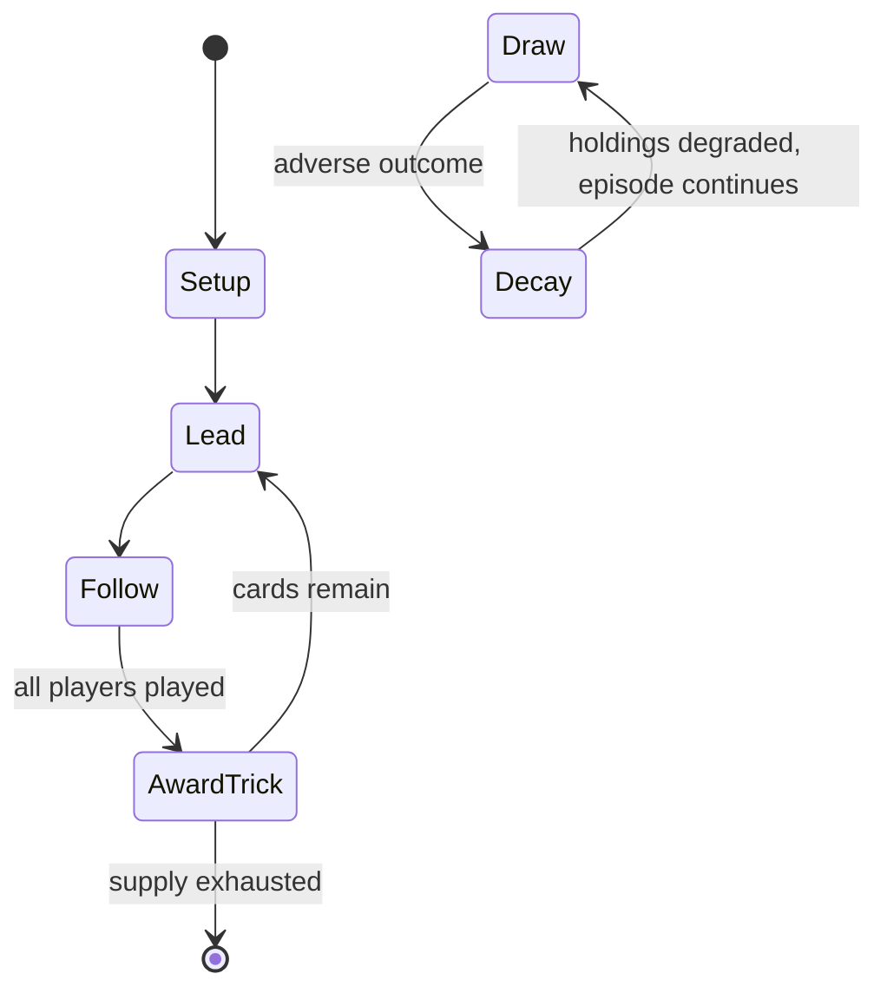

# Doppelkopf

*card game*

`doppelkopf` &nbsp; state: **DEEPENED** &nbsp; method: **heuristic**

## Found layer (recorded, not trusted)

| field | value |
| --- | --- |
| wikidata | Q1243075 |
| wikipedia | Doppelkopf |
| genres (source) | -- |
| instance of (source) | card game, cumulative trick-taking game, trick-taking game |
| country of origin | -- |

## Declared layer (orders bench work)

| field | value |
| --- | --- |
| year created | -- |
| epoch | -- |
| region | -- |
| media | CARD, TRICK_TAKING |
| players | 4 |
| age band | -- |
| exogenous process | -- |
| loss shape | PARTIAL_DECAY |
| live axes | DISCARD |
| horizon | -- |
| scoring shape | SET_COLLECTION_CONVEX |
| information | IMPERFECT |
| interaction | COMPETITIVE |
| turn structure | TRICK_ROUND |
| tractability | SAMPLING_ONLY |
| randomness | DICE |
| luck factor | 0.58 |
| rules complexity | 2.22 |
| strategic depth | 2.37 |
| novelty | 0.5705 |
| solved status | -- |
| strategies | deduction, set_collection |
| algorithms | -- |

## Object model

```
Episode
  players      : 4
  turn_structure: TRICK_ROUND
  horizon       : ?
  scoring       : SET_COLLECTION_CONVEX

Deck           -- ordered multiset, drawn without replacement
Hand           -- private multiset held by one player
DiscardPile    -- public accumulation of spent cards
Trick          -- one card per player; a winner is determined
Trump          -- suit that dominates the ordering
DiscardChoice  -- what is given up to satisfy a limit
```

## State transition diagram



## Research item -- turn trace

```
# Doppelkopf -- simulated turn events
# generated from the DECLARED vector, not from a rulebook.
# structure: exo=None loss=PARTIAL_DECAY horizon=None scoring=SET_COLLECTION_CONVEX axes=DISCARD

t=0    SETUP        players=4  pot=0  capacity=4
t=1    FORCED       p1 single legal option taken (pot_gain=+0.9)
t=2    DISCARD      p1 discards to hand limit
t=3    FORCED       p1 single legal option taken (pot_gain=+1.6)
t=4    DISCARD      p1 discards to hand limit
t=5    FORCED       p1 single legal option taken (pot_gain=+1.0)
t=6    DISCARD      p1 discards to hand limit
t=7    FORCED       p1 single legal option taken (pot_gain=+1.7)
t=8    DISCARD      p1 discards to hand limit
t=9    ENDTURN      turn passes to p2
t=10   FORCED       p2 single legal option taken (pot_gain=+1.2)
t=11   FORCED       p2 single legal option taken (pot_gain=+1.1)
t=12   ENDTURN      turn passes to p3
t=13   FORCED       p3 single legal option taken (pot_gain=+0.7)
t=14   FORCED       p3 single legal option taken (pot_gain=+1.8)
t=15   FORCED       p3 single legal option taken (pot_gain=+1.8)
t=16   DISCARD      p3 discards to hand limit
t=17   FORCED       p3 single legal option taken (pot_gain=+1.2)
t=18   DISCARD      p3 discards to hand limit
t=19   FORCED       p3 single legal option taken (pot_gain=+0.6)
t=20   DISCARD      p3 discards to hand limit
t=21   ENDTURN      turn passes to p4
t=22   FORCED       p4 single legal option taken (pot_gain=+1.9)
t=23   DISCARD      p4 discards to hand limit
t=24   FORCED       p4 single legal option taken (pot_gain=+0.9)
t=25   DISCARD      p4 discards to hand limit
t=26   FORCED       p4 single legal option taken (pot_gain=+0.6)

terminal: VARIABLE
```

## Conditions

| kind | threshold | effect | trigger |
| --- | --- | --- | --- |
| WIN | 121 points | -- | Note that this means that, in the case of an announced "Contra", the Contra team must now make 121 points instead of 120 to win the game, unless Re is also announced. |
| BOUNDARY | 61 points | -- | A team needed at least 61 points to avoid losing Schneider i.e. double. |
| BOUNDARY | 90 points | -- | +1 if the winning team won with at least 90 points against an announcement of No 60 |
| BOUNDARY | 60 points | -- | +1 if the winning team won with at least 60 points against an announcement of No 30 |
| BOUNDARY | 30 points | -- | +1 if the winning team won with at least 30 points against an announcement of Schwarz |
| BOUNDARY | -- | -- | He goes on to describe in detail no fewer than nine variants of 'Schaafkopf', but states clearly that the original was a four-hand, point-trick, team game with 4 Unters as top trumps, known as Wenzels (pronounced "Ventse |
| BOUNDARY | -- | -- | However, if their partner has said Kontra players should lead a trump as they should have at least one 10 of hearts. |
| BOUNDARY | -- | -- | If one is trumping, and there is a possibility of being overtrumped, it is key to try trump, at least, a jack so that the fourth player cannot win with a fox or 10 of trumps. |
| BOUNDARY | -- | -- | It is desirable to partner with Wedding as one's partner normally has at least 2 high trumps. |
| PENALTY | -- | -- | It was played much as in Doppelschafkopf above, but there was now an extra penalty for losing the "Fox" – the trump Ace. |

## Source extract

Doppelkopf (German pronunciation: [ˈdɔpl̩kɔpf], lit. double-head), sometimes abbreviated to
Doko, is a trick-taking card game for four players. In Germany, Doppelkopf is nearly as popular
as Skat, especially in Northern Germany and the Rhein-Main Region. Schafkopf, however, is still
the preferred point-trick game in Bavaria. As with Skat and Bavarian Schafkopf there is a set of
official rules, but numerous unofficial variants. Although the German Doppelkopf Association
(Deutscher Doppelkopf-Verband) has developed standard rules for tournaments, informal sessions
are often played in many different variants, and players adopt their own house rules. Before
playing with a new group of players, it is advisable to agree on a specific set of rules before
the first game.   == History ==   === Classic Schafkopf === Games of the Schafkopf group date to
the 18th century or earlier, the oldest member of the family being known as Schafkopf or,
nowadays, German Schafkopf to avoid confusion with its modern Bavarian descendant. A 1783 novel
describes the scene after a wedding dinner as the dining tables were cleared away and replaced
by games tables: "here stood an Ombre table, there a noble Schaf

<sub>Wikipedia, CC BY-SA. Retained as evidence for the structural
classification above. Every rule inferred from it is HYPOTHESIZED
until audited against a rulebook.</sub>
