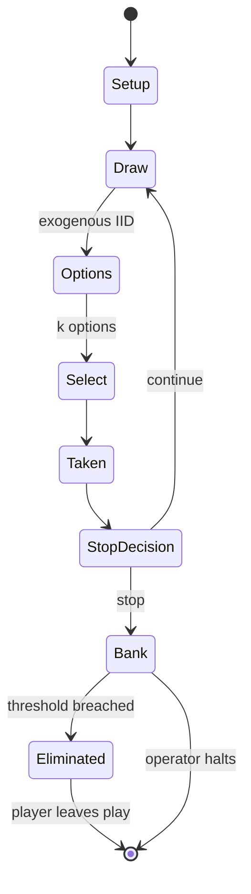

# Dorfromantik: The Board Game

*2022 board game*

`dorfromantik_the_board_game` &nbsp; state: **DEEPENED** &nbsp; method: **heuristic**

## Found layer (recorded, not trusted)

| field | value |
| --- | --- |
| wikidata | Q118186288 |
| wikipedia | Dorfromantik: The Board Game |
| genres (source) | adventure board game, cooperative board game, tile-based game |
| instance of (source) | board game, cooperative board game, game, tile-based game |
| country of origin | Germany |

## Declared layer (orders bench work)

| field | value |
| --- | --- |
| year created | 2020 |
| epoch | CONTEMPORARY |
| region | EUROPE_WEST |
| media | BOARD, TILE, VIDEO |
| players | 1-6 |
| age band | -- |
| exogenous process | IID |
| loss shape | ELIMINATION |
| live axes | SELECT, STOP |
| horizon | OPEN_ENDED |
| scoring shape | LINEAR_ACCUMULATION |
| information | -- |
| interaction | COOPERATIVE |
| turn structure | -- |
| tractability | SAMPLING_ONLY |
| randomness | DICE |
| luck factor | 0.58 |
| rules complexity | 3.4 |
| strategic depth | 1.87 |
| novelty | 1.0 |
| solved status | -- |
| strategies | -- |
| algorithms | -- |

## Object model

```
Episode
  players      : 1-6
  turn_structure: ?
  horizon       : OPEN_ENDED
  scoring       : LINEAR_ACCUMULATION

Board          -- spatial substrate; cells carry position and occupancy
Piece          -- movable token owned by a player
TileBag        -- unordered draw source
Layout         -- placed tiles and their adjacencies
WorldState     -- simulation state advanced by the engine
Avatar         -- player-controlled agent
Clock          -- frame or tick counter
OptionSet      -- the choices available after an exogenous draw
Pot            -- value accumulated this episode and at risk until banked
```

## State transition diagram



## Research item -- turn trace

```
# Dorfromantik: The Board Game -- simulated turn events
# generated from the DECLARED vector, not from a rulebook.
# structure: exo=IID loss=ELIMINATION horizon=OPEN_ENDED scoring=LINEAR_ACCUMULATION axes=SELECT,STOP

t=0    SETUP        players=1  pot=0  capacity=3
t=1    DRAW         p1 roll from d6 pool -> outcome #4  (p=0.139)
t=2    SELECT       p1 3 options; take #1  (pot_gain=+1.0, capacity=-2)
t=3    STOP?        p1 pot=1.0  P(bust|continue)=0.16  E[gain]=0.43 -> CONTINUE
t=4    DRAW         p1 roll from d6 pool -> outcome #6  (p=0.143)
t=5    SELECT       p1 1 options; take #1  (pot_gain=+3.4, capacity=-1)
t=6    STOP?        p1 pot=4.4  P(bust|continue)=0.24  E[gain]=1.81 -> CONTINUE
t=7    DRAW         p1 roll from d6 pool -> outcome #6  (p=0.203)
t=8    SELECT       p1 1 options; take #1  (pot_gain=+2.6, capacity=-0)
t=9    STOP?        p1 pot=7.0  P(bust|continue)=0.40  E[gain]=0.68 -> BANK
t=10   BANK         p1 banks 7.0  (pot now safe)
t=11   DRAW         p1 roll from d6 pool -> outcome #3  (p=0.089)
t=12   SELECT       p1 3 options; take #3  (pot_gain=+0.8, capacity=-0)
t=13   STOP?        p1 pot=0.8  P(bust|continue)=0.19  E[gain]=0.98 -> CONTINUE
t=14   DRAW         p1 roll from d6 pool -> outcome #6  (p=0.283)
t=15   SELECT       p1 2 options; take #1  (pot_gain=+0.5, capacity=-1)
t=16   STOP?        p1 pot=1.3  P(bust|continue)=0.24  E[gain]=0.71 -> CONTINUE
t=17   DRAW         p1 roll from d6 pool -> outcome #5  (p=0.099)
t=18   SELECT       p1 3 options; take #1  (pot_gain=+1.1, capacity=-1)
t=19   STOP?        p1 pot=2.4  P(bust|continue)=0.41  E[gain]=2.15 -> CONTINUE
t=20   DRAW         p1 roll from d6 pool -> outcome #1  (p=0.213)
t=21   SELECT       p1 3 options; take #1  (pot_gain=+0.6, capacity=-0)
t=22   STOP?        p1 pot=3.0  P(bust|continue)=0.49  E[gain]=1.17 -> BANK
t=23   BANK         p1 banks 3.0  (pot now safe)
t=24   DRAW         p1 roll from d6 pool -> outcome #6  (p=0.232)
t=25   SELECT       p1 1 options; take #1  (pot_gain=+3.4, capacity=-2)
t=26   STOP?        p1 pot=3.4  P(bust|continue)=0.24  E[gain]=2.16 -> CONTINUE

terminal: OPEN_ENDED
```

## Conditions

| kind | threshold | effect | trigger |
| --- | --- | --- | --- |
| ELIMINATE | 2 players | -- | It introduces new task types as well as a tile-matching system between the two players, eliminating most aspects of luck and making the game perfectly symmetrical. |
| TERMINATE | -- | -- | Once the task pile is exhausted and no task tiles remain, the game ends immediately and scoring begins. |
| BOUNDARY | -- | -- | Except for the very first tile, all tiles placed must be connected by at least one edge to the rest of the game map. |

## Source extract

Dorfromantik: The Board Game (German: Dorfromantik: Das Brettspiel) is a board game by Lukas
Zach and Michael Palm based on the video game of the same name. The game was published by the
German game company Pegasus Spiele in 2022. Dorfromantik is a cooperative game in which players
lay hexagonal tiles to create a landscape of various terrains, while also managing tasks to
score more points. Dorfromantik also has a campaign mode in which players open boxes as they
play games to continually increase their scores. It has won several awards both in Germany and
abroad, including the 2023 Spiel des Jahres (German: Game of the Year). As of April 2026, two
mini-expansions for Dorfromantik have been released, The Great Mill and The Wetterau. In
addition, two subsequent games have been launched: Dorfromantik: The Duel and Dorfromantik:
Sakura. In October 2025, a compact version of the game was released, Dorfromantik: Light
Luggage.   == Background and development ==  The video game Dorfromantik was developed in Berlin
by Toukana Interactive. Toukana is a German indie game studio which was founded in 2020 as part
of a master's degree program at the HTW Berlin. The video game version of Dorfro

<sub>Wikipedia, CC BY-SA. Retained as evidence for the structural
classification above. Every rule inferred from it is HYPOTHESIZED
until audited against a rulebook.</sub>
