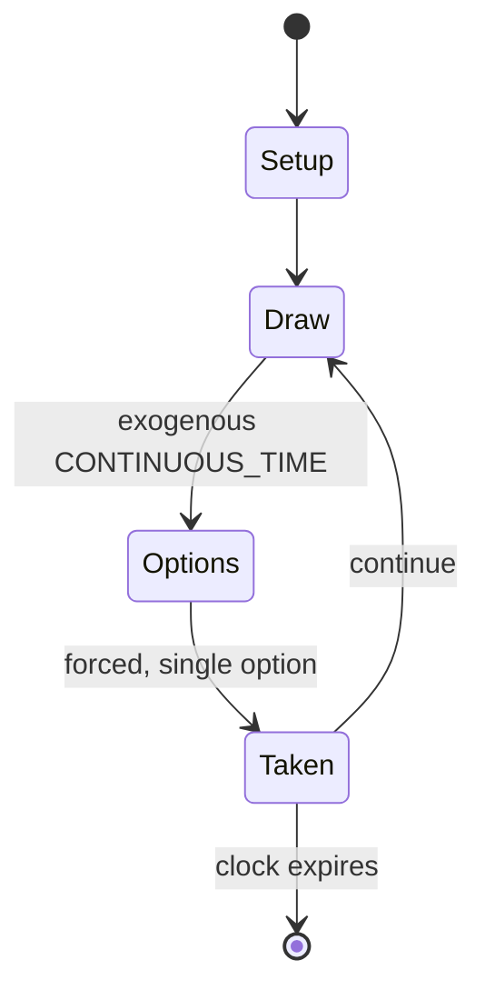

# Dota 2

`dota_2` &nbsp; state: **DEEPENED** &nbsp; method: **heuristic**

## Found layer (recorded, not trusted)

| field | value |
| --- | --- |
| wikidata | Q771541 |
| wikipedia | Dota 2 |
| genres (source) | -- |
| instance of (source) | -- |
| country of origin | -- |

## Declared layer (orders bench work)

| field | value |
| --- | --- |
| year created | 2020 |
| epoch | CONTEMPORARY |
| region | -- |
| media | VIDEO |
| players | -- |
| age band | -- |
| exogenous process | CONTINUOUS_TIME |
| loss shape | -- |
| live axes | TIMING |
| horizon | CLOCK_LIMITED |
| scoring shape | SET_COLLECTION_CONVEX |
| information | -- |
| interaction | TEAM |
| turn structure | PHASE_STRUCTURED |
| tractability | SAMPLING_ONLY |
| randomness | REAL_TIME_PHYSICAL |
| luck factor | 0.3 |
| rules complexity | 3.4 |
| strategic depth | 2.5 |
| novelty | 0.7441 |
| solved status | -- |
| strategies | spatial_packing, tempo |
| algorithms | -- |

## Object model

```
Episode
  players      : ?
  turn_structure: PHASE_STRUCTURED
  horizon       : CLOCK_LIMITED
  scoring       : SET_COLLECTION_CONVEX

WorldState     -- simulation state advanced by the engine
Avatar         -- player-controlled agent
Clock          -- frame or tick counter
Initiative     -- who acts, and when, relative to others
```

## State transition diagram



## Research item -- turn trace

```
# Dota 2 -- simulated turn events
# generated from the DECLARED vector, not from a rulebook.
# structure: exo=CONTINUOUS_TIME loss=None horizon=CLOCK_LIMITED scoring=SET_COLLECTION_CONVEX axes=TIMING

t=0    SETUP        players=2  pot=0  capacity=7
t=1    DRAW         p1 tick from clock -> outcome #4  (p=0.047)
t=2    FORCED       p1 single legal option taken (pot_gain=+1.7)
t=3    ENDTURN      turn passes to p2
t=4    DRAW         p2 tick from clock -> outcome #3  (p=0.062)
t=5    FORCED       p2 single legal option taken (pot_gain=+2.0)
t=6    ENDTURN      turn passes to p1
t=7    DRAW         p1 tick from clock -> outcome #1  (p=0.283)
t=8    FORCED       p1 single legal option taken (pot_gain=+1.5)
t=9    DRAW         p1 tick from clock -> outcome #1  (p=0.276)
t=10   FORCED       p1 single legal option taken (pot_gain=+1.3)
t=11   DRAW         p1 tick from clock -> outcome #2  (p=0.171)
t=12   FORCED       p1 single legal option taken (pot_gain=+1.3)
t=13   DRAW         p1 tick from clock -> outcome #5  (p=0.142)
t=14   FORCED       p1 single legal option taken (pot_gain=+1.5)
t=15   DRAW         p1 tick from clock -> outcome #5  (p=0.044)
t=16   FORCED       p1 single legal option taken (pot_gain=+0.7)
t=17   DRAW         p1 tick from clock -> outcome #5  (p=0.143)
t=18   FORCED       p1 single legal option taken (pot_gain=+1.5)
t=19   DRAW         p1 tick from clock -> outcome #2  (p=0.293)
t=20   FORCED       p1 single legal option taken (pot_gain=+1.6)
t=21   DRAW         p1 tick from clock -> outcome #1  (p=0.041)
t=22   FORCED       p1 single legal option taken (pot_gain=+0.8)
t=23   DRAW         p1 tick from clock -> outcome #2  (p=0.116)
t=24   FORCED       p1 single legal option taken (pot_gain=+1.8)
t=25   DRAW         p1 tick from clock -> outcome #2  (p=0.091)
t=26   FORCED       p1 single legal option taken (pot_gain=+1.3)

terminal: CLOCK_LIMITED
```

## Conditions

| kind | threshold | effect | trigger |
| --- | --- | --- | --- |
| BOUNDARY | -- | -- | Each hero has at least four of them, all of which are unique. |
| BOUNDARY | -- | -- | Heroes begin each game with an experience level of one, only having access to one of their abilities, but are able to level up and become more powerful during the course of the game, up to a maximum level of 30. |
| PENALTY | -- | -- | In Captain's Mode games, an additional "GG" forfeit feature is available to end games early. |
| PENALTY | -- | -- | Largely attributed to technical difficulties players experienced with the update, the global player base experienced a sharp drop of approximately sixteen percent the month following its release. |

## Source extract

Dota 2 is a 2013 multiplayer online battle arena (MOBA) video game by Valve. The game is a
sequel to Defense of the Ancients (DotA), a community-created mod for Blizzard Entertainment's
Warcraft III: Reign of Chaos. Dota 2 is played in matches between two teams of five players,
with each team occupying and defending their own separate base on the map. Each of the ten
players independently controls a character known as a hero that has unique abilities and
differing styles of play. During a match, players collect experience points (XP) and items for
their heroes to defeat the opposing team's heroes in player versus player (PvP) combat. A team
wins by being the first to destroy the other team's Ancient, a large durable structure located
in the center of each base. Development of Dota 2 began in 2009 when IceFrog, lead designer of
Defense of the Ancients, was hired by Valve to design a standalone remake in the Source game
engine. It was released for Windows, OS X, and Linux via the digital distribution platform Steam
in July 2013, following a Windows-only open beta phase that began two years prior. Dota 2 is
fully free-to-play with no heroes or any other gameplay element needing to be

<sub>Wikipedia, CC BY-SA. Retained as evidence for the structural
classification above. Every rule inferred from it is HYPOTHESIZED
until audited against a rulebook.</sub>
